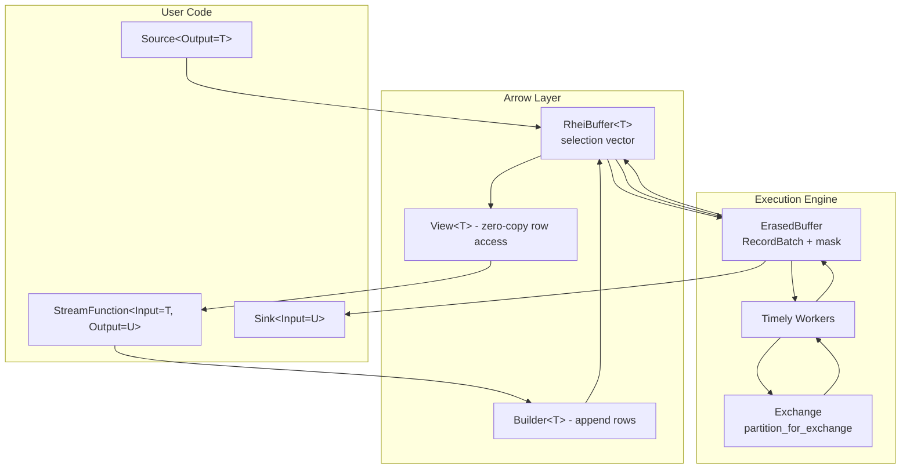
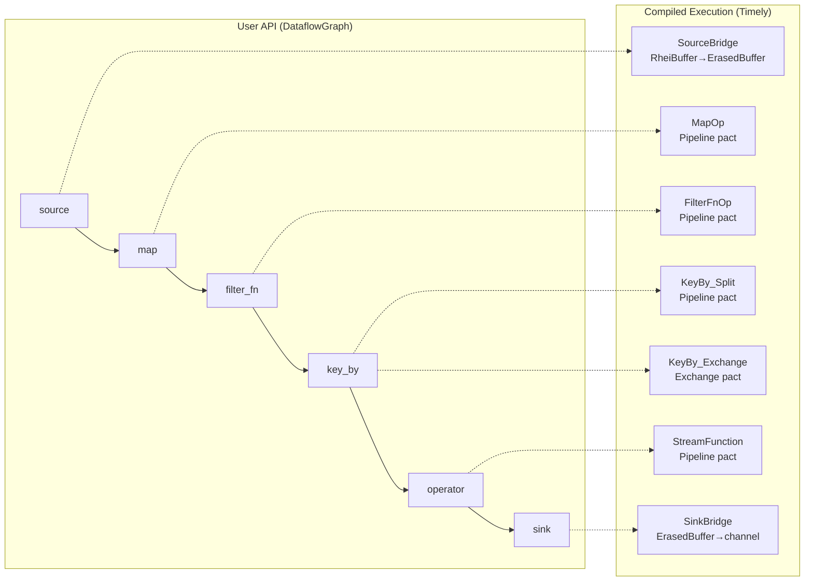
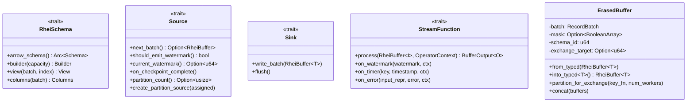

# ADR: Arrow Columnar Execution Model

**Status:** Accepted
**Date:** 2026-05-15

## Context

Rhei originally processed data row-by-row via a `StreamFunction` trait that operated on individual typed items (`AnyItem` type-erased at runtime). This design had fundamental performance limitations:

- No SIMD vectorization (row-at-a-time processing)
- No zero-copy filtering (each filter creates a new allocation)
- Cache-unfriendly memory access patterns (struct-of-arrays vs array-of-structs)
- Expensive per-element serialization for Timely exchange/shuffle
- Type erasure overhead on every element crossing the Timely boundary

The system also carried dual APIs (row-based `Source`/`Sink`/`StreamFunction` and the newer batch `BatchSource`/`BatchSink`/`BatchStreamFunction`), adding confusion and maintenance burden.

## Decision

Replace the row-based execution model entirely with Apache Arrow columnar processing. Data flows as `RecordBatch` buffers through the pipeline. The row-based API has been fully removed — Arrow is the only execution format. All types previously prefixed with `Batch` (e.g., `BatchSource`, `BatchStreamFunction`) have been renamed to drop the prefix (e.g., `Source`, `StreamFunction`) since there is no longer a non-batch alternative.

### Core Architecture

### Key Types

| Type | Role |
|------|------|
| `RheiSchema` | Trait defining Arrow schema, builder, view, and columns for a user type |
| `RheiBuffer<T>` | Typed wrapper around `RecordBatch` with optional selection vector (mask) |
| `RheiBuilder` | Appends user structs into columnar arrays, finishes into `RecordBatch` |
| `View<'a>` | Zero-copy reference into a single row of a `RecordBatch` |
| `ErasedBuffer` | Type-erased `RecordBatch + mask + schema_id` for Timely transport |
| `Source` | Async trait producing `RheiBuffer<T>` batches |
| `Sink` | Async trait consuming `RheiBuffer<T>` batches |
| `StreamFunction` | Async trait: `process(RheiBuffer<I>, &mut OperatorContext) -> BufferOutput<O>` |

### Data Flow

1. **Source** produces `RheiBuffer<T>` (typed Arrow buffer with selection vector)
2. **Type erasure**: `RheiBuffer<T>` → `ErasedBuffer` (schema ID + IPC-serialized RecordBatch)
3. **Timely transport**: `ErasedBuffer` flows through Timely operators (Pipeline or Exchange pact)
4. **Exchange**: `key_by` partitions rows by key hash into per-worker sub-buffers via `partition_for_exchange()`
5. **Operator**: `ErasedBuffer` → `RheiBuffer<T>` (zero-cost type recovery via schema ID) → view iteration → output builder → `RheiBuffer<O>`
6. **Sink**: Receives typed `RheiBuffer<T>`, iterates views for output

### Operator Processing Modes

Operators can process data at three granularities:

1. **Row-level (View)**: Iterate `RheiBuffer<T>` row-by-row via zero-copy `View<'a>` references. Used for custom stateful logic with `KeyedState`.
2. **Batch-level**: Receive the full `RheiBuffer<T>` and produce output. Used for operators that benefit from seeing all rows at once (e.g., windows, aggregations).
3. **Column-level (DataFusion)**: Apply Arrow compute kernels directly on column arrays. Used for filter expressions — produces a selection vector without copying data.

### Exchange Mechanism

`key_by` implements a two-stage Timely operator:

1. **Stage 1 (Pipeline pact)**: Split each `ErasedBuffer` into N sub-buffers (one per worker) using `partition_for_exchange()`. Each sub-buffer is tagged with `exchange_target: u64`.
2. **Stage 2 (Exchange pact)**: Route sub-buffers to target workers via `timely::Exchange`.

Partitioning uses `seahash::hash(key.as_bytes()) % num_workers` for deterministic routing.

### Serialization

`ErasedBuffer` serializes via Arrow IPC format for Timely's `Serialize`/`Deserialize` bounds. This is both fast (columnar, zero-copy friendly) and self-describing (schema embedded in the IPC payload).

## Diagram

### Pipeline Compilation

### Type Hierarchy

## Alternatives Considered

### 1. Keep dual APIs (row + batch) indefinitely

Rejected. Maintaining two parallel paths (traits, connectors, operators, executor branches) doubled the surface area and confused users about which to use. The batch path strictly dominates: it can express row-level logic via Views while enabling vectorized operations impossible in the row path.

### 2. Use DataFusion as the full execution engine (replace Timely)

Deferred. DataFusion excels at query planning and vectorized kernels but lacks Timely's progress tracking (frontiers), cyclic dataflow support, and multi-process exchange. We use DataFusion selectively for filter expression evaluation (producing selection vectors) while keeping Timely for dataflow orchestration.

### 3. Arrow Flight for exchange instead of Timely's built-in serialization

Deferred to clustering Phase 3. Timely's built-in TCP exchange with IPC-serialized `ErasedBuffer` works for current multi-process needs. Arrow Flight would add gRPC overhead without clear benefit until we need dynamic cluster membership.

### 4. Keep `Batch` prefix on all types

Rejected. With the row-based path fully removed, the prefix is redundant noise. `Source`, `Sink`, `StreamFunction` are clearer than `BatchSource`, `BatchSink`, `BatchStreamFunction`. The rename was done workspace-wide (46 files) with all tests passing.

## Consequences

**Positive:**
- Single API surface — no confusion between row and batch paths
- SIMD-friendly columnar layout for compute-intensive operators
- Zero-copy filtering via selection vectors (no data movement on filter)
- Efficient exchange: batch-level serialization (Arrow IPC) instead of per-element bincode
- Foundation for DataFusion kernel integration (aggregates, joins)
- Smaller codebase — removed all row-based operator implementations, type erasure via `AnyItem`, per-element channel bridging

**Negative:**
- Custom operators must implement `StreamFunction` with `RheiBuffer<T>` input/output (slightly more complex than the old `process(item)` signature). Mitigated by `#[rhei::op]` macro.
- Schema must be defined upfront via `RheiSchema` (previously items only needed `Serialize + Deserialize`). Mitigated by future `#[derive(RheiSchema)]` proc macro.
- Exchange partitioning operates at row granularity within a batch (must iterate to hash keys). Acceptable because key_by is infrequent relative to stateless transforms.

## Files Changed

Major structural changes across the workspace:

| Area | Key Files | Change |
|------|-----------|--------|
| Core traits | `rhei-core/src/arrow/traits.rs` | `Source`, `Sink`, `StreamFunction` (renamed from `Batch*`) |
| Buffer | `rhei-core/src/arrow/buffer.rs` | `RheiBuffer<T>` with selection vector |
| Schema | `rhei-core/src/arrow/builder.rs` | `RheiSchema`, `RheiBuilder` traits |
| Operators | `rhei-core/src/operators/batch/*.rs` | `MapOp`, `FilterOp`, `TumblingWindow`, etc. (renamed from `Batch*`) |
| Connectors | `rhei-core/src/connectors/batch/*.rs` | `KafkaSource`, `KafkaSink`, `VecSource`, etc. (renamed from `Batch*`) |
| DLQ | `rhei-core/src/dlq.rs`, `connectors/batch/kafka_dlq.rs` | `DlqSink` trait, `FileDlqSink`, `LogDlqSink`, `KafkaDlqSink` |
| Executor | `rhei-runtime/src/executor.rs` | `ErasedBuffer` transport, `partition_for_exchange`, merge via `Concatenate` |
| Dataflow | `rhei-runtime/src/dataflow.rs` | `Stream<T>` (renamed from `BatchStream`), `key_by`, `merge`, convenience methods |
| Task Manager | `rhei-runtime/src/task_manager.rs` | Partitioned source bridging, DLQ sink integration |
