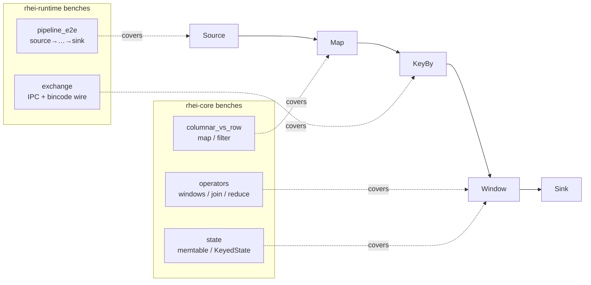
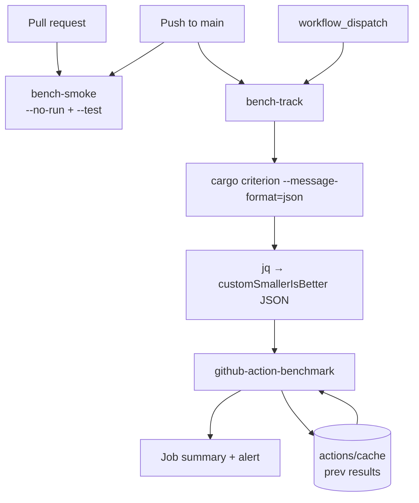

# ADR: Benchmark Suite and CI Integration

**Status:** Accepted
**Date:** 2026-06-11

## Context

Rhei is a performance-oriented stream processor: the entire Arrow columnar
execution model exists to maximize rows/sec and minimize per-row overhead.
Until now the only benchmark was `rhei-core/benches/columnar_vs_row.rs`
(map/filter throughput), and nothing ran benchmarks in CI. This left two gaps:

- **No coverage.** The stateful operators (windows, joins, reduce), the state
  hierarchy hot path, the Exchange wire format, and end-to-end pipeline
  execution — the parts most likely to regress — were never measured.
- **No regression signal.** A change could silently halve throughput and pass
  every check. The ROADMAP item "Benchmark suite with throughput/latency
  targets" was unaddressed.

We want benchmarks that (a) cover the layers where performance actually lives,
(b) cannot bit-rot (they must keep compiling and running as the API evolves),
and (c) surface regressions over time without making CI flaky on noisy shared
runners.

## Decision

Add an **extensive criterion benchmark suite** across `rhei-core` and
`rhei-runtime`, and wire it into CI with a two-tier workflow.

### Benchmark coverage

| File | Crate | Measures |
| --- | --- | --- |
| `benches/columnar_vs_row.rs` | rhei-core | map / filter / filter-expr / chained (pre-existing) |
| `benches/operators.rs` | rhei-core | tumbling & sliding windows, reduce, rolling aggregate, temporal join, flat_map, `partition_by_key` (the key_by split) |
| `benches/state.rs` | rhei-core | `StateContext` raw put/get (L1 memtable), `KeyedState` JSON vs Bincode encoders |
| `benches/exchange.rs` | rhei-runtime | `ErasedBuffer` serialize / deserialize / roundtrip (Arrow IPC + bincode framing) |
| `benches/pipeline_e2e.rs` | rhei-runtime | full `DataflowGraph` via `PipelineController`: map→filter, key_by→window, and 1/2/4-worker scaling |

All benchmarks report `Throughput::Elements`, so results read as rows/sec and a
regression shows up as a throughput drop rather than an opaque time delta.

Benchmark schema types are generated with `#[derive(RheiSchema)]` instead of the
hand-written ~80-line `impl` blocks the original bench used. This works because a
criterion bench is a *separate crate* that links the library, so the macro's
`::rhei_core::arrow::…` paths resolve. `rhei-macros` is added as a **dev**
dependency of `rhei-core` (it has no dependency on `rhei-core`, so no cycle).

### CI workflow (`.github/workflows/ci-bench.yml`)

Two jobs, deliberately split by trigger:

- **`bench-smoke`** (every PR + push): `cargo bench --workspace --no-run` then
  `cargo bench --workspace -- --test`. Criterion's `--test` mode runs each
  benchmark exactly once, so this is a fast guard that benches compile and don't
  panic — without paying for statistical sampling on a noisy runner.
- **`bench-track`** (main + `workflow_dispatch` only): runs the full suite via
  `cargo criterion --message-format=json`, converts the `benchmark-complete`
  messages to `customSmallerIsBetter` JSON with a `jq` one-liner (normalizing
  the unit to nanoseconds), and feeds it to
  `benchmark-action/github-action-benchmark`. Previous results are restored from
  an `actions/cache` data file (no `gh-pages` branch needed), the comparison is
  written to the job summary, and a >200% regression raises a non-blocking
  alert. A second `jq` script (`.github/scripts/bench-summary.jq`) renders the
  absolute median/mean/throughput numbers as a Markdown table in the same job
  summary, so the raw results are visible at a glance alongside the
  delta-vs-baseline comparison.

Perf gating is intentionally **non-blocking** (`fail-on-alert: false`): shared
GitHub runners are too variable to fail a build on, so the value is the trend
line and the alert, not a hard gate.

## Diagram

### Benchmark coverage vs. the data path

### CI flow

## Alternatives considered

- **`tool: cargo` in github-action-benchmark.** That parser only understands
  libtest `#[bench]` output, not criterion. Rejected; we use `cargo criterion`'s
  JSON + `customSmallerIsBetter` instead.
- **Store history in a `gh-pages` branch.** The action's default. Rejected to
  avoid an extra pushed branch and `contents: write`; the cache-backed data file
  gives continuity on `main` with `contents: read`.
- **Hard-fail on regression.** Rejected — shared runners are too noisy;
  a flaky perf gate trains people to ignore it. We alert instead.
- **Run the full suite on every PR.** Rejected — slow and the numbers are noisy
  on PR runners and would pollute the trend line. PRs get the `--test` smoke run.
- **Keep hand-written `RheiSchema` impls in benches.** Rejected — ~80 lines of
  boilerplate per schema; the derive macro resolves correctly from a bench crate.

## Consequences

**Positive**
- Performance-critical layers (operators, state, exchange, e2e) are measured.
- Benchmarks cannot silently bit-rot: every PR compiles and test-runs them.
- Regressions on `main` are tracked over time and alert automatically.
- New benches drop in via `[[bench]]` + the derive macro with minimal ceremony.

**Negative**
- `bench-track` installs `cargo-criterion` (~1–2 min compile) on each main run.
- The cache-based history is best-effort: cache eviction loses the baseline (it
  rebuilds from the next run; no correctness impact).
- Full e2e benches are wall-clock heavy, so they use a reduced sample size — the
  e2e numbers are coarser than the micro-benchmarks.
