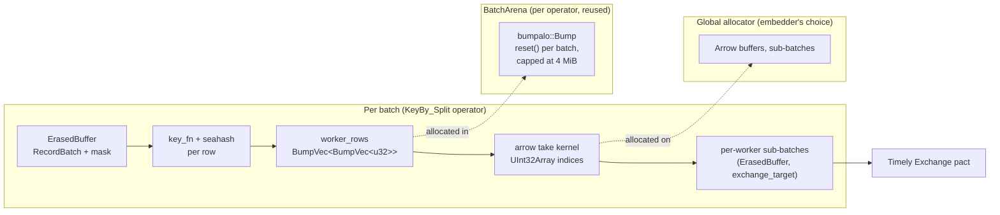
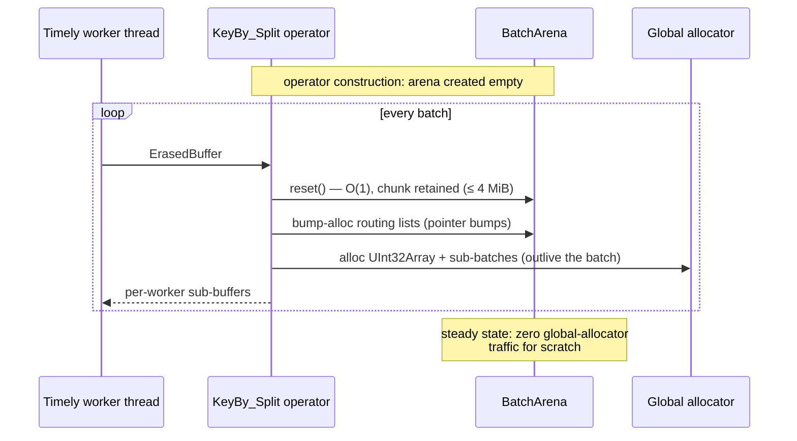

# ADR: Bump-Arena Scratch Buffering for Per-Batch Hot Paths

**Status:** Accepted
**Date:** 2026-07-04

## Context

Timely workers process batches in a tight loop on blocking threads. Several
hot paths need *scratch* memory that lives exactly as long as one batch —
allocated at the top of a batch, dead by the time the operator yields its
outputs. The worst offender was the `key_by` split stage
(`ErasedBuffer::partition_for_exchange`): for **every batch** it allocated

- one `Vec<Vec<usize>>` of per-worker row-routing lists (`num_workers`
  heap allocations, each growing through repeated reallocation), and
- one intermediate `Vec<u32>` per non-empty worker to feed Arrow's `take`
  kernel.

That is `O(num_workers)` global-allocator round-trips per batch, forever,
on the single hottest operator in a keyed pipeline.

`ADR/memory-allocator.md` already established that rhei stays
allocator-agnostic: we run on whatever global allocator the embedding
binary picks, which is glibc ptmalloc2 by default — the allocator that
handles exactly this high-churn, multi-threaded pattern worst. We cannot
fix scratch churn by choosing a better global allocator, because the choice
is not ours to make.

## Decision

Add **`bumpalo`** and route per-batch scratch through a reusable bump
arena instead of the global allocator.

- **`rhei_runtime::arena::BatchArena`** wraps a `bumpalo::Bump`. One arena
  is owned per operator instance per worker (Timely operator closures are
  single-threaded, so no synchronization). Allocation is a pointer bump;
  `reset()` reclaims the whole batch's scratch in O(1) and keeps the
  backing chunk warm, so the steady state after the first few batches is
  **zero global-allocator traffic** for scratch data.
- `partition_for_exchange` now takes `&mut BatchArena`, resets it on
  entry, and builds its per-worker routing lists as
  `bumpalo::collections::Vec<'_, u32>` inside the arena. The intermediate
  per-worker `Vec<u32>` copy is gone entirely — the `UInt32Array` for the
  `take` kernel is built straight from the arena-resident list with
  `from_iter_values` (one exact-sized allocation, which must be on the
  heap anyway because the Arrow array outlives the batch).
- The `key_by` split operator in the executor owns the arena and hands it
  to every invocation, so the chunk is reused batch after batch.
- `reset()` enforces a retained-capacity cap (`MAX_RETAINED_BYTES`, 4 MiB):
  `Bump::reset` keeps the largest chunk ever allocated, so one
  pathologically large batch would otherwise pin that high-water mark for
  the lifetime of a long-running pipeline. Past the cap the arena is
  rebuilt fresh.

The dividing line: **scratch that dies with the batch goes in the arena;
anything that outlives the batch (Arrow arrays, sub-batches handed to
Timely) stays on the global allocator.** Bumpalo does not run `Drop` for
arena contents, so arena residents are restricted to plain data (`u32`
row indices today) — nothing owning heap resources goes in.

This composes with, rather than replaces, the global-allocator policy:
the arena removes scratch churn no matter which allocator the embedder
chose, and `BatchArena` is public so future operators (and embedders'
custom operators) can adopt the same pattern.

## Diagram

Data flow through the `key_by` split stage, showing which allocations moved
into the arena:

Arena lifecycle across batches on one worker:

## Alternatives Considered

- **Switch the global allocator (mimalloc/jemalloc).** Already rejected in
  `ADR/memory-allocator.md` — the choice belongs to the embedding binary.
  Even with a fast global allocator, per-batch scratch still pays
  synchronized allocator round-trips; a worker-local arena is strictly
  cheaper (pointer bump) and works regardless of the embedder's choice.
- **Persistent reusable `Vec`s held by the operator (`clear()` between
  batches).** Viable for this one call site, but it hard-codes the scratch
  shape into the operator: every new scratch structure (nested lists,
  strings, differently-typed staging) needs its own hand-managed pooled
  field. An arena gives all current and future per-batch scratch a single
  uniform story — allocate freely, one `reset()` frees everything — which
  is the "proper buffering" primitive the runtime was missing.
- **`typed-arena`.** Only allocates one `T` per arena and cannot be reset
  without dropping the arena, so the backing memory isn't reusable across
  batches. Bumpalo's `reset()` + `collections` support is the exact shape
  needed.
- **Thread-local arena (`thread_local!`).** Avoids threading `&mut` through
  call signatures, but hides the dependency, complicates tests, and Timely
  already gives us a natural owner (the operator closure) with the right
  lifetime. Explicit ownership keeps borrow-checking honest and the reset
  discipline visible at the call site.

## Consequences

**Positive**

- Steady-state `key_by` splitting performs zero global-allocator calls for
  routing scratch; the previous intermediate `Vec<u32>` copy per worker is
  eliminated outright.
- Batch-to-batch memory reuse regardless of which global allocator the
  embedder selects — complements, and doesn't conflict with, the
  allocator-agnostic policy.
- `BatchArena` is a reusable primitive: future operators with per-batch
  scratch (window pane staging, join probe buffers) adopt it by taking
  `&mut BatchArena`.
- The retention cap bounds long-run memory: an outlier batch cannot pin an
  oversized chunk forever.
- Covered by an `exchange_partition` criterion bench mirroring the runtime
  reuse pattern, plus arena unit tests (reuse across resets, reclamation,
  cap enforcement).

**Negative / Risks**

- One more public dependency (`bumpalo`, MIT/Apache-2.0, already in the
  dependency graph transitively; its internals use `unsafe`, but the
  workspace `unsafe_code = "forbid"` lint applies to our code, and bumpalo
  is a widely-vetted foundational crate).
- Arena contents must not own heap resources (no `Drop` execution). Today
  only `u32` indices live there; the constraint is documented on
  `BatchArena` and enforced by review.
- `partition_for_exchange` grew a parameter, and callers must own an arena.
  Acceptable: there is exactly one runtime call site, and the signature
  makes the reuse contract explicit.
- Key extraction still allocates a `String` per row (`KeyFn` returns
  `String` by value). Moving keys into the arena requires a `KeyFn`
  signature change that touches the compiler, dataflow builder, and Python
  bindings — deferred as follow-up work.
