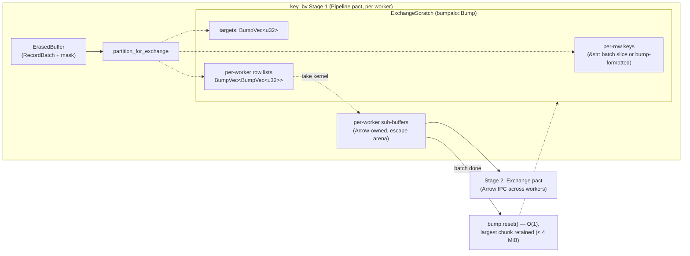
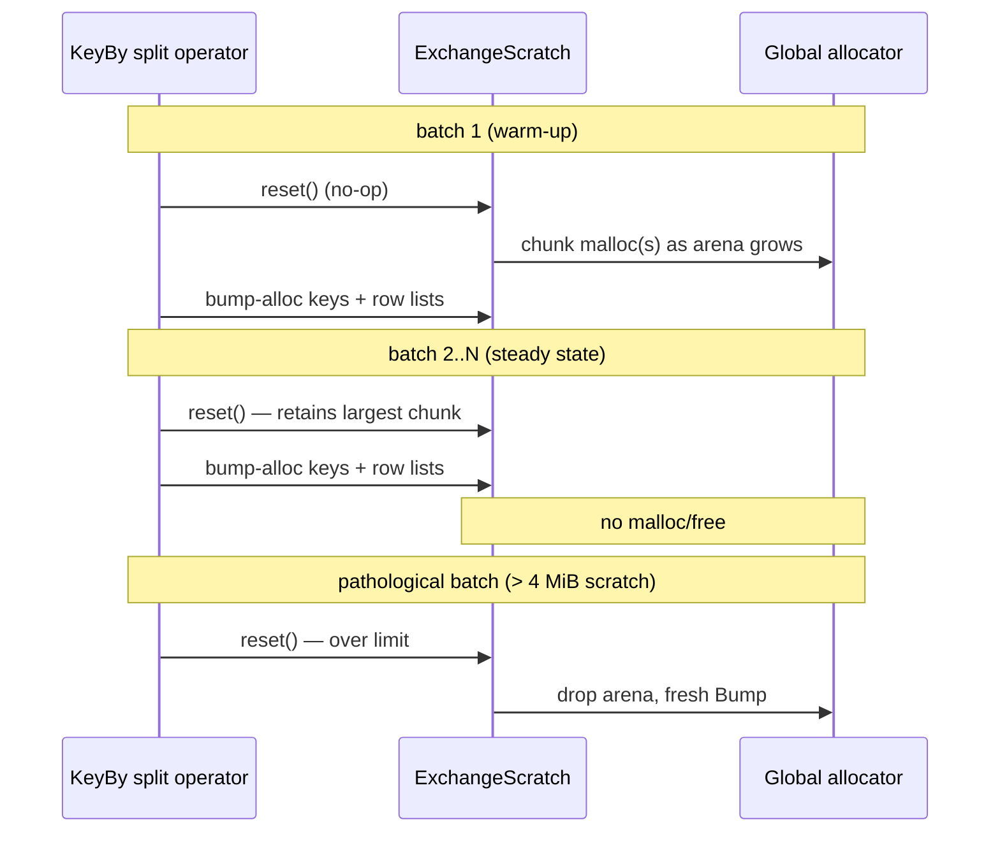

# ADR: Bumpalo Arena Buffering for the Exchange Partitioning Path

**Status:** Accepted
**Date:** 2026-07-04

## Context

Every `key_by` in a multi-worker pipeline runs a two-stage Timely operator
(see `ADR/timely-exchange-dag.md`): Stage 1 splits each incoming
`ErasedBuffer` into per-worker sub-buffers
(`ErasedBuffer::partition_for_exchange`), Stage 2 routes them via the
Exchange pact. Stage 1 sat on the hottest path in the runtime and hit the
global allocator **per row**:

- `KeyFn` was `Arc<dyn Fn(&RecordBatch, usize) -> String>` — one heap-allocated
  `String` per row, immediately hashed and dropped. Even keying by a string
  column that already exists in the batch forced an owned copy.
- Per-worker row assignments used `Vec<Vec<usize>>` — `num_workers + 1`
  allocations per batch, with growth reallocations, all freed at the end of
  the call.
- The Arrow `take` indices were built as `Vec<usize>` → `Vec<u32>` →
  `UInt32Array`, two transient allocations per non-empty partition.

`ADR/memory-allocator.md` established that rhei stays allocator-agnostic: we
don't swap in mimalloc/jemalloc inside the library to make this churn cheap.
The complementary move is to make the hot path stop producing churn at all.
This scratch data has a textbook arena profile: many small allocations, all
with identical lifetime (one batch), freed together.

## Decision

Add [`bumpalo`](https://docs.rs/bumpalo) (with the `collections` feature) to
`rhei-runtime` and buffer all Stage-1 partitioning scratch in a bump arena
that is reset — O(1), no per-object drops — between batches.

1. **`ExchangeScratch`** (`rhei-runtime/src/erased_buffer.rs`): a reusable
   wrapper around `bumpalo::Bump`, owned by each `key_by` split operator (one
   per worker, created inside the Timely operator constructor, so it never
   crosses threads). `reset()` retains the arena's largest chunk, so after
   the first batch the steady state performs **zero global-allocator traffic**
   for partitioning scratch. A soft cap (`RETAIN_LIMIT_BYTES`, 4 MiB) drops
   and rebuilds the arena if a pathological batch grew it larger, so one
   outlier cannot pin memory for the pipeline's lifetime.

2. **Arena-aware `KeyFn`.** The erased key extractor becomes

   ```rust
   pub type KeyFn =
       Arc<dyn for<'k> Fn(&'k RecordBatch, usize, &'k Bump) -> &'k str + Send + Sync>;
   ```

   The returned `&str` may borrow from the batch itself (keying by a string
   column: zero allocation) or be formatted into the arena
   (`bumpalo::format!` / `Bump::alloc_str` for composite keys: one bump
   pointer-advance, no `malloc`). `key_fn_from` pins the higher-ranked
   lifetime so callers write plain closures. `rhei-runtime` re-exports
   `bumpalo` so downstream implementers (e.g. `rhei-python`) build against
   the same version.

3. **`partition_for_exchange` runs entirely in the arena.** Row→worker
   targets, per-worker counts, and per-worker row-index lists are
   `bumpalo::collections::Vec`s. Two passes (assign+count, then fill
   exact-capacity lists) avoid growth waste inside the arena. Only the
   output sub-batches allocate normally — they are Arrow-owned and outlive
   the call, built directly via `UInt32Array::from_iter_values` (dropping the
   old double `Vec` conversion).

4. **`Stream::key_by_ref`** (`rhei-runtime/src/dataflow.rs`): a typed
   zero-allocation companion to `key_by`. The closure receives the row view
   plus the arena and returns a borrowed `&str`:

   ```rust
   stream.key_by_ref(|v: &WordView<'_>, _| v.word);                    // borrow the column
   stream.key_by_ref(|v, bump| bumpalo::format!(in bump, "{}/{}", v.a, v.b).into_bump_str());
   ```

   `key_by` (returning `String`) remains for convenience; its per-row
   `String` is copied into the arena and dropped immediately. The bundled
   examples (`word_count`, `temporal_join`, `window_agg`) now use
   `key_by_ref`.

The `exchange_partition` group in `rhei-runtime/benches/exchange.rs` covers
this path alongside the existing serialize/deserialize benches.

## Diagram

Data flow through the split stage — solid arrows are the batch path, dashed
arrows are arena traffic:



Arena lifecycle across batches:



## Alternatives Considered

- **Swap the global allocator (mimalloc/jemalloc).** Rejected by
  `ADR/memory-allocator.md` — that choice belongs to the final binary. An
  arena removes the traffic instead of making it cheaper, and composes with
  whatever allocator the embedder picks.
- **Hash-only key extraction (`Fn(...) -> u64`).** Fastest possible: no key
  materialization at all. Rejected because the key string is load-bearing
  beyond routing — tests verify routing against `partition_key(&key, n)`,
  and future work (range partitioning, key-aware DLQ context, rescaling)
  needs the key, not just its hash. The arena gets within a pointer-bump of
  the same cost while keeping the key observable.
- **Object pooling (reuse `Vec`s/`String`s across batches).** Pools the
  containers but not the per-row `String`s (they're produced by the user
  closure), needs per-container bookkeeping, and degrades to the allocator on
  size variance. The arena subsumes it with less machinery.
- **`smallvec`/stack buffers for row lists.** Helps only small batches;
  rhei's default batches (thousands of rows) always spill to the heap.
- **Borrow-only typed keys, `for<'v> Fn(&T::View<'v>) -> &'v str`.** The
  obvious `key_by_ref` signature without the arena parameter fails to
  compile (E0582): a late-bound lifetime cannot be constrained solely
  through a GAT projection (`T::View<'v>`). Passing `&'v Bump` as a concrete
  input type anchors `'v` — and is what enables arena-formatted composite
  keys, which a borrow-only signature could not express.

## Consequences

**Positive:**

- Steady-state exchange partitioning performs no global-allocator traffic
  for scratch data; keying by a string column allocates nothing at all.
  This is precisely the "high-churn, cross-thread" profile
  `ADR/memory-allocator.md` flags as ptmalloc2's worst case — now avoided
  rather than tuned around.
- Scratch freeing is one pointer reset instead of `num_rows + num_workers`
  drops; the arena's chunk is reused batch after batch (better locality).
- `KeyFn`'s arena signature gives every implementer (typed Rust closures,
  Python callables, future SQL/dynamic planners) the same zero-`malloc`
  fast path.
- Memory is bounded: at most ~4 MiB retained per `key_by` operator per
  worker between batches (plus transient growth during an oversized batch).

**Negative:**

- `KeyFn` implementations are more involved than `-> String` (HRTB lifetime,
  arena parameter). Mitigated by `key_fn_from` and by `key_by` keeping the
  simple `String` signature for users who don't care.
- `key_by`'s `String` path now pays an extra copy into the arena (bytes are
  copied so the erased signature stays uniform). For typical short keys this
  is noise next to the `String` allocation it already paid; allocation-free
  keying is one `key_by_ref` away.
- Arena scratch for a batch is freed only at the next batch's reset (arena
  semantics), so peak memory during a batch is the sum of all row keys plus
  row lists — bounded by batch sizing, and previously the same rows were
  simply spread across individual allocations.
- One more public dependency surface: `bumpalo` types appear in `KeyFn` and
  `key_by_ref`, so `rhei-runtime` re-exports the crate to keep versions
  aligned.
