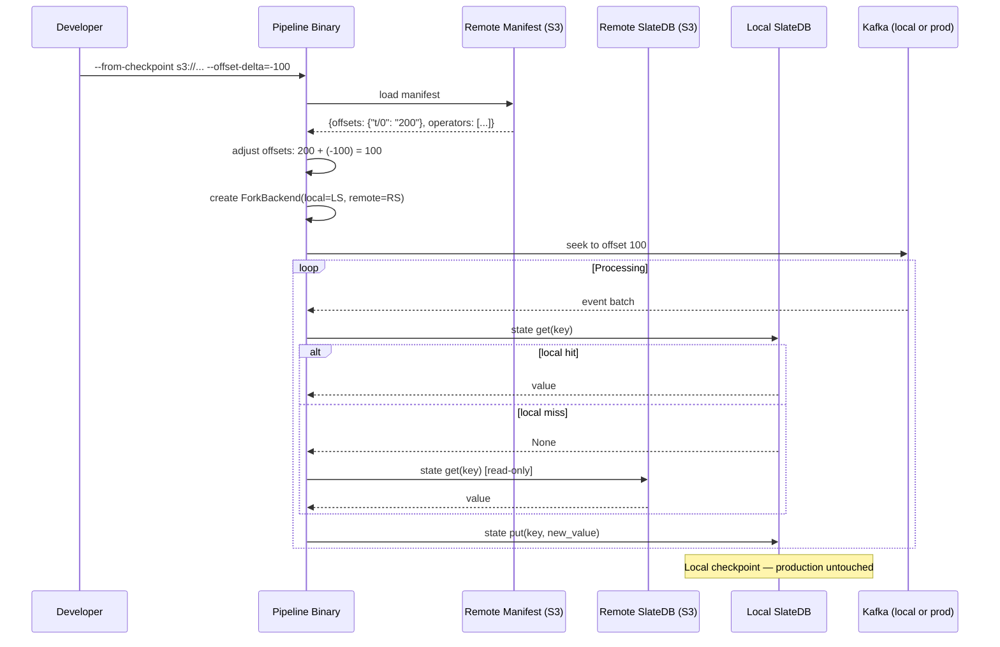
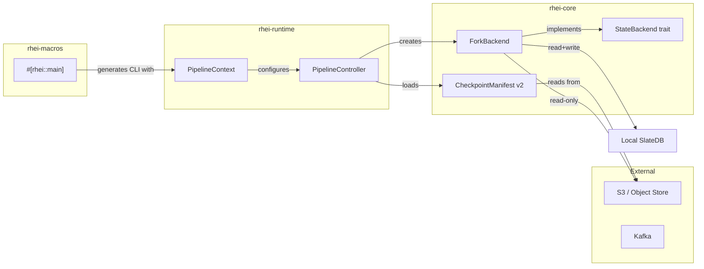

# ADR: Checkpoint Fork — Reproduce Production Locally

**Status:** Accepted
**Date:** 2026-03-27

## Context

When debugging production issues in a streaming pipeline, the developer needs to reproduce the exact state and data flow that led to the problem. Today, rhei supports restarting from checkpoints (manifest + state on S3, Kafka offset seek), but only in the same production environment. There is no way to pull a production checkpoint and run the pipeline locally against a local Kafka with a subset of production data, or against the production Kafka itself.

Stream processing bugs are notoriously hard to reproduce because they depend on the intersection of operator state and specific input sequences. Without the ability to fork production state locally, developers resort to guesswork or ad-hoc state reconstruction.

## Decision

Add a **checkpoint fork** mode to rhei that lets a developer resume a pipeline from a remote production checkpoint with copy-on-write state semantics.

### CLI flags

The pipeline binary (generated by `rhei::pipeline_bin!`) accepts:

```
my_pipeline --from-checkpoint s3://bucket/checkpoints/manifest.json \
            --offset-delta=-100 \
            --workers 2
```

- `--from-checkpoint <URL>` — Object store URL to a remote checkpoint manifest. Triggers fork mode.
- `--offset-delta <i64>` — Signed integer added to every source offset in the manifest before restoring. Default `0`.

**Offset delta examples:**
- Production Kafka, resume from checkpoint as-is: `--offset-delta=0`
- Local Kafka with events loaded starting at offset 0, production checkpoint at offset 100: `--offset-delta=-100`

### ForkBackend

A new `StateBackend` implementation that provides copy-on-write semantics over production state:

```rust
pub struct ForkBackend {
    local: Box<dyn StateBackend>,   // reads + writes
    remote: Box<dyn StateBackend>,  // read-only fallback
}
```

**Read path:** local backend first; on miss, fall through to remote. When a remote read hits, the value is **not** copied into local — it stays in the L1 memtable via `StateContext` and only lands in local on checkpoint flush.

**Write path:** local backend only. Production state is never modified.

**Checkpoint:** flushes to local backend only. The remote backend's `checkpoint()` is never called.

**Delete:** writes a tombstone to local so subsequent reads don't fall through to remote for that key.

### State read flow in fork mode

```
StateContext.get(key)
    → L1 memtable (hit? return)
    → L2 Foyer cache (hit? return, backfill L1)
    → ForkBackend.get(key)
        → local SlateDB (hit? return)
        → remote SlateDB on S3 (read-only, hit? return)
    → backfill L1 memtable
```

### Offset adjustment

When loading the manifest in fork mode:

1. Parse `source_offsets` from the manifest.
2. For each offset value (numeric string), add `offset_delta`.
3. Pass the adjusted offsets to `Source::restore_offsets()`.

This lets the developer control exactly where the pipeline starts consuming, whether that's a local Kafka with re-indexed data or the production cluster.

### Topology constraint

Fork mode requires the local pipeline to run with the **same worker count** as the production checkpoint. State key prefixes are `p{pid}/w{idx}/{op}` — a different worker count would cause prefix mismatches. The controller validates this on startup and fails with a clear error if the manifest's topology doesn't match.

This requires adding topology metadata (process count, workers per process) to `CheckpointManifest`. This is a small additive change to the manifest schema (version bump to 2, backward-compatible — missing fields default to "unknown/skip validation").

### Pipeline binary macro

Today, `rhei run` shells out to `cargo run` and passes configuration via environment variables. This is limiting — the generated binary has no CLI flags of its own.

A new `rhei::pipeline_bin!` proc macro (or attribute macro on `main`) generates a binary with clap-based CLI flags:

```rust
#[rhei::main]
async fn pipeline(ctx: rhei::PipelineContext) -> anyhow::Result<()> {
    let graph = DataflowGraph::new();
    // ... build pipeline ...
    ctx.run(graph).await
}
```

The generated binary accepts `--workers`, `--from-checkpoint`, `--offset-delta`, `--metrics-addr`, `--process-id`, `--peers`, etc. This replaces the env-var-based `from_env()` pattern with proper CLI ergonomics while keeping env var support as fallback.

## Diagram

### Fork mode data flow



### Component ownership



## Alternatives considered

### 1. Download all remote state to local on startup (eager prefetch)

Rejected because production state can be very large (GBs). The developer may only touch a small subset of keys during debugging. Copy-on-write via `ForkBackend` fetches only what's needed.

### 2. Direct remote L3 with write guard

Point the existing tiered storage at remote SlateDB and intercept writes. Rejected because it's fragile — a missed write guard would corrupt production state. `ForkBackend` makes the read/write split explicit and impossible to misconfigure.

### 3. Keep env-var-based configuration instead of CLI flags

Rejected because env vars are invisible and error-prone for interactive debugging workflows. A developer reproducing a production issue wants `--from-checkpoint <url>` not `RHEI_FROM_CHECKPOINT=... cargo run`. The macro approach gives first-class CLI ergonomics.

## Consequences

**Positive:**
- Developers can reproduce production state locally with a single command.
- Production state is never at risk — `ForkBackend` is physically incapable of writing to remote.
- Offset delta makes the feature composable with both local and production Kafka.
- Pipeline binary macro improves general DX beyond just fork mode.

**Negative:**
- First read of each key in fork mode has remote latency (S3 round-trip). Acceptable for debugging; L1/L2 caching mitigates repeat reads.
- Topology must match production (same worker count). Relaxing this is deferred to Phase 3 clustering work (state repartitioning).
- New proc macro crate (`rhei-macros`) adds build complexity. Justified by the DX improvement across all pipeline binaries.
- Manifest schema version bump requires backward-compatible handling of v1 manifests (missing topology fields).
