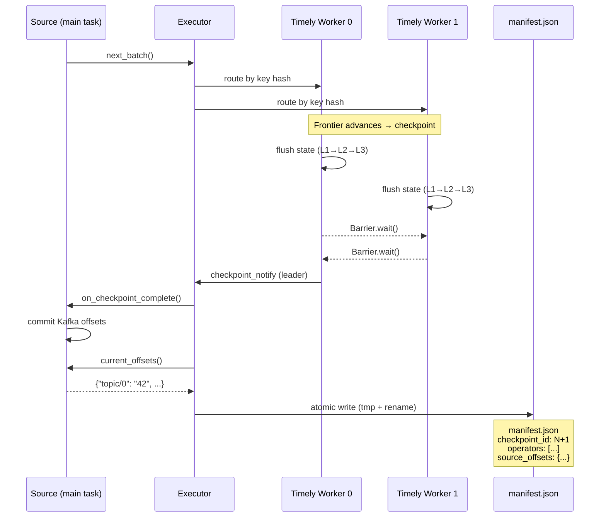
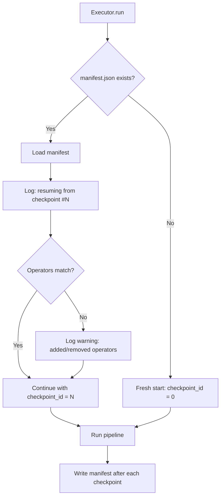
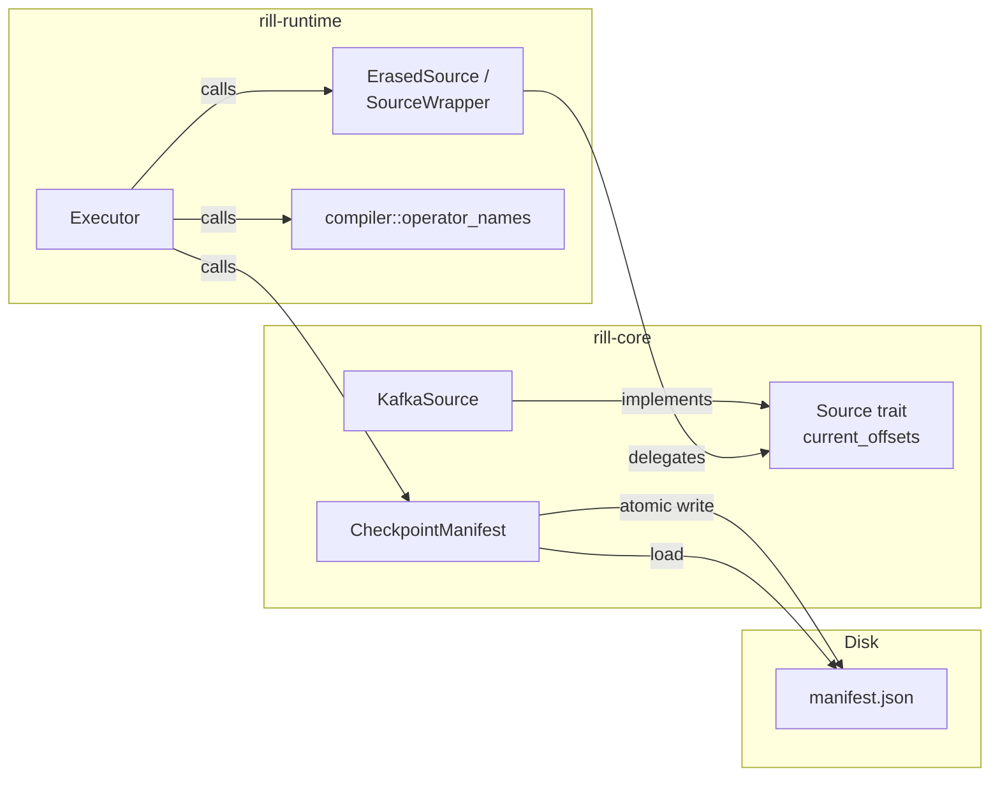

# ADR: Checkpoint Manifest and Restart Validation

**Status:** Accepted
**Date:** 2026-02-21

## Context

Rill's checkpoint infrastructure already persists operator state on each checkpoint cycle: `LocalBackend` writes JSON files that auto-load on construction, and `SlateDbBackend` is durable on S3. Kafka offsets are committed to Kafka's `__consumer_offsets` topic via `on_checkpoint_complete()`. A pipeline restart "happens to work" if you reuse the same checkpoint directory and Kafka consumer group, but there is no formal mechanism to:

- **Record** what was checkpointed (operators, source offsets, timestamp).
- **Verify** consistency at startup (e.g. detect topology changes).
- **Log** that a resume occurred and from which checkpoint.

Without a manifest, operators silently resume from stale state if the topology changes, there is no audit trail of checkpoint history, and debugging restart failures requires manual inspection of checkpoint files.

## Decision

Introduce a **checkpoint manifest** that is atomically persisted after every checkpoint cycle and validated on startup.

### Manifest structure

```rust
pub struct CheckpointManifest {
    pub version: u32,                          // schema version (1)
    pub checkpoint_id: u64,                    // monotonically increasing
    pub timestamp_ms: u64,                     // unix millis
    pub operators: Vec<String>,                // sorted operator names
    pub source_offsets: HashMap<String, String>, // source-specific offsets
}
```

### Persistence

- Written to `{checkpoint_dir}/manifest.json` via temp-file + atomic rename so a crash mid-write never leaves a corrupt file.
- Written after **every** checkpoint cycle (mid-pipeline coordinated checkpoints in multi-worker, and a final checkpoint at pipeline completion).

### Source offset export

- The `Source` trait gains a `current_offsets()` default method returning `HashMap<String, String>` (empty by default).
- `KafkaSource` implements it by formatting tracked offsets as `"topic/partition" -> "offset_value"`.
- The type-erased `ErasedSource` layer forwards the call through `SourceWrapper`.

### Startup validation

On `run()`, the executor:

1. Loads the existing manifest (if any) from the checkpoint directory.
2. Logs a resume message with the checkpoint ID, timestamp, and operator list.
3. Compares the operator names in the manifest against the current pipeline.
4. Logs a **warning** if operators were added or removed, but **proceeds** (state keys are namespaced per operator, so new operators start empty and removed operators' state is harmlessly ignored).
5. Initialises the `checkpoint_id` counter from the manifest so subsequent checkpoints increment monotonically.

### Multi-worker vs single-worker

| Aspect | Multi-worker | Single-worker |
|---|---|---|
| Source access | Source polled directly on main task | Source consumed by bridge (moved into spawned task) |
| Offset recording | Full — `current_offsets()` called after each coordinated checkpoint | Empty — source inaccessible after bridge; offsets committed to Kafka internally |
| Manifest timing | After every `on_checkpoint_complete()` call + final | Once at pipeline completion |

This asymmetry is acceptable because Kafka (the primary offset-tracking source) is used with multi-worker execution. `VecSource` and other finite sources have no meaningful offsets to record.

## Diagram

### Checkpoint cycle (multi-worker)



### Startup validation



### Component ownership



## Alternatives considered

### 1. Store the manifest inside the state backend (SlateDB / LocalBackend)

Rejected because the manifest must be readable independently of operator state. Keeping it as a separate JSON file allows external tooling to inspect checkpoint status without understanding the state backend format.

### 2. Fail on operator mismatch instead of warning

Rejected because strict failure would block common workflows like adding a new operator to an existing pipeline. Since state keys are namespaced (`{operator_name}_w{worker}/...`), mismatched operators are isolated. A warning surfaces the issue without blocking progress.

### 3. Refactor single-worker to retain source access for offset recording

Considered but deferred. Restructuring `execute_single_worker` to poll the source manually (like multi-worker does) would give full offset recording in both paths, but adds complexity for a path that is rarely used with Kafka. The current approach documents the limitation and records empty offsets.

### 4. Use a write-ahead log instead of a single manifest file

Rejected as over-engineering for the current stage. A single atomic manifest file is sufficient for recording the latest checkpoint. A WAL would be needed for incremental checkpointing or multi-pipeline coordination, neither of which is in scope.

## Consequences

**Positive:**
- Restart detection and logging — operators log when resuming from a prior checkpoint.
- Topology mismatch warnings — catches accidental operator renames before they cause silent data issues.
- Audit trail — `manifest.json` records checkpoint ID, timestamp, operators, and source offsets.
- Foundation for future work — the manifest schema (versioned) can be extended for multi-pipeline support, incremental checkpointing, or external checkpoint management.

**Negative:**
- One additional file write per checkpoint cycle. Negligible compared to state flush I/O.
- Single-worker path records empty source offsets — a known limitation documented in code and this ADR.

## Files changed

| File | Change |
|---|---|
| `rill-core/src/checkpoint.rs` | New — `CheckpointManifest` with `save`/`load` |
| `rill-core/src/lib.rs` | Register `pub mod checkpoint` |
| `rill-core/src/traits.rs` | Add `current_offsets()` default to `Source` |
| `rill-core/src/connectors/kafka_source.rs` | Implement `current_offsets()` |
| `rill-runtime/src/dataflow.rs` | Add `current_offsets()` to `ErasedSource` + `SourceWrapper` |
| `rill-runtime/src/compiler.rs` | Add `operator_names()` helper |
| `rill-runtime/src/executor.rs` | Manifest load/save, startup validation, checkpoint recording |
| `rill-runtime/tests/checkpoint_restart.rs` | New — E2E restart and mismatch tests |
