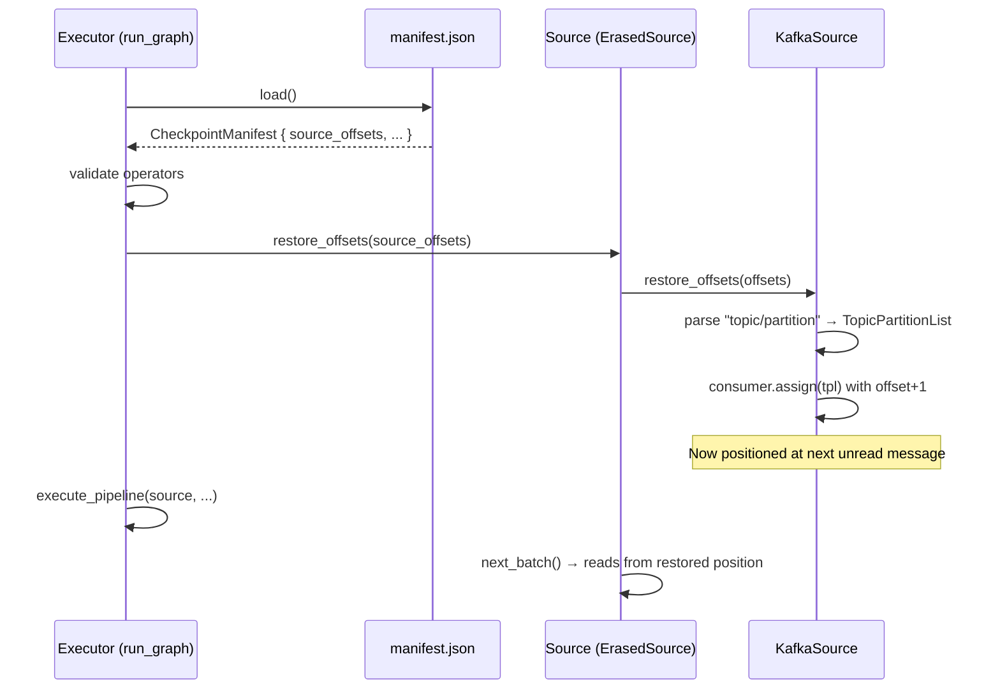
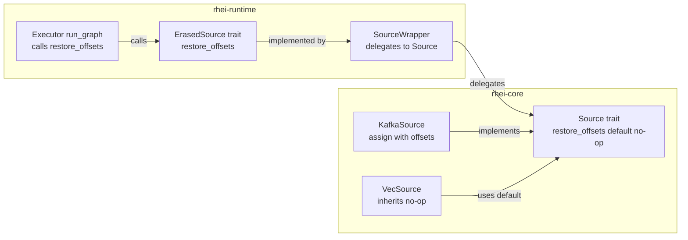
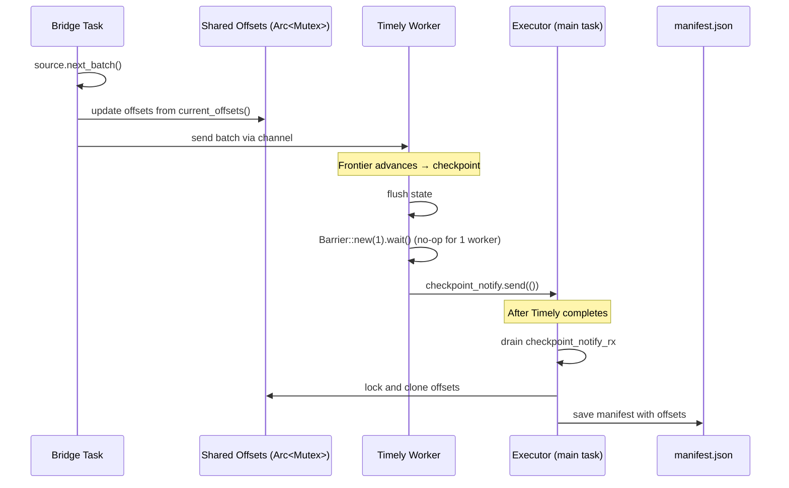

# ADR: Checkpoint Restore — Offset Recovery and Single-Worker Parity

**Status:** Accepted
**Date:** 2026-02-21

## Context

The existing checkpoint manifest (see `ADR/checkpoint-manifest.md`) persists source offsets and validates operator topology on restart, but five gaps remain:

1. **KI-2 — Offsets never restored to sources.** On restart, the manifest is loaded and validated, but persisted source offsets are discarded. Sources start from their default position (e.g. Kafka consumer group committed offset or `auto.offset.reset`), causing data re-consumption if the manifest is ahead of the committed offset (crash between checkpoint and Kafka commit).

2. **KI-8 — Hardcoded checkpoint interval.** The multi-worker main loop uses `let checkpoint_interval: u64 = 100;` with no way to configure it. Users cannot tune the trade-off between checkpoint frequency and throughput.

3. **KI-12 — Single-worker records empty source offsets.** In `execute_single_worker`, the source is moved into the bridge task, making `current_offsets()` unreachable. The final manifest always writes `source_offsets: {}`.

4. **KI-15 — Single-worker swallows checkpoint events.** `execute_single_worker` passes `None` for both `checkpoint_barrier` and `checkpoint_notify`, so Timely checkpoint events inside the dataflow are silently dropped. No intermediate manifests are written.

5. **KI-16 — No seek API on sources.** There is no `restore_offsets()` method on the `Source` trait. Even if KI-2 extracted offsets from the manifest, there is no way to tell a source to seek to specific positions.

Together, these gaps break at-least-once semantics on restart and make single-worker mode a second-class citizen for checkpointing.

## Decision

Five coordinated changes, applied in dependency order:

### 1. Configurable checkpoint interval (KI-8)

Add a `checkpoint_interval: u64` field to `Executor` and `ExecutorBuilder` with a default of `100`. Expose a builder method `checkpoint_interval(interval)` with `assert!(interval >= 1)`. The multi-worker main loop reads from the executor instead of a hardcoded constant.

### 2. Single-worker offset tracking (KI-12)

Add `erased_source_bridge_with_offsets()` in `bridge.rs`. This variant shares an `Arc<Mutex<HashMap<String, String>>>` between the bridge task and the caller. After each `next_batch()`, the bridge task copies the source's `current_offsets()` into the shared map. `execute_single_worker` reads from this map when writing manifests.

### 3. Single-worker checkpoint coordination (KI-15)

Create a `Barrier::new(1)` and `mpsc::channel` before `spawn_blocking` in `execute_single_worker`. Pass them into `build_timely_dataflow`. After Timely completes, drain checkpoint notifications and write intermediate manifests using the shared offset map from KI-12.

### 4. `restore_offsets()` trait method + KafkaSource seek (KI-16)

Add a default no-op `restore_offsets(&mut self, offsets: &HashMap<String, String>)` to the `Source` trait. Thread it through `ErasedSource` and `SourceWrapper`. `KafkaSource` implements it by parsing `"topic/partition"` keys, building a `TopicPartitionList` with `Offset::Offset(offset + 1)`, and calling `consumer.assign()` to switch to manual partition assignment at the correct positions.

### 5. Wire offset restoration in executor (KI-2)

In `run_graph`, extract `source_offsets` from the loaded manifest. Pass them through `execute_pipeline` to the source. Call `source.restore_offsets(&offsets)` before the source is handed to the bridge or polling loop, ensuring it seeks before producing any batches.

## Diagram

### Restart flow — offset restoration

### Component flow — `restore_offsets` through trait hierarchy

### Single-worker checkpoint flow (after KI-12 + KI-15)

## Alternatives considered

### 1. Rely solely on Kafka consumer group offsets for restart positioning

Rejected. The manifest may record offsets ahead of the last committed Kafka offset if a crash occurs between checkpoint and `on_checkpoint_complete()`. Restoring from the manifest ensures the source position matches the operator state, maintaining at-least-once semantics.

### 2. Refactor single-worker to keep source un-bridged (poll directly like multi-worker)

Rejected as too invasive. The bridge pattern is deeply integrated into the single-worker Timely dataflow. Sharing offsets via `Arc<Mutex<HashMap>>` achieves parity with minimal structural change and negligible contention (one write per batch, one read per checkpoint).

### 3. Time-based checkpoint interval instead of batch-based

Deferred. Batch-based intervals are simpler to reason about and sufficient for current use cases. Time-based intervals would require a separate timer in the main loop and complicate the checkpoint coordination protocol.

## Consequences

**Positive:**
- At-least-once semantics on restart — sources seek to the exact position recorded in the last checkpoint manifest, preventing data loss or excessive re-consumption.
- Configurable checkpoint interval — users can tune throughput vs. recovery granularity.
- Single-worker parity — single-worker manifests now record source offsets and respond to Timely checkpoint events, matching multi-worker behavior.
- Non-breaking — `restore_offsets()` has a default no-op implementation. Existing `Source` implementations (VecSource, custom sources) require no changes.

**Negative:**
- `KafkaSource::restore_offsets()` calls `consumer.assign()`, which overrides consumer group rebalancing. When restoring from a checkpoint, the consumer switches to manual partition assignment. This is intentional (the checkpoint knows better than the consumer group) but means the consumer will not participate in group rebalancing until the next fresh start.
- Shared offset state in single-worker adds an `Arc<Mutex<HashMap>>` lock acquisition per batch. Given batch granularity (not per-message), contention is negligible.

## Files changed

| File | Change |
|---|---|
| `ADR/checkpoint-restore.md` | New — this ADR |
| `rhei-core/src/traits.rs` | Add `restore_offsets()` default method to `Source` |
| `rhei-core/src/connectors/kafka_source.rs` | Implement `restore_offsets()` with `consumer.assign()` |
| `rhei-runtime/src/dataflow.rs` | Add `restore_offsets()` to `ErasedSource` + `SourceWrapper` |
| `rhei-runtime/src/bridge.rs` | Add `erased_source_bridge_with_offsets()` |
| `rhei-runtime/src/executor.rs` | Configurable interval, single-worker coordination, offset restore wiring |
