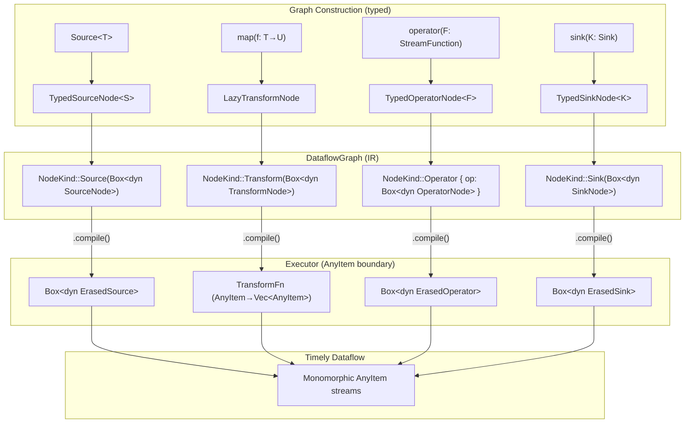
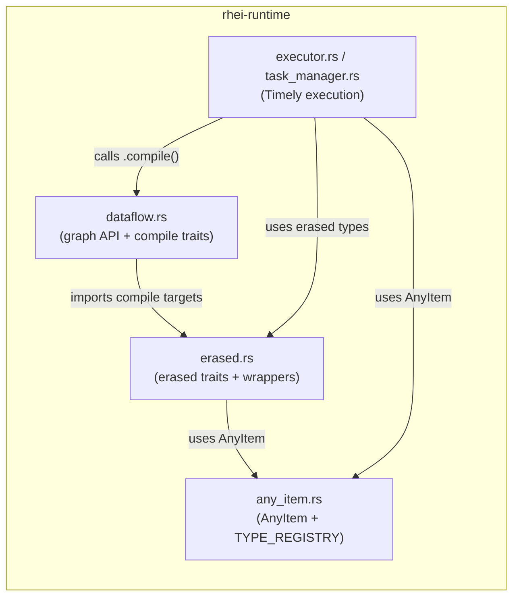

# ADR: Confine AnyItem to the Timely Execution Boundary

**Status:** Accepted
**Date:** 2026-03-28

## Context

`AnyItem` is a type-erased `Box<dyn CloneAnySend>` wrapper required by Timely Dataflow, which demands a single monomorphic stream element type. Previously, `AnyItem` permeated the entire runtime: the `DataflowGraph` API stored `TransformFn` closures (`Arc<dyn Fn(AnyItem, &TransformContext) -> Vec<AnyItem>>`), `ErasedOperator` / `ErasedSource` / `ErasedSink` trait objects, and `KeyFn` extractors — all operating on `AnyItem` — directly inside graph nodes.

This meant:

- **Type safety lost at graph construction time.** A `Stream<T>.map(f)` immediately erased `T` into `AnyItem`, so the graph carried no type information between construction and execution.
- **Poor separation of concerns.** The graph IR (data structure) was coupled to the Timely execution layer (runtime). Adding a new executor backend would require re-implementing AnyItem-based erasure.
- **Difficult to reason about.** Every graph node contained closures that downcast `AnyItem` internally, making the boundary between typed user code and erased runtime code invisible.

## Decision

Confine `AnyItem` to the Timely execution boundary by introducing **compile traits** on graph nodes. The `DataflowGraph` stores typed wrappers that defer AnyItem conversion to a `compile()` call, which only happens when the executor materializes the graph into a Timely dataflow.

### Module restructuring

| Module | Responsibility |
|---|---|
| `any_item.rs` | `AnyItem` definition, `CloneAnySend` trait, `TYPE_REGISTRY` for cross-process deser |
| `erased.rs` | Type-erased traits (`ErasedSource`, `ErasedSink`, `ErasedOperator`), wrappers (`SourceWrapper`, `SinkWrapper`, `OperatorWrapper`), `DlqTag<T>`, `DlqErasedOperator`, `TransformFn`, `KeyFn` |
| `dataflow.rs` | Graph API (`DataflowGraph`, `Stream<T>`, `KeyedStream<T>`), compile traits (`SourceNode`, `TransformNode`, `KeyByNode`, `OperatorNode`, `SinkNode`), typed node wrappers |

### Compile trait pattern

Each graph node kind has a corresponding trait with a single `compile()` method that produces the AnyItem-based erased form:

```rust
pub(crate) trait SourceNode: Send {
    fn compile(self: Box<Self>) -> Box<dyn ErasedSource>;
}
pub(crate) trait TransformNode: Send {
    fn compile(self: Box<Self>) -> TransformFn;
}
pub(crate) trait OperatorNode: Send {
    fn compile(self: Box<Self>) -> Box<dyn ErasedOperator>;
}
pub(crate) trait SinkNode: Send {
    fn compile(self: Box<Self>) -> Box<dyn ErasedSink>;
}
```

### Lazy transform nodes

Stateless transforms (`map`, `filter`, `flat_map`) use `LazyTransformNode`, which stores a `Box<dyn FnOnce() -> TransformFn + Send>`. The closure captures typed user functions and only constructs the AnyItem-based `TransformFn` when `compile()` is called. This avoids needing separate typed node structs for each combinator while still deferring erasure.

### NodeKind

```rust
pub(crate) enum NodeKind {
    Source(Box<dyn SourceNode>),
    Transform(Box<dyn TransformNode>),
    KeyBy(Box<dyn KeyByNode>),
    Operator { name: String, op: Box<dyn OperatorNode> },
    Merge,
    Sink(Box<dyn SinkNode>),
}
```

The executor calls `compile()` when extracting nodes from the graph, which is the single point where AnyItem conversion occurs.

## Diagram

### Type-erasure boundary



### Module dependency



## Alternatives considered

### 1. Remove AnyItem entirely and use generic Timely streams

Rejected. Timely Dataflow requires a single element type across all stream operators in a dataflow. Generic streams would require monomorphizing the entire Timely DAG per pipeline configuration, which is not feasible with Timely's API.

### 2. Keep AnyItem in graph nodes but add typed phantom markers

Rejected. This would add type safety via `Stream<T>` phantom types (which we already have) but leave the runtime coupling intact. The closures inside graph nodes would still operate on `AnyItem`, and the module structure would remain tangled.

### 3. Full typed IR with enum-based node kinds

Considered but deferred. A fully typed IR where each node variant carries its concrete types would require GATs or extensive enum variants. The compile-trait approach gives the same separation with less complexity.

## Consequences

**Positive:**
- **Clear boundary.** AnyItem only appears in `any_item.rs`, `erased.rs`, `executor.rs`, `task_manager.rs`, and `timely_operator.rs` — the execution layer. Graph construction code in `dataflow.rs` references AnyItem only inside `compile()` implementations.
- **Better separation of concerns.** The graph IR is decoupled from the execution layer. A future alternative executor could implement its own compile targets.
- **Easier to reason about.** The type-erasure point is explicit and localized at `compile()` calls.
- **No public API changes.** `Stream<T>`, `KeyedStream<T>`, and all user-facing methods are unchanged.

**Negative:**
- **Additional indirection.** Each graph node stores a trait object (`Box<dyn SourceNode>` etc.) that wraps the user type, adding one layer of dynamic dispatch at compile time (not at runtime processing).
- **Lazy closures for transforms.** `LazyTransformNode` uses `Box<dyn FnOnce()>` which is slightly less transparent than a direct struct, though it keeps the code concise.

## Files changed

| File | Change |
|---|---|
| `rhei-runtime/src/any_item.rs` | Extracted from `dataflow.rs` — `AnyItem`, `CloneAnySend`, `TYPE_REGISTRY`, `register_type`, `Debug` impl |
| `rhei-runtime/src/erased.rs` | New — all type-erased traits, wrappers, `DlqTag<T>`, `TransformFn`, `KeyFn` |
| `rhei-runtime/src/dataflow.rs` | Removed erased types, added compile traits (`SourceNode`, `TransformNode`, `KeyByNode`, `OperatorNode`, `SinkNode`) and typed wrappers (`TypedSourceNode`, `LazyTransformNode`, `TypedOperatorNode`, `DlqOperatorNode`, `TypedSinkNode`) |
| `rhei-runtime/src/lib.rs` | Added `pub(crate) mod any_item` and `pub(crate) mod erased` |
| `rhei-runtime/src/executor.rs` | Updated imports to use `crate::any_item` and `crate::erased` |
| `rhei-runtime/src/task_manager.rs` | Updated imports, `extract_*` functions now call `.compile()` |
| `rhei-runtime/src/bridge.rs` | Updated import path for `ErasedSource` |
| `rhei-runtime/src/timely_operator.rs` | Updated import path for `ErasedOperator` |
