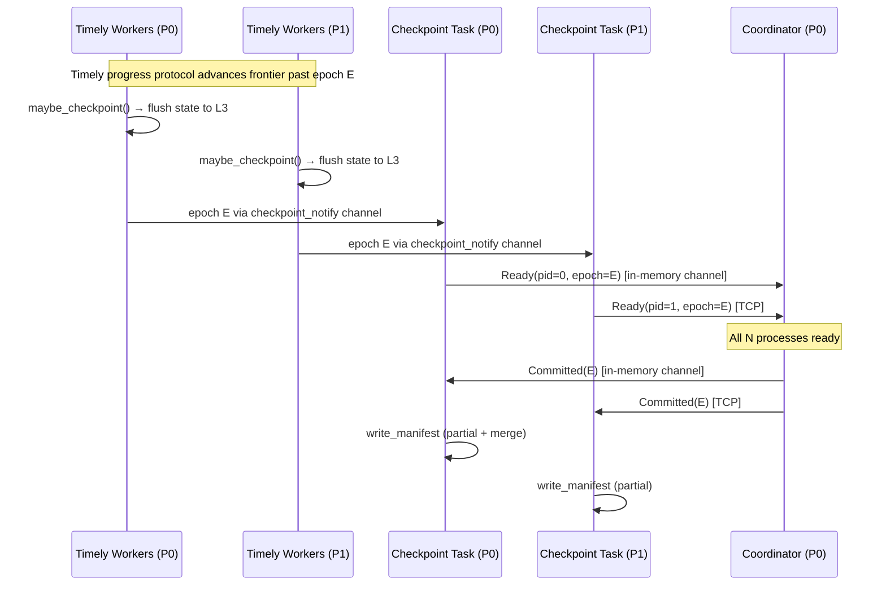
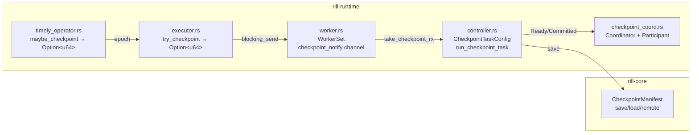

# ADR: Coordinated Checkpointing & Distributed State Backend

**Status:** Accepted
**Date:** 2026-02-27

## Context

Multi-process Timely execution works (TCP cluster, E2E tested), but checkpoints are process-local: each process flushes state independently, partial manifests are only merged after the DAG completes, and there is no guarantee that other processes have flushed before the merge. For long-running streaming pipelines, intermediate checkpoints never produce a merged manifest at all.

Additionally, there is no shared state backend configuration — each process opens SlateDB locally, requiring manual remote object store setup outside the builder API.

## Decision

Add three capabilities:

1. **Cross-process checkpoint coordination** via a lightweight TCP protocol separate from Timely's data plane.
2. **Mid-execution checkpoint task** that writes manifests concurrently with DAG execution.
3. **Remote state configuration** via builder API and environment variables (supports S3, Azure Blob, GCS).

### Coordination protocol

Process 0 runs a `CheckpointCoordinator`; all other processes connect as `CheckpointParticipant`s. Process 0 self-participates via in-memory channels (no TCP to itself).

**Messages** (bincode-encoded, length-prefixed):

| Message | Direction | Fields |
|---------|-----------|--------|
| `Ready` | Participant -> Coordinator | `process_id: usize`, `epoch: u64` |
| `Committed` | Coordinator -> Participants | `epoch: u64` |

**Port:** Derived from the first Timely peer address port + 1000, or overridden via `RILL_CHECKPOINT_PORT`.

### Checkpoint channel enhancement

The checkpoint notification channel carries `u64` epoch numbers (instead of `()`) so the coordination layer knows which epoch was checkpointed. Changed from `std::sync::mpsc` to `tokio::sync::mpsc` for async compatibility in the checkpoint management task.

### Mid-execution checkpoint task

A Tokio task spawned alongside the Timely DAG receives epoch notifications and writes manifests as they arrive. In cluster mode, it coordinates with other processes before writing. On DAG completion, the task is cancelled and a final manifest is written during cleanup.

### State key prefix

Changed cluster-mode prefix from `p{pid}_w{idx}_{op}` to `p{pid}/w{idx}/{op}` to match the CLUSTERING.md specification and be consistent with the slash-separated convention used elsewhere.

### Remote state configuration

`RemoteStateConfig` struct with builder method `.remote_state(config)` and environment variable support (`RILL_REMOTE_BUCKET`, `RILL_REMOTE_PREFIX`, `RILL_REMOTE_ENDPOINT`, `RILL_REMOTE_REGION`, `RILL_REMOTE_ALLOW_HTTP`). Feature-gated on `remote-state`. Supports S3, Azure Blob Storage, and GCS via the `object_store` crate.

`CheckpointManifest` gains `save_to_object_store()` and `load_from_object_store()` for remote manifest storage.

## Diagram

### Coordination flow per checkpoint epoch

### Component architecture

## Alternatives considered

### 1. File-based polling for coordination

Each process writes a "ready" marker file; the coordinator polls for all markers. Rejected: introduces unnecessary I/O latency, race conditions with filesystem caching, and doesn't scale as cleanly as TCP.

### 2. Piggyback on Timely's progress protocol

Inject checkpoint barriers as special epochs and use Timely's frontier tracking to confirm all processes are done. Rejected: conflates data progress with durability confirmation. If a process has finished processing an epoch but not yet flushed to L3, Timely would report it as complete prematurely.

### 3. gRPC for coordination

Use tonic/gRPC instead of raw TCP with bincode. Rejected as over-engineering for two simple message types. The lightweight TCP protocol adds no new dependencies and is sufficient for Phase 2. Phase 3 (control plane) will introduce gRPC for the full Job Manager API.

### 4. Embed coordination in the checkpoint manifest merge

Process 0 polls for partial manifests from all processes in a loop. Rejected: requires all processes to write partial manifests to a shared filesystem, which doesn't work when processes are on different machines without shared storage.

## Consequences

**Positive:**
- Long-running pipelines now produce consistent intermediate checkpoints.
- Cross-process checkpoint coordination ensures all processes have flushed state before the manifest is committed.
- Remote state configuration via builder API simplifies distributed deployment.
- Epoch-carrying checkpoint channel enables future per-epoch source offset tracking.

**Negative:**
- Additional TCP port required for coordination (derived automatically from Timely peer port).
- Coordinator is a single point of failure (process 0). If process 0 crashes, all processes stop (consistent with Timely's failure model).
- The `read_from_any` polling loop in the coordinator uses 10ms timeouts, which adds latency to checkpoint coordination. Acceptable for checkpoint frequency (seconds to minutes).

## Files changed

| File | Change |
|------|--------|
| `rill-runtime/src/checkpoint_coord.rs` | New: coordinator + participant protocol |
| `rill-runtime/src/controller.rs` | Prefix fix, remote state config, mid-execution checkpoint task, coordinator integration |
| `rill-runtime/src/worker.rs` | Channel `()` -> `u64`, `std::sync::mpsc` -> `tokio::sync::mpsc` |
| `rill-runtime/src/executor.rs` | Forward epoch from `try_checkpoint` |
| `rill-runtime/src/timely_operator.rs` | `maybe_checkpoint` returns `Option<u64>` |
| `rill-runtime/src/lib.rs` | Register `checkpoint_coord` module |
| `rill-core/src/checkpoint.rs` | `save_to_object_store` / `load_from_object_store` |
| `rill-runtime/tests/checkpoint_coord_e2e.rs` | New: cross-process coordination E2E |
| `ROADMAP.md` | Mark Phase 2 items complete |
