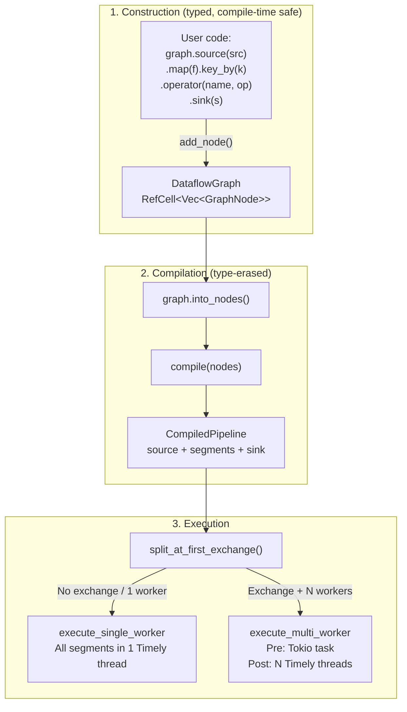
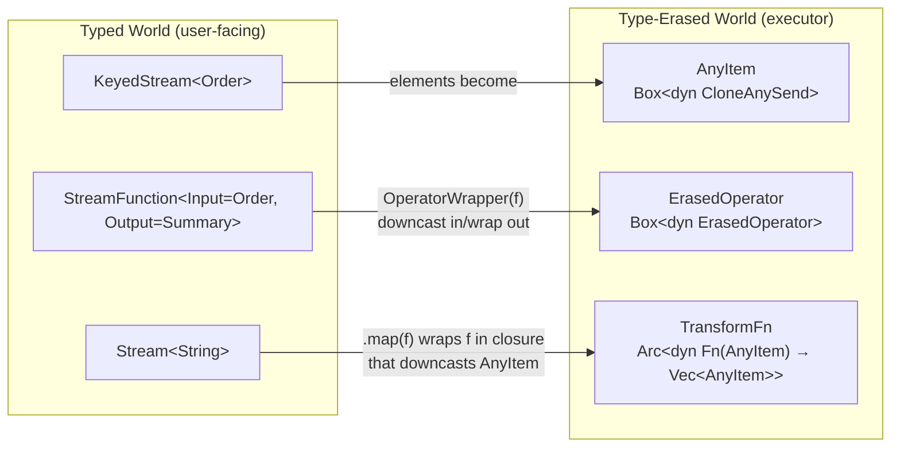
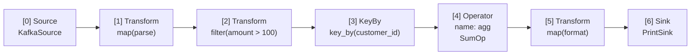
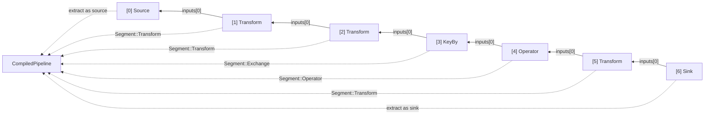
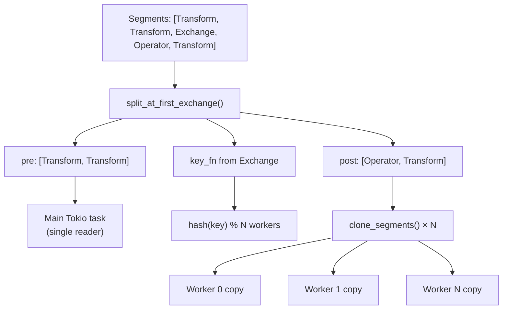
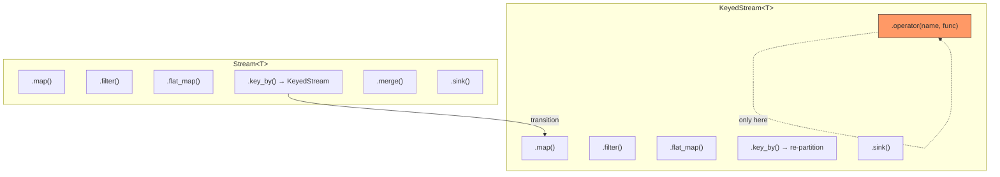

# ADR: Dataflow Graph API and Compilation

**Status:** Accepted
**Date:** 2026-02-21

## Context

Rhei needs a user-facing API for constructing stream processing pipelines. The API must:

- Be type-safe — a `Stream<String>` should not accept an operator expecting `i32`.
- Support both stateless transforms (map, filter) and stateful operators (windows, aggregations).
- Enforce that stateful operators only run on keyed streams (key affinity is required for correctness).
- Compile to an executable form that the Timely-backed executor can run.
- Support multi-worker execution where operators are cloned per worker.

The core tension is between type safety (compile-time enforcement of stream types) and type erasure (the executor needs homogeneous types to build Timely dataflows dynamically).

## Decision

### Two-phase design: typed construction, type-erased execution

1. **Construction phase**: Users build pipelines with generic `Stream<T>` and `KeyedStream<T>` handles. All type checking happens at compile time via Rust's type system.
2. **Compilation phase**: The graph is compiled into `CompiledPipeline` with type-erased `Segment`s. Concrete types are wrapped in `AnyItem` (a cloneable `Box<dyn Any + Send>`).
3. **Execution phase**: The executor materializes segments into Timely dataflows, downcasting `AnyItem` back to concrete types inside closures that captured the original type information.

### DataflowGraph with interior mutability

```rust
pub struct DataflowGraph {
    nodes: RefCell<Vec<GraphNode>>,
}
```

`RefCell` enables shared `&DataflowGraph` references to add nodes. Graph construction is single-threaded — `RefCell` is sufficient, no `Mutex` needed. The graph is consumed by `into_nodes()` for compilation.

### Stream and KeyedStream: copyable handles

```rust
pub struct Stream<'a, T> {
    graph: &'a DataflowGraph,
    node_id: NodeId,
    _phantom: PhantomData<T>,
}
```

Handles are `Copy` (via `PhantomData<T>` — no actual `T` stored). Lifetime `'a` ties the handle to the graph, preventing use-after-drop. Each operation (`.map()`, `.filter()`, etc.) adds a node to the graph and returns a new handle. This enables a fluent builder pattern:

```rust
graph.source(kafka_source)
    .map(parse)
    .filter(|o| o.amount > 100)
    .key_by(|o| o.customer_id.clone())
    .operator("agg", SumOp)
    .sink(output_sink);
```

### Compile-time enforcement of keyed operations

Stateful operators (`.operator()`) are only available on `KeyedStream<T>`, not `Stream<T>`. The transition from `Stream` to `KeyedStream` happens via `.key_by()`. This enforces at compile time that stateful operators always run on partitioned data — a requirement for correct multi-worker execution.

Stateless transforms (`.map()`, `.filter()`, `.flat_map()`) are available on both `Stream` and `KeyedStream`. On `KeyedStream`, they preserve the partitioning.

### Type erasure via AnyItem

```rust
pub(crate) struct AnyItem(Box<dyn CloneAnySend>);
```

`CloneAnySend` requires `Clone + Any + Send + Debug`. The `Clone` bound enables genuine cloning (needed for Timely's Exchange pact). `Debug` enables `debug_repr()` for DLQ diagnostics. Downcasting (`AnyItem::downcast::<T>()`) panics on type mismatch — but this cannot happen in practice because closures capture the concrete type at construction time.

### Arc-wrapped closures for worker sharing

```rust
pub(crate) type TransformFn = Arc<dyn Fn(AnyItem, &TransformContext) -> Vec<AnyItem> + Send + Sync>;
pub(crate) type KeyFn = Arc<dyn Fn(&AnyItem) -> String + Send + Sync>;
```

`Arc` wrapping allows cheap cloning for per-worker copies. Each worker shares the same closure via `Arc::clone()`. Stateful operators use `clone_erased()` (deep clone) since each worker needs its own mutable state.

### TransformContext for worker metadata

```rust
pub struct TransformContext {
    pub worker_index: usize,
    pub num_workers: usize,
}
```

Available via `_ctx` variants (`.map_ctx()`, `.filter_ctx()`, `.flat_map_ctx()`). Enables worker-aware transforms without requiring a full stateful operator.

### Graph node model

```rust
pub(crate) enum NodeKind {
    Source(Box<dyn ErasedSource>),
    Transform(TransformFn),
    KeyBy(KeyFn),
    Operator { name: String, op: Box<dyn ErasedOperator> },
    Merge,
    Sink(Box<dyn ErasedSink>),
}

pub(crate) struct GraphNode {
    pub id: NodeId,
    pub kind: NodeKind,
    pub inputs: Vec<NodeId>,
}
```

Nodes are stored in a flat `Vec`. `NodeId` is a sequential index. Each node records its input node IDs (0 for Source, 1 for most nodes, 2 for Merge).

### Compilation: backward walk from sinks

The `compile()` function converts the graph into executable `CompiledPipeline`s:

1. Find all Sink nodes.
2. For each sink, walk backward via `inputs[0]` to the source.
3. Validate linear topology (no fan-out, no merge — detected and rejected).
4. Extract middle nodes as `Segment`s (Transform, Exchange, Operator).
5. Extract source and sink. Package as `CompiledPipeline { source, segments, sink }`.

Node extraction uses `std::mem::replace` to take ownership from the mutable vector without invalidating other nodes.

### Pipeline splitting for execution

```rust
pub(crate) fn split_at_first_exchange(
    segments: Vec<Segment>,
) -> (Vec<Segment>, Option<(KeyFn, Vec<Segment>)>)
```

Splits segments at the first `Exchange` (key_by). Returns `(pre_exchange, Option<(key_fn, post_exchange)>)`. This determines the execution path:

- **No exchange or single worker**: All segments run in one Timely worker.
- **Exchange with multiple workers**: Pre-exchange runs on the main Tokio task; post-exchange runs in N Timely workers with hash-based routing.

### Segment cloning for multi-worker

```rust
pub(crate) fn clone_segments(segments: &[Segment]) -> Vec<Segment>
```

Creates per-worker copies. `Arc` transforms are cheap clones (reference count increment). Operators use `clone_erased()` (deep clone via `StreamFunction::clone()`).

## Diagram

### Pipeline construction to execution



### Type erasure boundary



### Graph node topology (example)



### Compilation: backward walk



### Split at exchange for execution routing



### Stream vs KeyedStream API surface



## Alternatives considered

### 1. Fully typed compilation (no type erasure)

Rejected. Without type erasure, every pipeline topology would need a unique Rust type, making the executor generic over the entire pipeline shape. This would prevent dynamic graph construction, complicate the Timely integration (which needs homogeneous stream types), and make compilation times impractical for complex pipelines.

### 2. Macro-based pipeline DSL

Rejected. Procedural macros could generate typed pipeline code, but they are harder to debug, produce opaque error messages, and prevent runtime graph construction (e.g., building pipelines from configuration files). The `Stream<T>`/`KeyedStream<T>` API provides equivalent type safety with standard Rust generics.

### 3. Allow stateful operators on unkeyed streams

Rejected. Stateful operators without key partitioning produce incorrect results in multi-worker execution — different workers would independently maintain state for the same key, leading to inconsistent counts/windows. Requiring `.key_by()` before `.operator()` prevents this class of bugs at compile time.

### 4. `Rc<RefCell<DataflowGraph>>` instead of `RefCell` with lifetimes

Rejected. `Rc` would allow graph handles to outlive the graph (use-after-free at the type level). The lifetime-based approach (`Stream<'a, T>` borrows `&'a DataflowGraph`) ensures handles cannot be used after the graph is consumed by `into_nodes()`. This is enforced at compile time with zero runtime cost.

### 5. Trait-object-based closures instead of Arc-wrapped closures

Rejected. `Box<dyn Fn>` is not `Clone` — it cannot be copied for per-worker instances. `Arc<dyn Fn>` enables cheap reference-counted sharing across workers. Since transforms are stateless (no mutable captures), sharing a single closure instance is both correct and efficient.

### 6. DAG compilation with fan-out and merge support

Deferred. The current compiler supports linear topologies only (source → transforms → sink). Fan-out (one stream feeding multiple sinks) and merge (combining streams) are represented in the node model (`NodeKind::Merge`, `GraphNode::inputs` supports multiple inputs) but rejected at compile time. Linear topology covers the common case; DAG support is planned for a future release.

## Consequences

**Positive:**
- Type-safe API — stream type mismatches are compile-time errors, not runtime panics.
- Compile-time enforcement of keyed operations — stateful operators on unkeyed streams are impossible to express.
- Fluent builder pattern — pipelines read naturally as a chain of transformations.
- `Copy` stream handles — no ownership issues when building branching pipelines (e.g., `stream.filter(...).sink(a); stream.map(...).sink(b)`).
- Clean separation of concerns — construction (typed), compilation (topology validation), execution (Timely integration) are independent phases.
- Multi-worker ready — `Arc` closures and `clone_erased()` operators enable per-worker copies without user involvement.

**Negative:**
- Type erasure introduces runtime downcast panics on type mismatch. In practice this cannot happen (closures capture the correct type at construction), but the panic path exists.
- Linear topology restriction — fan-out and merge are modeled but not yet executable. Users who need these patterns must use multiple independent pipelines.
- `RefCell` enables runtime borrow panics if graph building were ever concurrent. Mitigated by the single-threaded construction assumption documented in the code.
- `AnyItem` allocates per element (`Box<dyn CloneAnySend>`). For high-throughput pipelines with small elements, this allocation overhead is measurable. Acceptable for the current design; arena-based allocation is a future optimization.

## Files

| File | Role |
|------|------|
| `rhei-runtime/src/dataflow.rs` | `DataflowGraph`, `Stream<T>`, `KeyedStream<T>`, `AnyItem`, `CloneAnySend`, `NodeKind`, `GraphNode`, `ErasedSource`/`ErasedSink`/`ErasedOperator` with wrappers, `TransformFn`, `KeyFn`, `TransformContext` |
| `rhei-runtime/src/compiler.rs` | `compile()`, `Segment`, `CompiledPipeline`, `split_at_first_exchange()`, `clone_segments()`, `operator_names()` |
| `rhei-runtime/src/executor.rs` | `execute_pipeline()` — routes compiled pipeline to single/multi-worker; `build_timely_dataflow()` — materializes segments into Timely operators |
| `rhei-core/src/traits.rs` | `StreamFunction`, `Source`, `Sink` — the typed traits that underpin the API |
