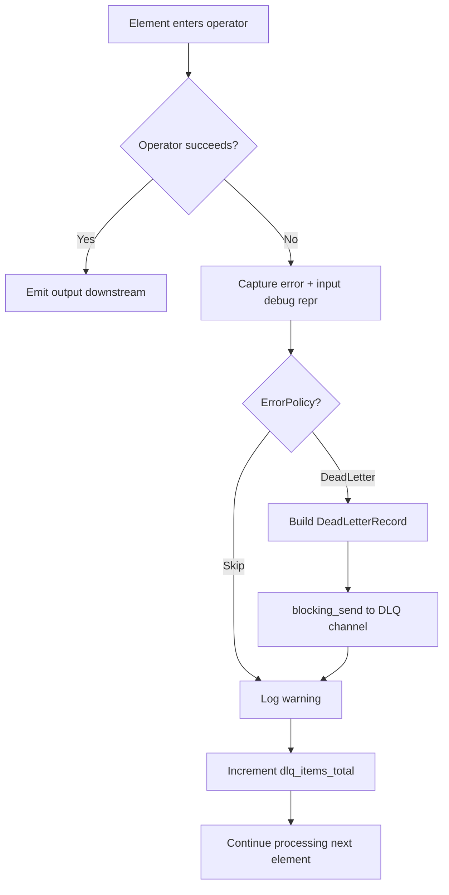
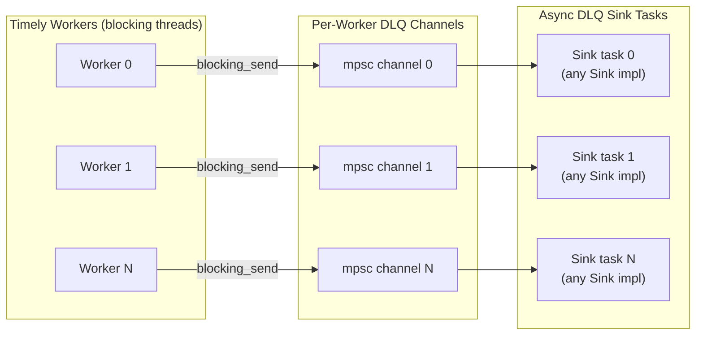
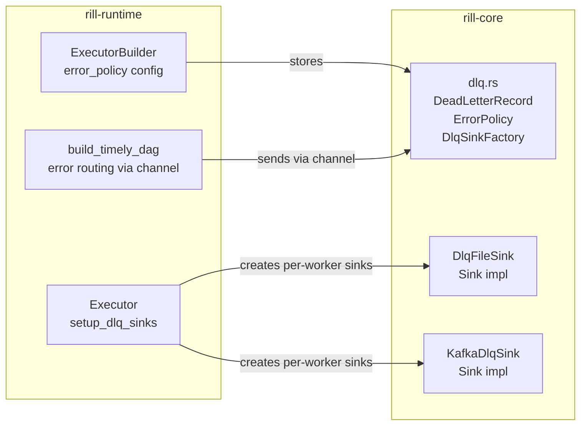

# ADR: Dead Letter Queue (DLQ)

**Status:** Accepted (updated 2026-02-26)
**Date:** 2026-02-21

## Context

Stream processing pipelines must handle operator failures gracefully. An operator may fail due to malformed input, transient state backend errors, or logic bugs. Without an error handling strategy, a single bad element can crash the entire pipeline or silently drop data with no audit trail.

The system needs a configurable policy that balances between availability (keep processing) and observability (know what failed and why).

## Decision

Introduce a **Dead Letter Queue** backed by the `Sink` trait. Operator errors are captured with full context and routed to any `Sink` implementation for post-mortem analysis, while the pipeline continues processing.

### Error policy

```rust
pub enum ErrorPolicy {
    Skip,                                  // log warning, drop element
    DeadLetter(Box<dyn DlqSinkFactory>),   // persist via Sink trait, drop element
}
```

`Skip` is the default. `DeadLetter` creates per-worker sink instances via a factory. Both increment the `dlq_items_total` metrics counter. A convenience constructor `ErrorPolicy::dead_letter_file(path)` creates a file-backed DLQ.

### DlqSinkFactory trait

```rust
pub trait DlqSinkFactory: Send + Sync + Debug {
    fn create(&self, worker_index: usize) -> Result<Box<dyn Sink<Input = DeadLetterRecord>>>;
}
```

The factory creates one sink per Timely worker, eliminating shared-state contention. Built-in implementations:

- `DlqFileSinkFactory` — file-backed, appends `-{worker_index}` to the base path
- `KafkaDlqFactory` — Kafka-backed (behind `kafka` feature flag)

### Dead letter record

```rust
pub struct DeadLetterRecord {
    pub input_repr: String,       // Debug representation of the failed input
    pub operator_name: String,    // Which operator failed
    pub error: String,            // Error message
    pub timestamp: String,        // Unix epoch seconds
}
```

Each record is serialized as a single JSON line, enabling simple `cat | jq` inspection and streaming ingestion by log aggregators.

### DLQ file sink

`DlqFileSink` opens the file in append mode with `BufWriter` for efficient I/O. Records are written as JSON Lines (one JSON object per line, newline-delimited). It implements the `Sink` trait with `Input = DeadLetterRecord`.

### Kafka DLQ sink

`KafkaDlqSink` wraps `KafkaSink`, serializing `DeadLetterRecord` as a JSON payload with the `operator_name` as the Kafka message key. Available behind the `kafka` feature flag.

### Error routing in the executor

Per-worker DLQ sinks are bridged via `tokio::sync::mpsc` channels — the same pattern used for regular sinks. Each worker sends `DeadLetterRecord`s via `blocking_send()` to its own channel, where an async task drives the sink.

Errors surface from Timely dataflow operators: capture `debug_repr` of the input before processing, on error create a `DeadLetterRecord`, send to the DLQ channel (if configured), increment metrics, continue.

### Configuration

```rust
// File-backed DLQ (convenience constructor)
let executor = Executor::builder()
    .error_policy(ErrorPolicy::dead_letter_file("./dlq.jsonl"))
    .build();

// Kafka-backed DLQ
let executor = Executor::builder()
    .error_policy(ErrorPolicy::DeadLetter(Box::new(
        KafkaDlqFactory::new("localhost:9092", "dlq-topic"),
    )))
    .build();
```

## Diagram

### Error routing flow



### Per-worker channel model



### Component ownership



## Alternatives considered

### 1. Retry with backoff before routing to DLQ

Rejected for the initial implementation. Retries add latency and complexity (backoff policy, max retries, idempotency requirements). Most operator errors are deterministic (bad input, schema mismatch) and will fail again on retry. Retries can be added as a future `ErrorPolicy` variant without changing the DLQ infrastructure.

### 2. In-memory DLQ buffer with periodic flush

Rejected because it risks losing error records on crash. Append-mode file I/O with `BufWriter` is already fast, and DLQ writes are infrequent (error path only). The current design trades minimal write latency for crash safety.

### 3. Shared Mutex for DLQ sink (previous design)

The original implementation used `Arc<Mutex<DlqFileSink>>` shared across all Timely workers. This was replaced with per-worker channels and sinks because: (a) mutex contention becomes a bottleneck under high error rates, (b) the bespoke `DlqFileSink` bypassed the standard `Sink` trait, limiting DLQ destinations to files.

### 4. Fail-fast: crash the pipeline on first error

Rejected as the default because it makes pipelines fragile. A single malformed record would halt an entire streaming job. However, this could be added as a future `ErrorPolicy::Fail` variant for strict correctness requirements.

## Consequences

**Positive:**
- Pipelines survive operator errors without data loss visibility — every failure is recorded.
- JSON Lines format is universally supported by log aggregators, `jq`, and monitoring tools.
- Per-worker channels eliminate mutex contention — lock-free DLQ writes at any error rate.
- Any `Sink` implementation can serve as a DLQ destination (file, Kafka, custom).
- `DlqSinkFactory` trait enables per-worker isolation with zero shared state.
- Metrics integration (`dlq_items_total`) enables alerting on error rate spikes.

**Negative:**
- DLQ file grows unboundedly. No built-in rotation or retention policy — operators must manage file lifecycle externally (logrotate, cron cleanup).
- Per-worker file sinks produce multiple output files (one per worker) that must be aggregated for analysis.
- `input_repr` uses `Debug` formatting, which may not capture full element fidelity for complex types.

## Files

| File | Role |
|------|------|
| `rill-core/src/dlq.rs` | `DeadLetterRecord`, `ErrorPolicy`, `DlqSinkFactory`, `DlqFileSinkFactory` |
| `rill-core/src/connectors/dlq_file_sink.rs` | `DlqFileSink` — append-only JSON Lines writer, implements `Sink` |
| `rill-core/src/connectors/kafka_dlq.rs` | `KafkaDlqSink`, `KafkaDlqFactory` — Kafka DLQ adapter (behind `kafka` feature) |
| `rill-runtime/src/executor.rs` | `setup_dlq_sinks()`, per-worker channel bridge, error routing in `build_timely_dag` |
