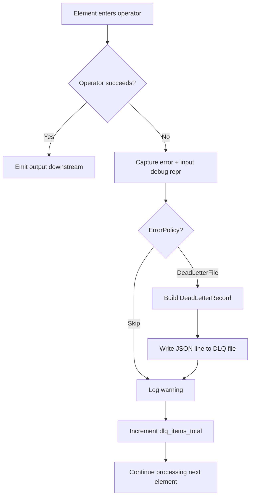
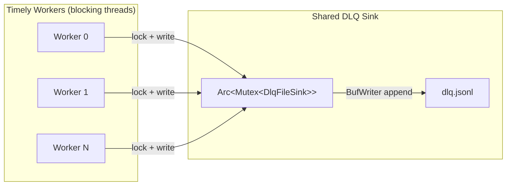
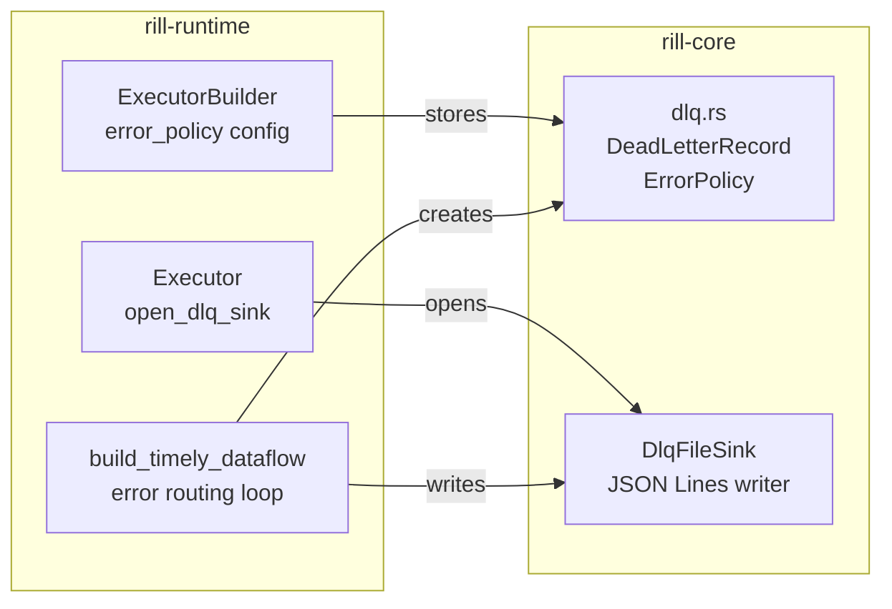

# ADR: Dead Letter Queue (DLQ)

**Status:** Accepted
**Date:** 2026-02-21

## Context

Stream processing pipelines must handle operator failures gracefully. An operator may fail due to malformed input, transient state backend errors, or logic bugs. Without an error handling strategy, a single bad element can crash the entire pipeline or silently drop data with no audit trail.

The system needs a configurable policy that balances between availability (keep processing) and observability (know what failed and why).

## Decision

Introduce a **Dead Letter Queue** backed by an append-only JSON Lines file. Operator errors are captured with full context and persisted for post-mortem analysis, while the pipeline continues processing.

### Error policy

```rust
pub enum ErrorPolicy {
    Skip,                              // log warning, drop element
    DeadLetterFile { path: PathBuf },  // persist to file, drop element
}
```

`Skip` is the default. `DeadLetterFile` adds persistence. Both increment the `dlq_items_total` metrics counter.

### Dead letter record

```rust
pub struct DeadLetterRecord {
    pub input_repr: String,       // Debug representation of the failed input
    pub operator_name: String,    // Which operator failed
    pub error: String,            // Error message
    pub timestamp: String,        // Unix epoch seconds
}
```

Each record is serialized as a single JSON line, enabling simple `cat | jq` inspection and streaming ingestion by log aggregators.

### DLQ file sink

`DlqFileSink` opens the file in append mode with `BufWriter` for efficient I/O. Records are written as JSON Lines (one JSON object per line, newline-delimited).

### Error routing in the executor

Errors surface from two locations:

1. **Pre-exchange operators** (`apply_steps`) — errors logged with `tracing::error`, `dlq_items_total` incremented, element dropped.
2. **Timely dataflow operators** (`build_timely_dataflow`) — full DLQ path: capture `debug_repr` of the input before processing, on error create a `DeadLetterRecord`, write to the `DlqFileSink` (if configured), increment metrics, continue.

The DLQ sink is wrapped in `Arc<Mutex<DlqFileSink>>` for thread-safe sharing across Timely worker threads. Lock contention is negligible because DLQ writes are rare (error path only).

### Configuration

```rust
let executor = Executor::builder()
    .error_policy(ErrorPolicy::DeadLetterFile {
        path: PathBuf::from("./dlq.jsonl"),
    })
    .build();
```

## Diagram

### Error routing flow



### Thread safety model



### Component ownership



## Alternatives considered

### 1. Retry with backoff before routing to DLQ

Rejected for the initial implementation. Retries add latency and complexity (backoff policy, max retries, idempotency requirements). Most operator errors are deterministic (bad input, schema mismatch) and will fail again on retry. Retries can be added as a future `ErrorPolicy` variant without changing the DLQ infrastructure.

### 2. In-memory DLQ buffer with periodic flush

Rejected because it risks losing error records on crash. Append-mode file I/O with `BufWriter` is already fast, and DLQ writes are infrequent (error path only). The current design trades minimal write latency for crash safety.

### 3. Route DLQ records to a Kafka topic

Rejected as over-engineering for the initial implementation. A file-based DLQ has zero external dependencies and works in any environment. Kafka-based DLQ can be added as a future `ErrorPolicy` variant (e.g., `DeadLetterKafka { topic, brokers }`).

### 4. Fail-fast: crash the pipeline on first error

Rejected as the default because it makes pipelines fragile. A single malformed record would halt an entire streaming job. However, this could be added as a future `ErrorPolicy::Fail` variant for strict correctness requirements.

## Consequences

**Positive:**
- Pipelines survive operator errors without data loss visibility — every failure is recorded.
- JSON Lines format is universally supported by log aggregators, `jq`, and monitoring tools.
- Zero external dependencies — file-based DLQ works in any deployment.
- Metrics integration (`dlq_items_total`) enables alerting on error rate spikes.
- `ErrorPolicy` enum is extensible for future strategies (retry, Kafka DLQ, fail-fast).

**Negative:**
- DLQ file grows unboundedly. No built-in rotation or retention policy — operators must manage file lifecycle externally (logrotate, cron cleanup).
- `Arc<Mutex>` introduces a theoretical contention point, though in practice DLQ writes are rare and fast.
- `input_repr` uses `Debug` formatting, which may not capture full element fidelity for complex types.

## Files

| File | Role |
|------|------|
| `rill-core/src/dlq.rs` | `DeadLetterRecord`, `ErrorPolicy` types |
| `rill-core/src/connectors/dlq_file_sink.rs` | `DlqFileSink` — append-only JSON Lines writer |
| `rill-runtime/src/executor.rs` | `open_dlq_sink()`, error routing in `build_timely_dataflow` |
