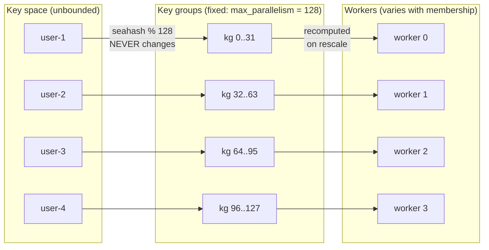
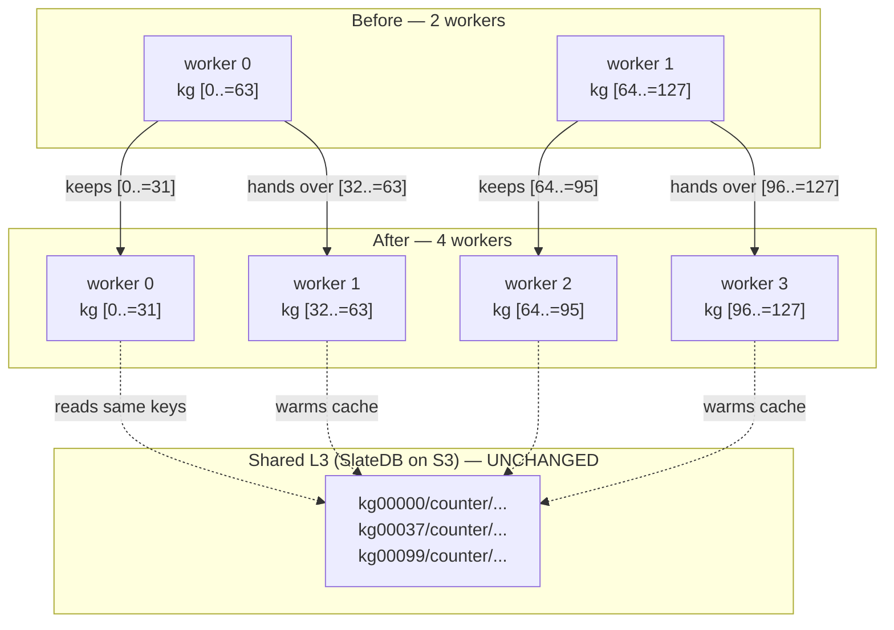
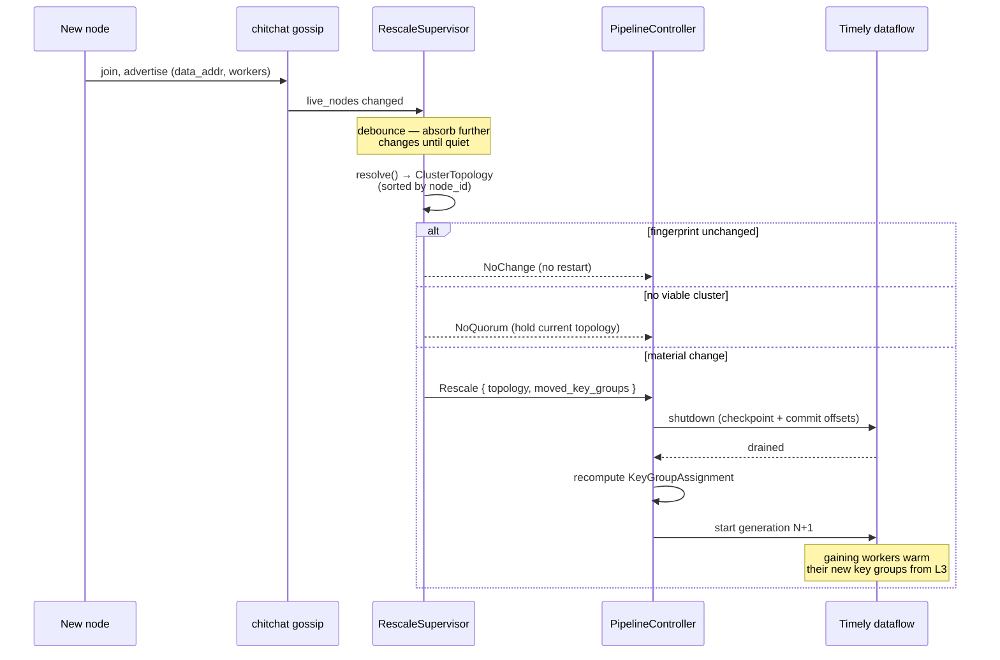
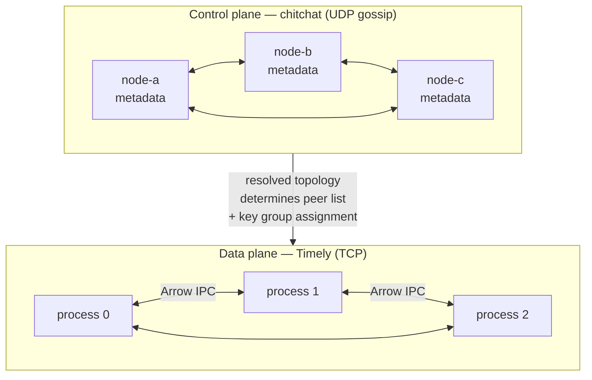

# ADR: Dynamic Discovery and Key-Group Reshuffling (Phase 3)

**Status:** Accepted
**Date:** 2026-08-14
**Implemented:** 2026-08-14

## Context

Phase 1 ([multi-threaded-worker.md](multi-threaded-worker.md)) and Phase 2
([multi-process-worker.md](multi-process-worker.md)) scale rhei to N worker
threads across M processes — but the cluster's shape is **fixed at startup**.
Every process is launched with `--process-id` and the full `--peers` list.
Adding capacity means stopping the pipeline, rewriting the peer list on every
node, and starting again.

Worse, two mechanisms were welded to the worker count in a way that made
rescaling *silently lossy* rather than merely inconvenient:

1. **Routing.** `ErasedBuffer::partition_for_exchange` assigned rows with
   `seahash(key) % num_workers`. Changing the worker count remaps essentially
   every key to a different worker.

2. **State addressing.** `create_context_for_worker` namespaced durable state as
   `p{process_id}/w{worker_index}/{operator}`. The persisted bytes are therefore
   addressed by a coordinate that changes when the cluster changes.

Together these mean that restarting a 4-worker pipeline as a 6-worker pipeline
does not repartition state — it **abandons** it. Every key routes to a worker
that looks under a prefix nobody wrote, reads `None`, and starts counting from
zero. Nothing errors; the numbers are just wrong.

This ADR covers making the cluster shape dynamic: nodes discover each other at
runtime, failures and joins are detected automatically, and the pipeline
rescales onto the new shape while keyed state survives.

## Decision

Three changes, in dependency order. The first is the precondition for the other
two.

### 1. Key groups decouple ownership from worker count

Introduce a fixed-cardinality bucket space between keys and workers, matching
Flink's `KeyGroupRangeAssignment`:

```text
key ──hash──> key group ──range assignment──> worker
     (fixed)                (recomputed on rescale)
```

- `max_parallelism` (default 128) key groups exist for the pipeline's lifetime.
- `key_group = seahash(key) % max_parallelism` — never changes.
- Workers own **contiguous ranges** of key groups, recomputed on every topology
  change.

Both directions of the mapping live in `rhei-core/src/cluster/key_group.rs` and
must agree exactly, since every worker computes routing independently:

```rust
// group -> worker (routing)
worker = key_group * parallelism / max_parallelism

// worker -> group range (state ownership)
start = ceil(worker * max_parallelism / parallelism)
end   = ((worker + 1) * max_parallelism - 1) / parallelism
```

The ceiling on `start` is load-bearing. The intuitive floor-split
`[i*max/p, (i+1)*max/p - 1]` tiles the space correctly but is **not** the
inverse of the routing formula whenever `max_parallelism` is not a multiple of
the worker count — rows would route to a worker that does not own the matching
state. An exhaustive test (`routing_agrees_with_ranges`) pins the invariant
across the whole parameter space; it caught exactly this bug during
implementation.

When `parallelism > max_parallelism` there are more workers than groups. Flink
rejects this outright; rhei clamps to an `effective_parallelism` and logs a
warning, because the worker count is driven by cluster membership and a node
joining should not fail the pipeline. Surplus workers own empty ranges and run
only stateless work.

### 2. State is addressed by key group

`StateAddressing` (`rhei-core/src/state/key_group_addressing.rs`) replaces the
worker-coordinate prefix:

```text
before:  p{process_id}/w{worker_index}/{operator}/{user_key}
after:   kg{group:05}/{operator}/{state_key}
```

The physical key is identical regardless of which worker or process performs
the access. A worker that inherits key group 37 issues exactly the reads its
previous owner issued.

**Rescaling therefore moves no bytes.** It reassigns ownership, and the gaining
worker reads from shared L3 storage on first access — a cache-warming problem,
not a data-transfer problem. This is the property that makes disaggregated
state (SlateDB on S3) pay off.

#### The group comes from the partition key, not the storage key

The group must be derived from the same bytes the exchange routed on — the
record's `key_by` output — and not from the storage key a state wrapper builds.

The first implementation got this wrong, in a way worth recording because it
produced no visible symptom. A `KeyGroupBackend` wrapped the store and hashed
whatever key reached it. But `KeyedState` stores under `"{namespace}:{encoded_key}"`,
so the backend hashed `counts:"alpha"` and filed the entry in a different group
than routing had put `alpha` in.

Nothing broke immediately. The physical key was still a pure function of the
logical key, every worker derived it identically, and state still survived a
rescale — `keyed_state_survives_rescaling_the_worker_count` passed throughout.
What was silently broken was every *per-key-group* operation, which is the
reason key groups exist beyond storage layout:

- Warming the groups a worker gains on rescale would prefetch keys belonging to
  rows that route elsewhere, and miss the ones that route here.
- A scan of a key group's prefix returns keys the scanning worker does not own.

The fix moves group derivation up to the layer that still knows the logical key.
`StateContext` carries a `StateAddressing` and exposes keyed accessors that take
the partition key alongside the storage key; `KeyedState` and `MapState` pass
the record key, and the backend below is left as a plain store. A backend
wrapper *cannot* do this correctly — by the time a key reaches it, the partition
key is gone.

`state_is_filed_in_a_key_group_the_routing_worker_owns` pins the invariant end
to end: it reads the physical keys the runtime actually persisted and asserts
that, for every key, the worker the exchange routes the row to is the worker
that owns the group the state landed in. It fails against the old derivation.

Partition bytes must reproduce exactly what the exchange hashed. `key_by`
produces a `String` and the exchange hashes its raw UTF-8, so string keys map to
their own bytes; other key types have no `key_by` counterpart and fall back to a
canonical JSON form. This is deliberately independent of the `KeyEncoder` used
for storage: how a key is serialized to disk is a storage decision, while which
group it belongs to is a routing decision, and the exchange only knew the latter.

#### Unpartitioned state stays per-worker

`ValueState` and `ListState` are scoped to a name rather than a record key, so
they have no partition key and no meaningful key group. They are addressed
`w{worker}/{operator}/{state_key}` — per worker, as before key groups existed.

Sharing one instance across workers would expose it to concurrent
read-modify-write races, so per-worker is the safe reading. The consequence is
that unpartitioned state does not survive a change in worker count, which is
inherent rather than incidental: without a key there is nothing to redistribute
it by.

The zero-padded group keeps lexicographic order aligned with numeric order, so
an owned range is a contiguous scan in ordered stores.

One consequence needed care: with all workers deriving the *same* physical keys,
they must also share one backing store. `LocalBackend` holds its whole map in
memory and `checkpoint()` writes it wholesale, so handing each worker its own
instance over the same file would let the last flush erase every other worker's
state. The controller now caches one `LocalBackend` per operator, shared across
the process's workers.

### 3. Gossip discovery drives rescale generations

`GossipMembership` (`rhei-runtime/src/cluster/gossip.rs`) wraps
[chitchat](https://github.com/quickwit-oss/chitchat), a Scuttlebutt gossip
implementation with a phi-accrual failure detector. Each node advertises two
facts — its Timely data-plane address and its worker count — and learns the same
about its peers. Gossip carries **control-plane metadata only**; records still
travel over Timely's TCP transport.

A `ClusterView` resolves into a `ClusterTopology` by sorting participants by
node ID. Determinism here is a correctness requirement, not a nicety: every node
resolves independently from its own copy of the view, and a disagreement about
process ordering is a disagreement about which worker owns which key group.

Timely cannot add or remove workers from a running dataflow, so a rescale is
necessarily stop-and-restart — the same shape as Flink's stop-with-savepoint
rescale. `RescaleSupervisor` debounces membership churn into a small number of
deliberate generations, and `PipelineController::run_dynamic` executes them:
checkpoint, drain, recompute the assignment, restart.

Two guards keep churn from thrashing the pipeline:

- **Debounce.** Membership must stay quiet for an interval (default 5s) before a
  rescale fires. A rolling restart emits a leave and a join per node; without
  this, the pipeline restarts once per event and makes no progress.
- **Fingerprint comparison.** A change that resolves to the same execution shape
  costs nothing. Node `generation` (incarnation) is part of the fingerprint, so a
  node restarting in place — same ID, same address — still forces a rescale,
  because it lost its in-memory state.

Losing *every* peer reports `NoQuorum` and holds the current topology rather
than tearing down: a total membership loss is far more likely a network
partition than a real cluster-wide shutdown.

## Diagram

### Two-level mapping: keys → key groups → workers



### Rescale: 2 workers → 4 workers



### Discovery → topology → execution



### Control plane vs data plane



## Observability

Rescaling is invisible from inside a pipeline — the dataflow restarts, counters
keep accumulating, and nothing in the data path indicates it happened. These
metrics are what make it legible from outside.

### Metrics

| Metric | Type | Meaning |
|---|---|---|
| `rhei_cluster_generation` | gauge | Current pipeline generation; increments once per rescale |
| `rhei_cluster_processes` | gauge | Processes in the resolved topology |
| `rhei_cluster_workers` | gauge | Total workers across the cluster |
| `rhei_cluster_key_groups_owned` | gauge | Key groups this node owns; compare across nodes to see skew |
| `rhei_cluster_idle_workers` | gauge | Workers beyond `max_parallelism` that own no keyed state |
| `rhei_cluster_topology_changes_total` | counter | Membership changes that resolved to a new topology |
| `rhei_cluster_rescales_total` | counter | Rescales actually executed |
| `rhei_cluster_rescales_suppressed_total` | counter | Changes that did *not* rescale, by `reason` |
| `rhei_cluster_key_groups_moved_total` | counter | Cumulative key groups reassigned |
| `rhei_cluster_no_quorum_total` | counter | Membership resolved to no viable cluster |
| `rhei_cluster_rescale_duration_seconds` | histogram | Drain → checkpoint → rebuild, i.e. pipeline downtime |
| `rhei_gossip_members` | gauge | Members usable in the topology |
| `rhei_gossip_members_live` | gauge | Nodes chitchat considers alive |
| `rhei_gossip_members_pending` | gauge | Live but not yet advertising `data_addr`/`workers` |
| `rhei_gossip_members_joined_total` / `_left_total` | counter | Membership arrivals and departures |
| `rhei_gossip_membership_changes_total` | counter | Distinct membership transitions observed |

Four of these exist to answer questions the obvious ones cannot:

- **`rescale_duration_seconds`** is the only measure of what a rescale costs.
  Counting rescales says they happened; this says whether they hurt. It is also
  the baseline any future work on assignment churn or cache warming has to beat,
  so it needs to exist before that work starts.
- **`rescales_suppressed_total`** rising while `rescales_total` stays flat is the
  debounce and fingerprint check earning their keep. The reverse — suppressed
  flat, rescales climbing — means every membership blip is restarting the
  pipeline, which looks identical to a healthy cluster in every other metric.
- **`gossip_members_pending`** covers a failure that is otherwise silent: a node
  that has joined gossip but not yet advertised a usable `data_addr`/`workers`
  pair is deliberately excluded from the topology, so it is live to gossip and
  invisible to the pipeline. Without this gauge that is indistinguishable from a
  node that never started.
- **`key_groups_owned`** is per-node, so comparing it across the fleet surfaces
  load skew. `rhei_cluster_workers` is a cluster-wide aggregate and cannot.

### Log events

`gossip membership changed` carries `joined` and `left` node lists rather than
just a count, so a flapping node is identifiable from logs alone. `cluster
topology change detected` carries the before/after summaries and
`moved_key_groups`; `installing cluster topology` carries the fingerprint and
this node's `owned_key_groups`; `rescale complete` carries the measured
downtime. All are captured into the ring buffer served at `/api/logs`.

### Not covered here

Spans and distributed tracing are deliberately out of scope — the workspace has
no OpenTelemetry dependency, and cross-process correlation is its own piece of
work. `/api/topology` also still reports processes and worker counts without the
key group assignment, so "who owns key group 37?" is not yet answerable over
HTTP; the metrics above give the aggregate but not the mapping.

## Alternatives considered

### 1. Consistent hashing instead of key groups

Rejected. Consistent hashing also limits how much moves on a rescale, but it
gives each worker a *scattered* set of hash ranges rather than a contiguous one.
That loses range-scan locality in ordered stores like SlateDB, complicates
reasoning about ownership, and offers no advantage here — key groups already cap
movement at roughly `1/parallelism` of the key space. Key groups also match
Flink's operational model, which is what users of this feature will expect.

### 2. Rehashing state in place on rescale

Rejected. Reading every key and rewriting it under a new prefix makes rescale
cost proportional to *state size* rather than to the fraction of ownership that
moved. For pipelines with large state — exactly the ones that need to scale —
this turns a fast reassignment into a multi-minute stall. Key groups make the
rewrite unnecessary.

### 3. Live rescale without restarting the dataflow

Rejected as infeasible on Timely. Its progress protocol assumes a fixed worker
set for the life of a dataflow; there is no supported way to add or remove a
peer mid-computation. Restart-from-checkpoint is what Flink does too
(stop-with-savepoint), and with key-group state addressing the restart is cheap
in the part that matters: no state migration.

### 4. OpenRaft for membership instead of gossip

Deferred, not rejected. Raft gives strongly consistent membership, which is
attractive — but it needs a quorum to make progress, adds a leader-election
failure mode, and detects failures by polling rather than by a dedicated
detector. Gossip's phi-accrual detector is faster and degrades more gracefully
for *liveness*, which is what drives rescaling. Raft remains the right tool for
metadata that must be linearizable (committed checkpoint IDs, job assignments),
and `MembershipProvider` is a trait precisely so a Raft-backed implementation
can be added without touching the rescale machinery.

### 5. Keeping `hash(key) % num_workers` and forbidding rescale

Rejected — it is the status quo, and the status quo is actively dangerous.
Nothing today *prevents* an operator from restarting a pipeline with a different
`--workers` value; it just silently resets all keyed state. Even without the
discovery work, replacing the routing rule is a bug fix.

### 6. Making `max_parallelism` changeable

Rejected. Every key's group is `hash(key) % max_parallelism`, so changing it
rehashes the entire key space — equivalent to discarding all state. Rather than
pretend otherwise, the value is recorded in the checkpoint manifest and
`validate_compatible` rejects a mismatched restore with an explicit message.
Pick it generously up front; 128 key groups cost nothing until you have more
than 128 workers.

## Consequences

**Positive:**

- Keyed state survives worker-count changes. Verified end-to-end by
  `rescale_state_continuity.rs`, which accumulates counters across a
  1→2→4→3→8→2 worker schedule over one checkpoint directory.
- Nodes join and leave without editing peer lists or restarting other nodes.
- Node failure is detected by gossip and triggers a rescale onto surviving
  capacity, rather than hanging the cluster on an unreachable Timely peer.
- Rescale cost is proportional to key groups moved, not to state size.
- Routing and state addressing now derive from one source of truth, so they
  cannot drift apart.
- Static `--peers` clusters are unaffected: `StaticMembership` never changes, so
  the supervisor never fires.

**Negative:**

- `max_parallelism` is a permanent, up-front decision, and caps useful
  parallelism.
- A rescale is a brief pipeline restart, not a live reconfiguration. Throughput
  drops to zero for the drain-and-restart window.
- Cross-*process* rescaling requires shared L3 storage (`remote-state`). With a
  purely local backend, a key group that moves to another machine has no path to
  its bytes. Within a process, moving between worker threads works with any
  backend.
- Gossip adds a UDP port to operate and firewall.
- The gaining workers run cold immediately after a rescale, until their new key
  groups are warmed from L3.
- `partition_key`'s signature changed (it now takes a `KeyGroupAssignment`), and
  the on-disk state prefix changed. Checkpoints written by earlier versions are
  not readable by this one.

**Deferred to later work:**

- Job Manager and OpenRaft for linearizable job/checkpoint metadata.
- Source partition rebalance on scale events (re-triggering Kafka consumer group
  assignment).
- Proactive key-group warming, so gaining workers prefetch instead of faulting
  in on first access.

## Files

| File | Change |
|------|--------|
| `rhei-core/src/cluster/key_group.rs` | New — key group math, ranges, assignment, migration diffs |
| `rhei-core/src/cluster/membership.rs` | New — `ClusterView`, `ClusterTopology`, `MembershipProvider`, `StaticMembership` |
| `rhei-core/src/state/key_group_addressing.rs` | New — `kg{group}/{operator}/{key}` layout, grouped by partition key |
| `rhei-core/src/state/context.rs` | Carries `StateAddressing`; keyed vs unpartitioned accessors |
| `rhei-core/src/operators/keyed_state.rs` | Passes the record key as the partition key |
| `rhei-core/src/state/map_state.rs` | Passes the record key as the partition key |
| `rhei-runtime/src/cluster/gossip.rs` | New — chitchat-backed discovery (feature `chitchat`) |
| `rhei-runtime/src/cluster/rescale.rs` | New — debounced rescale supervision |
| `rhei-runtime/src/erased_buffer.rs` | `partition_for_exchange` routes by key group |
| `rhei-runtime/src/executor.rs` | Executor carries the assignment; `partition_key` retargeted |
| `rhei-runtime/src/controller.rs` | `max_parallelism`, active topology override, `run_dynamic`, shared local backends |
| `rhei-core/src/checkpoint.rs` | Manifest topology metadata + `validate_compatible` |
| `rhei-core/src/config.rs` | `[cluster]` discovery settings and env overrides |
| `rhei-cli/src/main.rs` | `--discovery`, `--gossip-addr`, `--seeds`, `--max-parallelism`, … |
| `rhei-runtime/tests/rescale_state_continuity.rs` | New — state survives rescaling |
