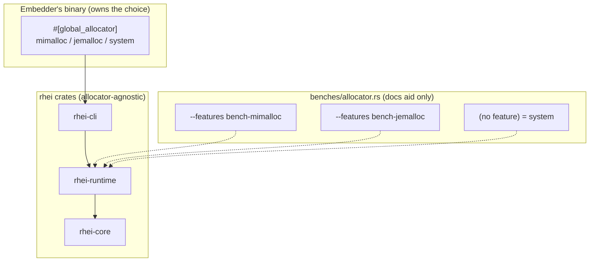

# ADR: Memory Allocator Policy (Stay Allocator-Agnostic)

**Status:** Accepted
**Date:** 2026-06-12

## Context

Rhei runs on the platform default allocator — on Linux, glibc `malloc`
(ptmalloc2). No crate declares a `#[global_allocator]`.

The runtime is an adversarial profile for ptmalloc2:

- **Heavily multi-threaded.** Timely runs N worker threads (on `spawn_blocking`),
  alongside a full tokio runtime and background services in `task_manager.rs`.
  ptmalloc2's per-thread arenas are capped (`8 × ncpus`), contend under high
  thread counts, and retain freed memory per arena — inflating RSS.
- **High-churn, cross-thread allocation on the hot path.** Every batch allocates
  a `RheiBuffer<T>` (Arrow `RecordBatch` + selection vector), erases it to
  `ErasedBuffer`, and the `key_by`/Exchange path serializes via Arrow IPC and
  deserializes on the receiving worker. Buffers are routinely allocated on one
  worker and freed on another — the pattern ptmalloc2 fragments on worst.
- **Long-running, stateful.** The L1 `HashMap` memtable grows/shrinks and flushes
  dirty keys to Foyer/SlateDB every checkpoint, so steady-state RSS matters as
  much as throughput.

A modern allocator (mimalloc, jemalloc) typically improves both throughput and
steady-state RSS on this profile. The question is *who* should select it.

## Decision

**rhei does not impose a global allocator.** The library crates (`rhei-core`,
`rhei-runtime`, the `rhei` facade) and the `rhei` binary stay allocator-agnostic.
Only one `#[global_allocator]` may exist per process, and that choice belongs to
the **final binary** — the user's pipeline application, a service embedding the
runtime, or `rhei-cli` as the user configures it. Forcing an allocator inside a
library would silently override an embedder's own selection.

To make that choice an informed one, we ship a **compile-time allocator
comparison benchmark** rather than a runtime knob:

- `rhei-runtime/benches/allocator.rs` selects the global allocator via mutually
  exclusive, off-by-default features `bench-mimalloc` / `bench-jemalloc` (neither
  set ⇒ system allocator). The allocator crates are **optional dependencies used
  only by this benchmark** — they are never compiled into normal builds and never
  referenced by library code.
- Two workloads mirror the real hot paths: `exchange_roundtrip` (single-threaded
  build + Arrow IPC round-trip) and `cross_thread_free` (allocate on producer
  threads, free on consumer threads — the Exchange pattern).
- Run it once per allocator and compare:

  ```bash
  cargo bench -p rhei-runtime --bench allocator                       # system (glibc)
  cargo bench -p rhei-runtime --bench allocator --features bench-mimalloc
  cargo bench -p rhei-runtime --bench allocator --features bench-jemalloc
  ```

The numbers feed user-facing docs ("Choosing an allocator") so embedders can
add a one-line `#[global_allocator]` if their workload benefits — without rhei
making the decision for them.

## Diagram

Allocator selection lives at the final binary; libraries stay neutral:



What the `cross_thread_free` workload exercises — allocate on one thread, free
on another:

```mermaid
sequenceDiagram
    participant P as Producer thread
    participant A as Allocator
    participant Co as Consumer thread
    P->>A: alloc RheiBuffer / Arrow IPC bytes
    P->>Co: send ErasedBuffer (flume)
    Co->>A: drop -> free on a different thread
    Note over A: glibc retains per-arena;<br/>mimalloc / jemalloc shard free lists
```

## Alternatives Considered

- **Force mimalloc as a default-on feature in the binary.** Simplest for the
  out-of-the-box case, but it overrides any allocator an embedder sets and makes
  the library opinionated about a process-global concern it does not own.
  Rejected — the binary, not the library, owns the allocator.
- **Runtime-selectable allocator.** Not possible: `#[global_allocator]` is a
  compile-time, process-wide item. A feature-gated benchmark is the correct
  shape for a compile-time comparison.
- **No benchmark, prose guidance only.** Cheaper, but leaves the recommendation
  unmeasured on rhei's own hot paths. Rejected — we want numbers to back the
  docs.

## Consequences

**Positive**

- Embedders retain full control of the allocator; rhei composes cleanly into
  applications that already set one.
- A repeatable, hot-path-representative benchmark backs the "choosing an
  allocator" guidance with real numbers instead of folklore.
- Zero allocator code in the shipped library; optional deps stay out of normal
  builds.

**Negative / Risks**

- rhei ships on glibc by default, so users who never read the docs leave
  performance on the table. Mitigated by documenting the comparison prominently.
- The benchmark adds two optional dev-facing dependencies (`mimalloc`,
  `tikv-jemallocator`); the latter builds C code (no new tooling — `rdkafka`
  already requires a C/cmake toolchain) and only when its feature is enabled.
- Results are workload- and machine-dependent; docs must present them as
  guidance, not guarantees, and note how to reproduce.
