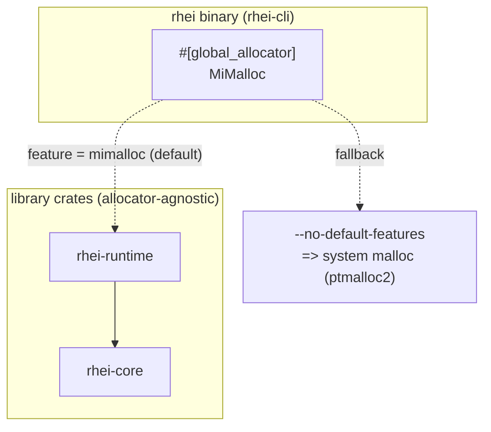
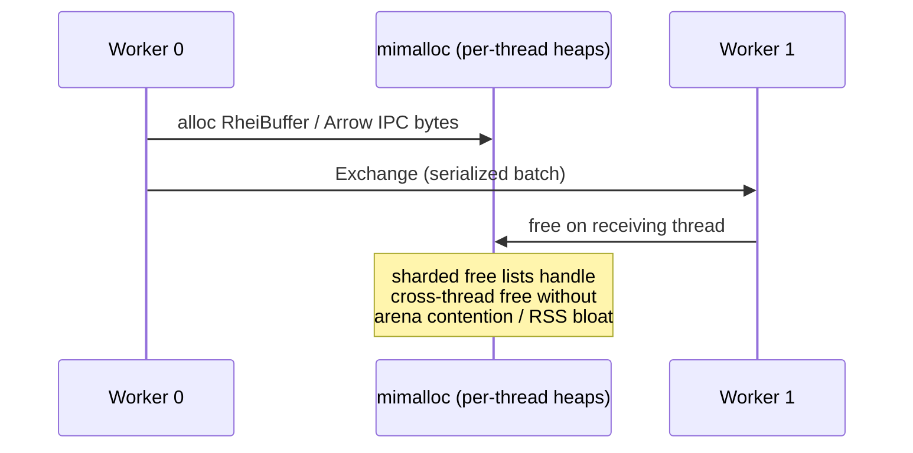

# ADR: Global Memory Allocator (mimalloc)

**Status:** Accepted
**Date:** 2026-06-12

## Context

Rhei ran on the platform default allocator. On Linux that is glibc `malloc`
(ptmalloc2). No crate declared a `#[global_allocator]`.

The rhei runtime is an adversarial profile for ptmalloc2:

- **Heavily multi-threaded.** Timely runs N worker threads (on `spawn_blocking`),
  alongside a full tokio runtime and background services in `task_manager.rs`.
  ptmalloc2's per-thread arenas are capped (`8 × ncpus`) and contend under high
  thread counts, and each arena retains freed memory — inflating RSS.
- **High-churn, cross-thread allocation on the hot path.** Every batch allocates
  a `RheiBuffer<T>` (Arrow `RecordBatch` + selection vector), erases it to
  `ErasedBuffer`, and the `key_by`/Exchange path serializes via Arrow IPC and
  deserializes on the receiving worker. Buffers are routinely allocated on one
  worker and freed on another — the pattern ptmalloc2 fragments on worst.
- **Long-running, stateful.** The L1 `HashMap` memtable grows/shrinks and flushes
  dirty keys to Foyer/SlateDB every checkpoint. Fragmentation compounds over
  multi-hour/day runs, so steady-state RSS matters as much as throughput.

## Decision

Register **mimalloc** as the process-wide global allocator for the `rhei`
binary, behind a default-on `mimalloc` feature flag.

```rust
// rhei-cli/src/main.rs
#[cfg(feature = "mimalloc")]
#[global_allocator]
static GLOBAL: mimalloc::MiMalloc = mimalloc::MiMalloc;
```

```toml
# rhei-cli/Cargo.toml
mimalloc = { version = "0.1", default-features = false, optional = true }

[features]
default = ["mimalloc"]
mimalloc = ["dep:mimalloc"]
```

### Rationale

- **The allocator lives in the binary, not the libraries.** `rhei-core`,
  `rhei-runtime`, and the `rhei` facade stay allocator-agnostic so downstream
  embedders keep their own `#[global_allocator]` choice — only one global
  allocator may exist per process.
- **mimalloc over jemalloc.** Both beat ptmalloc2 here; mimalloc was chosen for
  the trivial drop-in (one line, no tuning) and its strong handling of the
  cross-thread free pattern that dominates the Exchange path. jemalloc remains a
  reasonable alternative when heap profiling is needed (see Alternatives).
- **`default-features = false`** disables mimalloc's `secure` hardening build,
  trading guard pages / hardened free-lists for maximum throughput. The engine
  is not a security boundary on the allocator, so throughput wins.
- **Default-on, but reversible.** `cargo run -p rhei-cli --no-default-features`
  restores the system allocator for A/B benchmarking and as an escape hatch.

## Diagram

Allocator selection at the process boundary:



Why the hot path benefits — allocate on one worker, free on another:



## Alternatives Considered

- **No change (system allocator).** Lowest dependency footprint, but forgoes a
  high-ROI, low-risk win; the workload characteristics make ptmalloc2 a poor
  fit. Rejected.
- **jemalloc (`tikv-jemallocator`).** Excellent RSS/fragmentation control and
  built-in heap profiling, valuable for diagnosing state-backend growth. Heavier
  C build and best with tuning (`background_thread`, decay). Kept as a future
  option if allocation profiling becomes a priority; not the default.
- **Allocator in `rhei-core`/`rhei-runtime`.** Would force the choice on every
  embedder of the libraries and conflict with their own global allocator.
  Rejected — the binary owns the allocator.

## Consequences

**Positive**

- Expected throughput improvement and materially lower, flatter steady-state RSS
  on multi-worker pipelines, where cross-thread allocation churn is highest.
- Zero API/source changes for users; transparent and reversible via a feature.

**Negative / Risks**

- Adds a native (C) build dependency to the `rhei` binary. (The project already
  builds native code via `rdkafka`'s cmake build, so this is not new tooling.)
- The win is workload-dependent and not yet measured on rhei's own benchmarks —
  the numbers above are expectations. Add an allocator dimension to
  `rhei-runtime/benches/exchange.rs` and `rhei-core/benches/state.rs`, and track
  long-run RSS, to confirm before relying on the gain.
- One more knob: contributors benchmarking allocations must remember to compare
  against `--no-default-features`.
