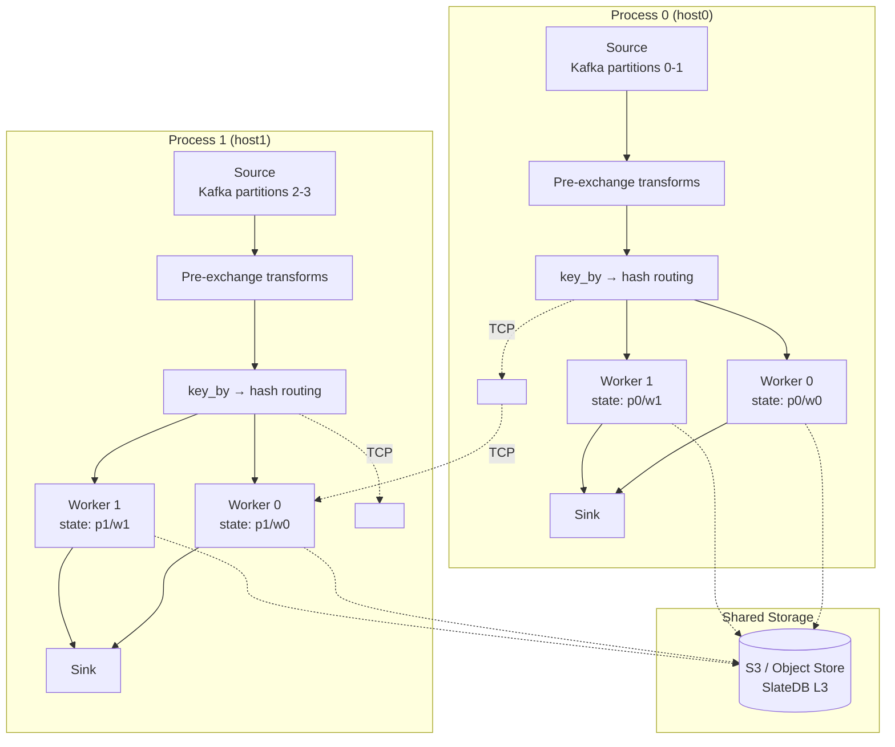
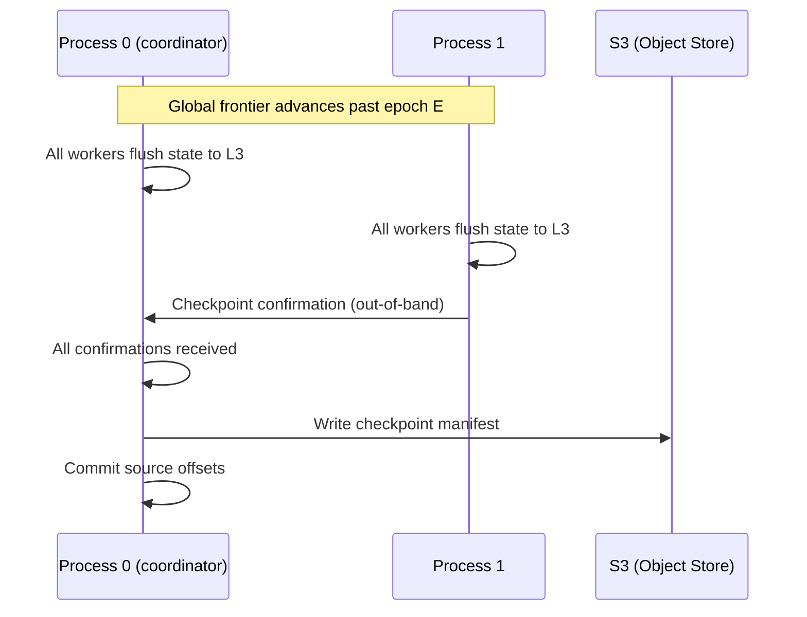
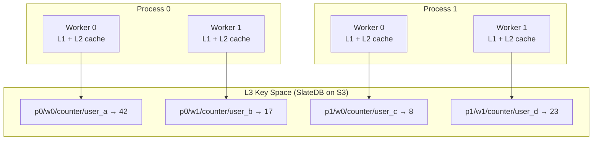
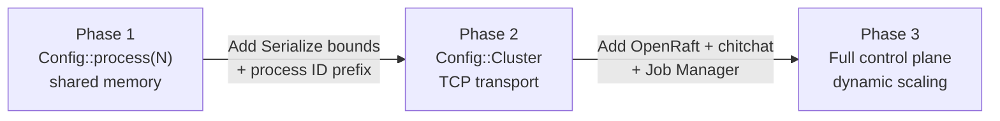

# ADR: Multi-Process Worker Execution (Phase 2)

**Status:** Accepted
**Date:** 2026-02-21
**Implemented:** 2026-02-26

## Context

Phase 1 (multi-threaded workers) scales to the core count of a single machine. For pipelines that exceed single-machine capacity — either due to state size (exceeds local NVMe) or throughput (exceeds single-node network/CPU) — the computation must distribute across multiple OS processes on separate machines.

Timely Dataflow natively supports multi-process execution via TCP, using `Config::Cluster`. The existing Phase 1 architecture (two-stage execution, key-affinity partitioning, per-worker state isolation) is designed to extend to this model with minimal structural changes.

This ADR documents the **planned design** for Phase 2. It is not yet implemented.

## Decision

Extend the executor to support Timely's `Config::Cluster` for TCP-based multi-process execution.

### Timely cluster configuration

```rust
timely::execute(timely::Config::Cluster {
    threads: threads_per_process,
    process: process_id,
    addresses: vec!["host0:2101".into(), "host1:2101".into()],
    report: false,
    log_fn: Box::new(|_| None),
}, move |worker| { ... });
```

Each process is started independently with its own `process_id` and the full peer list. Timely handles TCP connection setup, handshaking, and data exchange.

### Deployment model

```
rhei run pipeline.toml --workers 4 --process-id 0 --peers "host0:2101,host1:2101"
rhei run pipeline.toml --workers 4 --process-id 1 --peers "host0:2101,host1:2101"
```

Each command starts one process with 4 worker threads. The two processes form a cluster with 8 total workers.

### Data plane

From the operator's perspective, the data plane is identical to Phase 1. Exchange pacts route data by key hash, Pipeline pacts keep data local. The difference is transport: shared-memory within a process, TCP across processes. Timely handles serialization at process boundaries transparently.

### Serialization requirement

Elements crossing process boundaries must be serializable. This introduces a new trait bound:

```rust
// Phase 1 (current):
type Input: Send + Clone;

// Phase 2 (planned):
type Input: Send + Clone + Serialize + DeserializeOwned;
```

Serde-based Timely containers are the default (safe, moderate overhead). `Abomonation` (zero-copy, unsafe) is available as an opt-in optimization for hot-path types.

### State prefix extension

```
Phase 1:  "{operator_name}_w{worker_index}/{user_key}"
Phase 2:  "p{process_id}/w{worker_index}/{operator_name}/{user_key}"
```

Each process has its own L1 memtable and L2 Foyer cache. L3 (SlateDB on S3) is shared across processes — key prefixing prevents contention.

### Source partitioning

- **Kafka**: Consumer groups naturally partition across processes. Each process joins the same group and receives a subset of partitions.
- **Non-partitioned sources**: Process 0, worker 0 acts as the single source reader, distributing elements via Exchange.

### Checkpoint coordination

Timely's progress protocol extends across processes via TCP — frontiers are exchanged automatically. However, confirming durable state flush across processes requires out-of-band coordination:

1. Each process completes its L3 flush.
2. Each process sends a confirmation to a coordinator (process 0).
3. The coordinator commits the checkpoint ID and source offsets to S3.
4. On recovery, all processes load state from L3 at the committed checkpoint.

### Failure handling

Timely does not support partial failure recovery. If any process crashes:

1. All surviving processes stop.
2. All processes restart, loading state from L3 for their assigned key range.
3. Sources replay from committed offsets (e.g., Kafka consumer offsets at last checkpoint).

## Diagram

### Multi-process topology



### Checkpoint coordination across processes



### State prefix hierarchy



### Migration path



## Alternatives considered

### 1. Custom TCP transport instead of Timely's built-in cluster

Rejected. Timely's TCP transport is battle-tested and tightly integrated with its progress protocol. A custom transport would need to reimplement frontier exchange, flow control, and deadlock avoidance — all of which Timely handles internally.

### 2. gRPC for inter-process data exchange

Rejected for the data plane. gRPC adds per-message overhead (HTTP/2 framing, protobuf serialization) that is unnecessary for high-throughput element streaming. Timely's raw TCP transport is more efficient. gRPC is appropriate for the control plane (Phase 3 Job Manager), not the data plane.

### 3. `Abomonation` as the default serialization

Rejected as the default because it is `unsafe` and requires types to have fixed memory layouts (no `Vec`, `String`, or `Box` internals). Serde is safe and works with all standard Rust types. `Abomonation` can be opt-in for performance-critical paths.

### 4. Partial failure recovery (replace one crashed process)

Rejected for Phase 2. Timely does not support partial failure recovery — its progress protocol assumes all workers are alive. Partial recovery would require a fundamentally different dataflow engine. Full restart from checkpoint is the standard approach for Timely-based systems and is acceptable given S3-backed state (no data loss, only replay latency).

## Consequences

**Positive:**
- Horizontal scaling beyond a single machine — throughput scales with the number of processes.
- S3-backed state enables process replacement without state migration — new processes simply read from S3.
- Kafka consumer groups naturally partition across processes — no custom source partitioning needed.
- Reuses Phase 1's key-affinity model — operators are unchanged.

**Negative:**
- Breaking change: `Serialize + DeserializeOwned` bounds on element types. Types with non-serializable fields (`Rc`, closures, file handles) will not compile.
- TCP serialization overhead for cross-process element exchange.
- Full restart on any single-process failure — no partial recovery.
- Deployment complexity: each process must be started with correct `process_id` and peer list.
- Requires static cluster membership at startup — dynamic scaling deferred to Phase 3.

## Files (planned changes)

| File | Change |
|------|--------|
| `rhei-runtime/src/executor.rs` | Add `Config::Cluster` path, process ID handling, TCP address config |
| `rhei-core/src/traits.rs` | Add `Serialize + DeserializeOwned` bounds to `StreamFunction::Input`/`Output` |
| `rhei-core/src/state/prefixed_backend.rs` | Extend prefix scheme with process ID |
| `rhei-cli/src/main.rs` | Add `--process-id`, `--peers`, `--hostfile` CLI flags |
| `CLUSTERING.md` | Reference implementation document |
