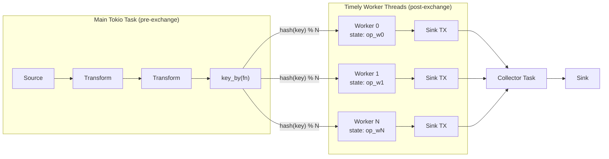
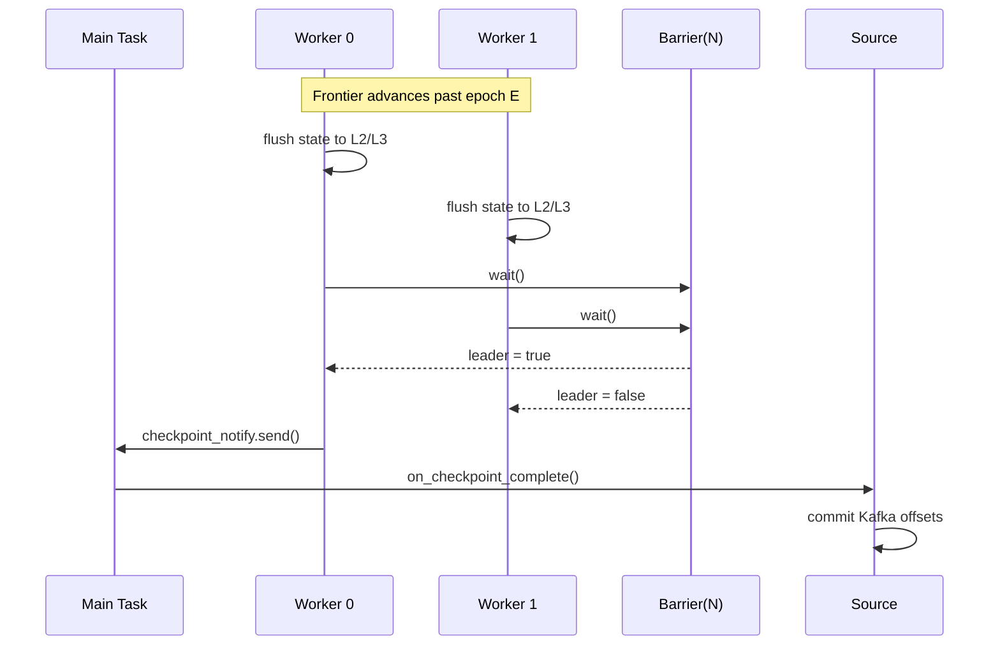
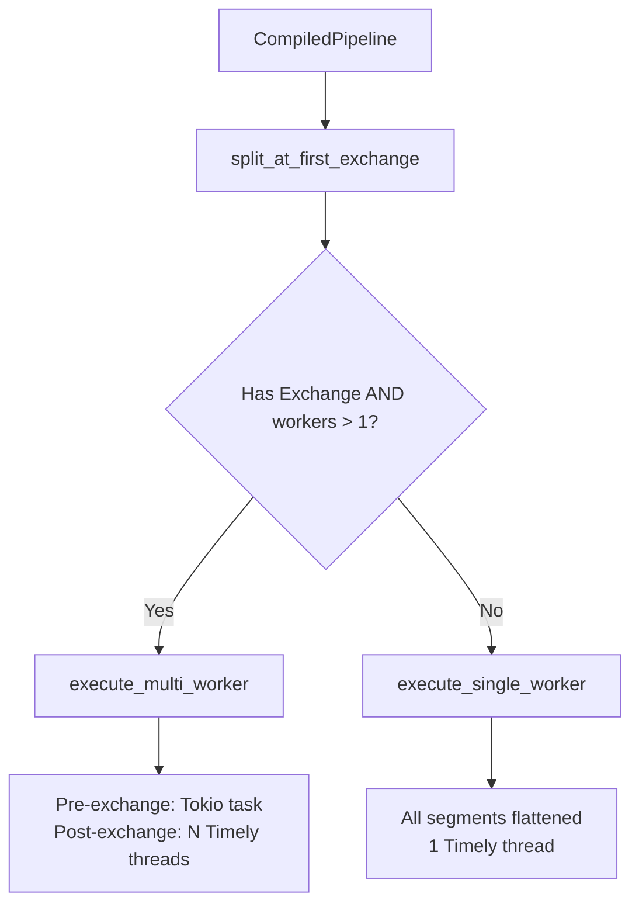
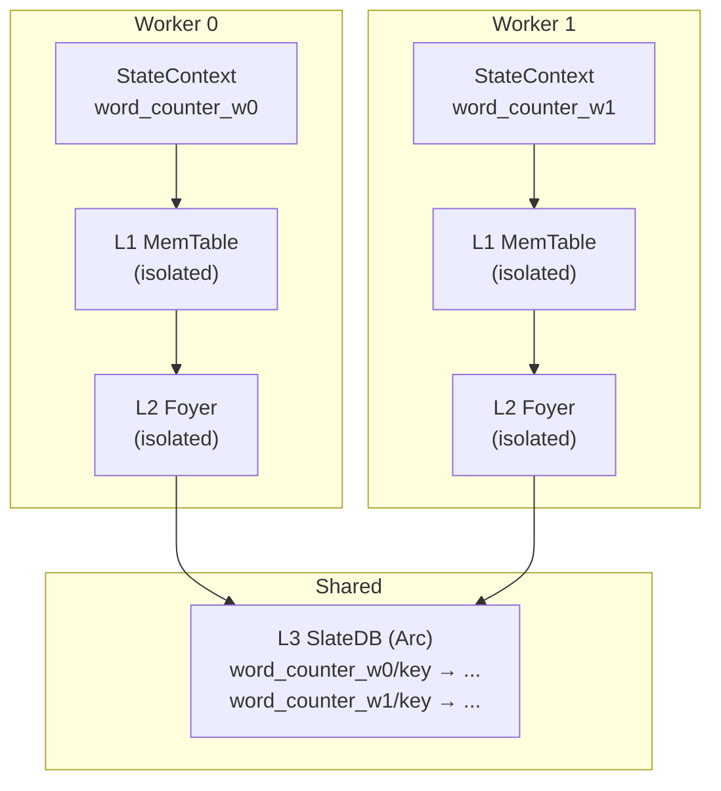

# ADR: Multi-Threaded Worker Execution

**Status:** Accepted
**Date:** 2026-02-21

## Context

Rhei's initial executor used `timely::execute_directly()`, running a single worker on one thread. All stateful operators, stateless transforms, source reads, and sink writes shared a single thread — limiting throughput to one CPU core.

For keyed stateful operators (windows, aggregations, joins), elements with different keys are independent and can be processed in parallel. The system needs a multi-threaded execution path that preserves key affinity (same key always goes to the same worker) while enabling parallel stateful processing.

## Decision

Implement **Phase 1** of the clustering roadmap: multi-threaded execution within a single OS process using Timely's `Config::process(n)`.

### Two-stage execution model

The pipeline is split at the first `key_by()` (Exchange) boundary into two stages:

1. **Pre-exchange** (main Tokio task): Source reads, stateless transforms (map, filter, flat_map). Single reader, no parallelism. Each element is hashed by key and routed to the appropriate worker channel.

2. **Post-exchange** (N Timely worker threads): Stateful operators and any remaining transforms. Each worker processes only its assigned key partition with isolated state.

### Key partitioning

```rust
pub fn partition_key(key: &str, n_workers: usize) -> usize {
    (seahash::hash(key.as_bytes()) as usize) % n_workers
}
```

`seahash` provides deterministic, portable hashing — the same key maps to the same worker across restarts and compiler versions. This guarantees key affinity: all elements with key K are processed by exactly one worker.

### Worker spawning

Timely's `Config::process(n_workers)` spawns N threads with shared-memory channels. Each worker receives its data via a dedicated `tokio::sync::mpsc` channel from the pre-exchange stage. Per-worker data (segments, state contexts, channels) is packaged in `Mutex<Vec<Option<T>>>` containers and `.take()`-ed by each worker at startup.

### State isolation

Each worker gets its own `StateContext` namespaced as `{operator_name}_w{worker_index}`. The `PrefixedBackend` prepends this namespace to every key, ensuring no cross-worker contention. Workers share L3 (`SlateDbBackend` via `Arc`) but key prefixing guarantees isolation.

### Checkpoint coordination

A `std::sync::Barrier(n_workers)` synchronizes checkpoint cycles:

1. Each worker detects frontier advancement and flushes its state.
2. All workers wait at the barrier.
3. The barrier leader sends a notification to the main task via `std::sync::mpsc`.
4. The main task calls `source.on_checkpoint_complete()` to commit offsets.

This ensures all workers have durably flushed state before source offsets are committed — providing at-least-once semantics.

### Fallback to single-worker

When `n_workers == 1`, or the pipeline has no Exchange (key_by) boundary, the executor uses `execute_single_worker` — all segments are flattened and run in a single Timely worker. `--workers 1` is the default and is behaviorally identical to the original `execute_directly()`.

## Diagram

### Two-stage execution model



### Checkpoint barrier coordination



### Routing decision



### State namespace per worker



## Alternatives considered

### 1. Tokio-only parallelism (no Timely multi-worker)

Rejected. Timely provides frontier tracking, epoch-based progress, and coordinated checkpointing out of the box. Reimplementing these on top of Tokio tasks would duplicate Timely's core value and lose its battle-tested progress protocol.

### 2. Exchange pact inside Timely instead of pre-exchange routing

Rejected for Phase 1. Timely's `Exchange` pact could route data between workers internally, but this would require the source to run inside a Timely operator (not on the Tokio runtime). The current architecture bridges async sources to Timely via channels, and the pre-exchange hash routing on the main task integrates cleanly with this bridge pattern. Timely-native Exchange is planned for Phase 2 (multi-process), where TCP serialization makes it necessary.

### 3. Shared state across workers (concurrent HashMap)

Rejected. Shared mutable state between workers requires locking, introduces contention, and complicates checkpointing (which worker flushes which keys?). Key-affinity partitioning eliminates the need for shared state entirely — each key is owned by exactly one worker.

### 4. `RandomState` hash for key partitioning

Rejected. Rust's default `HashMap` hasher uses a random seed, producing different partitioning across restarts. This would break state recovery — a key's data would be on worker 0 in run 1 but worker 2 in run 2. `seahash` provides a fixed, portable hash function that is deterministic across restarts and platforms.

## Consequences

**Positive:**
- Linear throughput scaling for keyed pipelines — N workers process N key partitions in parallel.
- Key affinity guarantee — same key always routes to same worker, enabling correct stateful processing.
- Backward compatible — `--workers 1` (default) behaves identically to single-threaded execution.
- Coordinated checkpointing — barrier sync ensures all workers flush before offset commit.
- Foundation for Phase 2 (multi-process) — the two-stage model and key partitioning carry over to TCP-distributed execution.

**Negative:**
- Pre-exchange stage is single-threaded — stateless transforms before `key_by()` are bottlenecked on one task. This is acceptable because stateless transforms are typically cheap (map, filter).
- `!Send` constraint on `TimelyAsyncOperator` requires the `Mutex` wrapping pattern to move data into worker threads. This adds boilerplate but is well-contained in `executor.rs`.
- Timely's `Config::process(n)` spawns OS threads, not Tokio tasks — mixing blocking threads with async requires `spawn_blocking` and `block_in_place` bridges.

## Files

| File | Role |
|------|------|
| `rhei-runtime/src/executor.rs` | `execute_multi_worker`, `partition_key`, barrier coordination, worker spawning |
| `rhei-runtime/src/compiler.rs` | `split_at_first_exchange` — pipeline splitting at Exchange boundary |
| `rhei-runtime/src/dataflow.rs` | `KeyFn`, `NodeKind::KeyBy` — key extraction and exchange node types |
| `rhei-runtime/src/bridge.rs` | `erased_source_bridge` — async source to sync channel bridge |
| `rhei-runtime/src/timely_operator.rs` | `TimelyErasedOperator` — frontier-aware checkpoint triggering |
