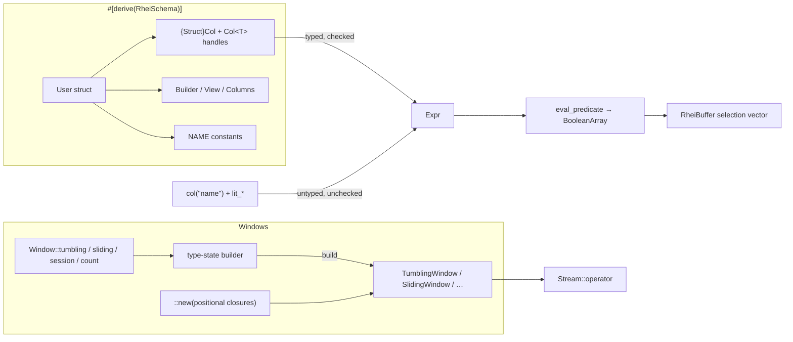
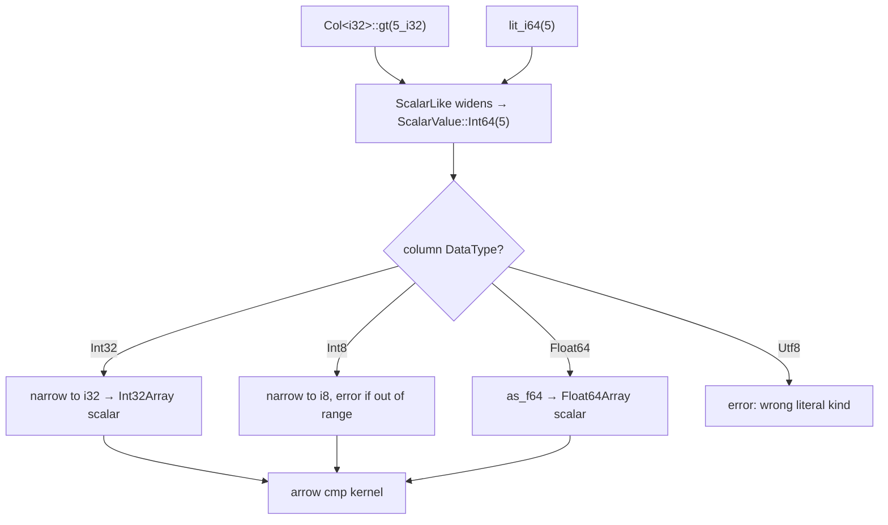

# ADR: Typed Column Handles and Window Builders

**Status:** Accepted
**Date:** 2026-08-15

## Context

Two of rhei's most-used operator APIs are the hardest to write correctly at a
call site, and both fail late.

**Filter expressions.** `Stream::filter` takes an `Expr` built from stringly
typed pieces:

```rust,ignore
// not-compiled: illustrative
.filter(col("dwell_ms").gt(lit_f64(3_000.0)))
```

Nothing here is checked against the schema. Three failure modes follow:

1. A misspelled or renamed column is a runtime error on the first batch.
2. The `lit_*` constructor must match the column's Arrow type, and only three
   widths exist (`Int64`, `UInt64`, `Float64`). `#[derive(RheiSchema)]` happily
   generates `Int32`, `UInt16`, `Float32`, … columns, so the natural
   `col("count_i32").gt(lit_i64(5))` reached `as_primitive::<Int64Type>()` on an
   `Int32Array` and **panicked** inside the operator.
3. Nullable columns (`Option<T>` fields) had no way to express a null check at
   all.

The derive already emits `WebEvent::USER_ID: &'static str` name constants, but
they only fix the first problem, and only if the author remembers to use them.

**Window construction.** All four windows take the same four closures
positionally:

```rust,ignore
// not-compiled: illustrative
TumblingWindow::new(60_000, key_fn, time_fn, accumulate_fn, finish_fn)
```

The closures are structurally similar — two of them take a view and return a
scalar — so swapping `key` and `time` type-checks in some schemas and silently
windows on the wrong field. There is no name at the call site saying which is
which, and `.with_allowed_lateness()` reads as an afterthought rather than part
of the window's definition.

## Decision

Add two helpers. Neither replaces the existing API: both compile down to
exactly the same operator values, and the positional constructors and the
untyped `col`/`lit_*` builders remain available and supported.

### 1. Typed column handles, generated by the derive

`#[derive(RheiSchema)]` gains a generated zero-sized `{Struct}Col` type and an
associated `col()` accessor. Each field yields a `Col<T>` carrying the column
name and the field's Rust type:

```rust,ignore
// not-compiled: illustrative
let c = PageView::col();
stream.filter(c.dwell_ms().gt(3_000.0).and(c.referrer().is_not_null()))
```

- `Col<T>` exposes `gt`, `gt_eq`, `lt`, `lt_eq`, `eq`, `not_eq` taking
  `impl Into<T>`, plus `between`, `is_in`, `is_null`, `is_not_null`, `expr`,
  and `name`.
- `Option<T>` fields produce `Col<T>` — a nullable column still compares
  against plain `T` values.
- Fields with no scalar form (`Vec<T>`, `Vec<u8>`) produce a handle whose type
  parameter has no `ScalarLike` impl, so only the name and null predicates are
  reachable. The field is still discoverable rather than silently absent.

Two supporting changes make this sound:

- `Expr` gains `IsNull` / `IsNotNull`, evaluated with the Arrow
  `is_null` / `is_not_null` kernels.
- `cmp_array_scalar` now dispatches on the **column's** `DataType` rather than
  on the literal's variant, narrowing the widened literal (`i64`/`u64`/`f64`)
  back to the column's native type. Narrow columns compare correctly, an
  out-of-range literal is an `anyhow` error, and a literal of the wrong kind is
  an error — where all three previously panicked. This also fixes the untyped
  `col`/`lit_*` path, not just the typed one.

`ScalarLike` is the trait mapping a Rust type to a `ScalarValue` literal; it is
implemented for `i8`–`i64`, `u8`–`u64`, `f32`, `f64`, `bool`, and `String`.

### 2. `Window` builders

A `Window` namespace returns a type-state builder per window kind:

```rust,ignore
// not-compiled: illustrative
Window::tumbling(60_000)
    .key(|v: PageViewView<'_>| v.user_id.to_string())
    .time(|v: PageViewView<'_>| v.ts)
    .accumulate(|acc: &mut u64, _v: PageViewView<'_>| *acc += 1)
    .finish(|user_id: &str, start: u64, end: u64, views: &u64| PerMinute { .. })
    .allowed_lateness(5_000)
    .build()
```

Each slot is a type parameter that starts as `Unset` and becomes `Set<F>` when
supplied. `build()` is implemented only where every slot satisfies the `Filled`
trait, which `Unset` does not implement — so a missing closure is a compile
error naming the unfilled slot, and slots may be supplied in any order.

`build::<I, O, Acc>()` is generic over the input, output, and accumulator types
rather than the builder being generic over them. This matters: those three are
inferred from the `.operator("name", op)` call site, exactly as they are for
`::new(...)`, and pinning them earlier would have forced turbofish at every
call site.

`Window::count` has no `time()` or `allowed_lateness()`, because count windows
have no notion of time. That asymmetry is expressed in the type rather than
documented and ignored.

## Diagram

Where each helper sits relative to the existing API:



Literal narrowing on the comparison path:



Builder type-state, using the tumbling window as the example:

```mermaid
stateDiagram-v2
    direction LR
    [*] --> B0: Window::tumbling(size)
    B0 --> Bk: .key(f) — Unset → Set&lt;F&gt;
    Bk --> Bkt: .time(f)
    Bkt --> Bkta: .accumulate(f)
    Bkta --> Full: .finish(f)
    Full --> Full: .allowed_lateness(n)
    B0 --> B0: .allowed_lateness(n)
    Full --> [*]: .build() — only Set&lt;_&gt; implements Filled
```

## Alternatives considered

1. **Generate `Col<T>` accessors directly on the struct**
   (`PageView::dwell_ms()`) — shortest to write, but claims a method name per
   field in the user's inherent namespace, colliding with any accessor they
   write themselves. The `col()` indirection costs six characters and is
   collision-free. It is also `Copy`, so `let c = PageView::col();` recovers the
   brevity.

2. **Change the existing `USER_ID` constants to be `Col<T>` instead of `&str`** —
   would break every existing use of the name constants (they are documented as
   plain column names for DataFusion interop) for no gain over a new accessor.

3. **Add `Int8`/`Int32`/`Float32`/… variants to `ScalarValue`** — the obvious
   fix for narrow columns, but it pushes the burden back onto the caller
   (`lit_i32` vs `lit_i64`) and leaves `lit_i64` against an `Int32` column still
   panicking. Dispatching on the column type fixes every caller at once,
   including ones that already exist.

4. **Runtime-validated column names** (check `col("...")` against the schema
   when the graph is built) — catches typos earlier than the first batch, but
   still not at compile time, and does nothing for literal types. Worth doing
   independently; not a substitute.

5. **A linear builder chain** (`.key()` returns a distinct `KeyedStage` type,
   forcing key → time → accumulate → finish order) — gives an equally good
   "missing slot" error with less machinery, but imposes an arbitrary order and
   makes `.allowed_lateness()` legal at only one point in the chain. The
   `Set`/`Unset` type-state costs one extra trait and allows any order.

6. **`Option`-typed slots validated in `build()`** — a runtime panic for a
   missing closure. Rejected: the whole point is to move the failure to compile
   time.

7. **Accept `std::time::Duration` for window sizes** — reads better, but window
   sizes are in whatever unit the `time()` closure returns, which is
   user-defined and frequently not milliseconds. A `Duration` parameter would
   imply a unit the operator does not enforce.

## Consequences

**Positive**

- Column names in filters come from the schema; renaming a field breaks the
  filter at compile time rather than on the first batch.
- Literals are checked against the field's type, and narrow columns
  (`i32`, `u16`, `f32`) work at all — previously a panic in the operator.
- Nullable columns are expressible (`is_null` / `is_not_null`), for typed and
  untyped expressions alike.
- Comparison failures are `anyhow` errors routed through normal pipeline error
  handling instead of panics inside the Timely worker.
- A window's four closures are named at the call site, and an incomplete window
  does not compile.
- Both helpers are additive: no existing call site changes, and the built
  values are identical to what the positional constructors produce.

**Negative**

- The derive emits one more type (`{Struct}Col`) and one method per field,
  growing generated code and compile time slightly for wide schemas.
- `Col<T>` handles only whole-column comparisons against literals or other
  columns; arithmetic (`price * qty > 100`) still needs `filter_fn`, and the
  `Expr` language does not have it either.
- Four near-identical builder types (one per window) are ~400 lines of
  mechanical code that must be kept in step when a window gains a parameter.
- The "missing slot" compile error is an `E0599` mentioning `Unset: Filled`
  rather than a bespoke message; `#[diagnostic::on_unimplemented]` improves the
  message only where the bound is checked outside method resolution.
- Two ways to build a window and two ways to build a predicate now coexist. The
  documentation names the typed/builder forms as preferred, but the older forms
  are not deprecated and remain in older examples.
