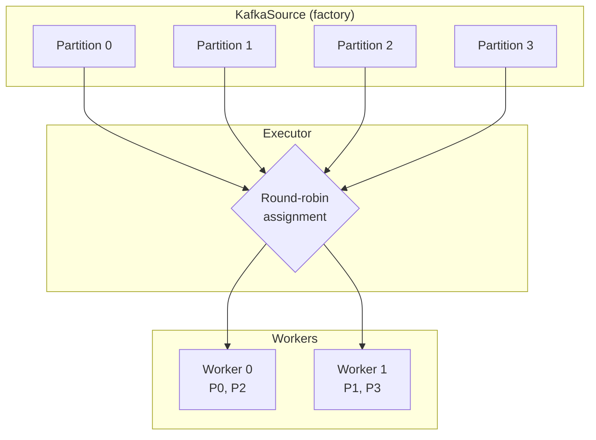
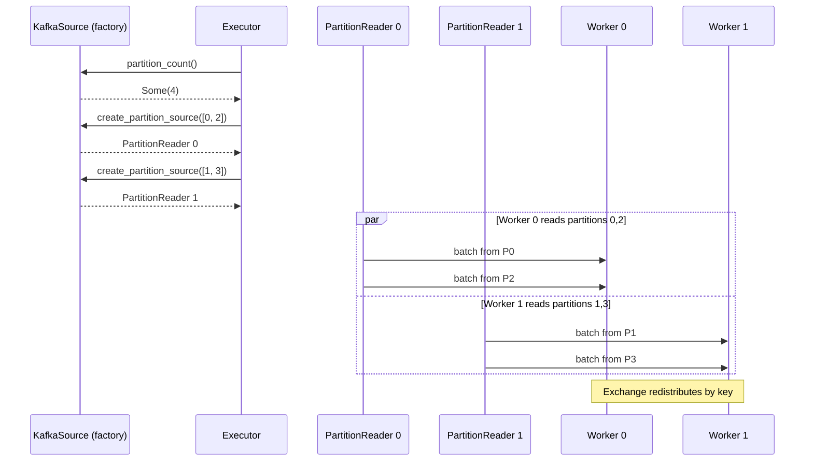
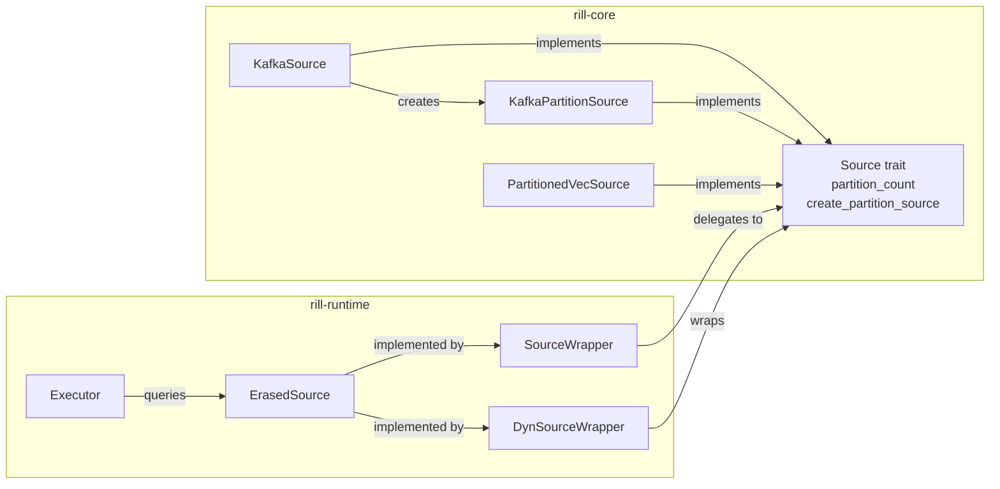

# ADR: Partitioned Source Consumption

**Status:** Accepted
**Date:** 2026-02-21

## Context

The unified Timely DAG executor funnels all source data through worker 0. Other workers are idle at the source level and only become active after an Exchange pact redistributes data by key. For Kafka, this is suboptimal — partitions are the natural unit of parallelism, and forcing a single consumer bottlenecks throughput.

Sources should expose partitioning capabilities so each worker can consume from its own partition(s), enabling true parallel ingestion before the exchange stage.

## Decision

Extend the `Source` trait with two optional methods that enable partition-aware parallel consumption. The executor detects partitioned sources and distributes partition readers across workers via round-robin assignment.

### Source trait extension

Two default methods are added to the `Source` trait:

- `partition_count() -> Option<usize>` — returns the number of partitions if the source supports parallel consumption. Default: `None`.
- `create_partition_source(&self, assigned: &[usize]) -> Box<dyn Source<Output = Self::Output>>` — creates a source that reads only the given partition indices. Has a `where Self: Sized` bound to preserve object safety.

### KafkaSource implementation

`KafkaSource` stores factory config (`brokers`, `group_id`, `topics`) so it can create new consumers:

- `partition_count()` fetches Kafka metadata to count partitions across subscribed topics.
- `create_partition_source()` creates a new `StreamConsumer` with manual partition assignment (no group rebalance), reading only the specified (topic, partition) pairs.

A new `KafkaPartitionSource` struct handles per-partition reading with the same polling logic as `KafkaSource`, but `restore_offsets()` filters to only its assigned partitions.

### Executor integration

The executor's source bridging section detects partitioned sources and distributes partitions across workers:

1. Query `partition_count()` on each source.
2. If `Some(n)`, round-robin assign partitions to workers: partition `p` goes to worker `p % n_workers`.
3. Create per-worker partition readers via `create_partition_source()`.
4. Bridge each reader independently with its own offset tracking.
5. Workers without partitions (when `n_workers > n_partitions`) get no source receiver — their source operator closes immediately, and they participate only after Exchange feeds them data.

Non-partitioned sources continue to be bridged only to worker 0 (unchanged behavior).

### Type erasure

The `ErasedSource` trait gains `partition_count()` and `create_partition_source()` methods. `SourceWrapper<S>` delegates to the concrete `Source` implementation. A new `DynSourceWrapper<T>` wraps `Box<dyn Source<Output = T>>` (returned by `create_partition_source`) into `ErasedSource`.

### Testing

`PartitionedVecSource<T>` is a test utility that distributes items round-robin across partitions, enabling executor-level tests without Kafka.

## Diagram

### Partition distribution across workers

### Data flow with partitioned source

### Component relationships

## Alternatives considered

### 1. Separate `PartitionedSource` trait

A dedicated trait would avoid adding methods to `Source` that most implementations don't need. Rejected because:
- The default implementations make the methods opt-in with zero cost for non-partitioned sources.
- A separate trait would require additional type erasure plumbing and complicate the executor's source handling.

### 2. Dynamic rebalance protocol

A more sophisticated approach where the executor monitors partition assignments and rebalances as workers join/leave. Rejected because:
- The current single-process model has a fixed worker count at startup.
- Rebalancing adds significant complexity (state migration, offset handoff).
- Can be revisited when clustering support is added.

### 3. Source-level threading (source manages its own threads)

Each source could internally spawn threads for parallel partition reading. Rejected because:
- Breaks the executor's control over resource allocation.
- Makes offset tracking and checkpointing harder to coordinate.
- The executor already has worker threads — leveraging them is simpler.

## Consequences

**Positive:**
- Kafka sources can now ingest from multiple partitions in parallel, eliminating the single-consumer bottleneck.
- The design is generic — any source can opt into partitioning by implementing two methods.
- Non-partitioned sources are completely unchanged; all existing tests pass.
- `PartitionedVecSource` enables thorough testing without external dependencies.

**Negative:**
- `partition_count()` on `KafkaSource` performs a metadata fetch, adding latency at startup.
- Partition assignment is static (round-robin at startup). Dynamic rebalancing is not supported.
- Workers beyond the partition count are idle at the source level (though they participate after Exchange).

## Files changed

| File | Change |
|---|---|
| `rill-core/src/traits.rs` | Add `partition_count()` and `create_partition_source()` to `Source` |
| `rill-core/src/connectors/kafka_source.rs` | Store factory config, add `KafkaPartitionSource`, implement partitioning |
| `rill-core/src/connectors/partitioned_vec_source.rs` | New — `PartitionedVecSource` for testing |
| `rill-core/src/connectors/mod.rs` | Register `partitioned_vec_source` module |
| `rill-runtime/src/dataflow.rs` | Add partitioning to `ErasedSource`, implement in `SourceWrapper`, add `DynSourceWrapper` |
| `rill-runtime/src/executor.rs` | Partition-aware source bridging, per-worker source distribution, new tests |
| `ROADMAP.md` | Mark partitioned source consumption as completed |
