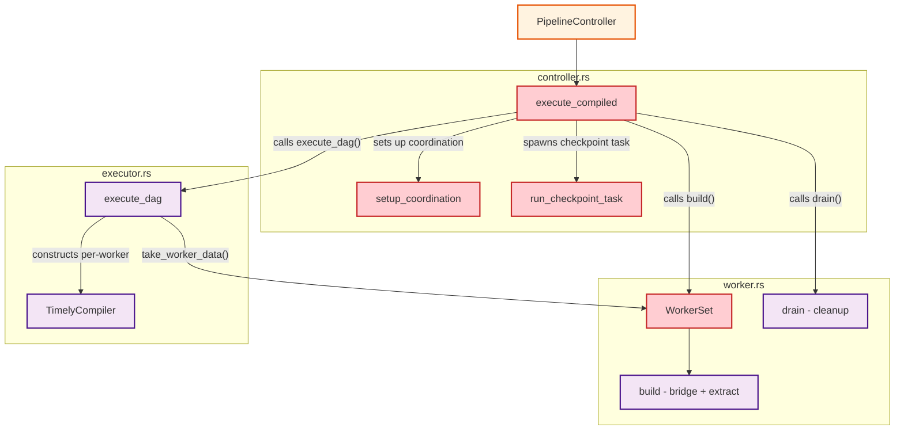
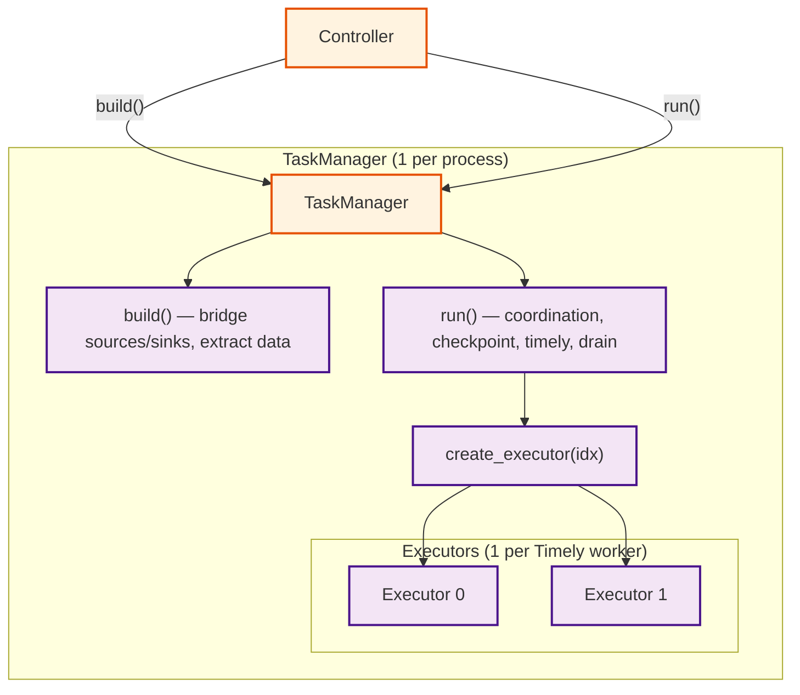
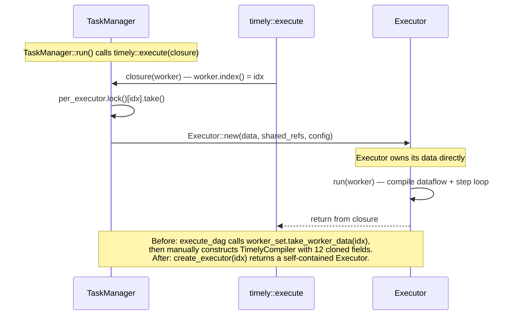

# ADR: Process-Internal Layering (Controller / TaskManager / Executor)

**Status:** Proposed
**Date:** 2026-02-28

## Context

The current `rhei-runtime` has three key components — `PipelineController`, `WorkerSet`, and `TimelyCompiler` / `execute_dag` — with blurred ownership boundaries. Four specific problems motivate this refactor:

1. **WorkerSet mixes dependency setup with data packaging.** `WorkerSet::build()` performs DLQ setup, source/sink bridging, per-worker data extraction, and global watermark task spawning. But it is not a real abstraction — it is a bag of fields consumed piecemeal by `execute_compiled` and `execute_dag`. It has no `run()` method and no lifecycle of its own.

2. **Controller orchestrates tasks that belong to the process worker layer.** The private `execute_compiled()` function in `controller.rs` spawns the checkpoint task, sets up cross-process coordination, creates the shutdown barrier, and manages the drain sequence. These are process-level execution concerns, not configuration/lifecycle concerns.

3. **Background task ownership is split across files.** Source bridges, sink drains, DLQ drains, and the watermark task are spawned in `worker.rs`. The checkpoint task and coordinator task are spawned in `controller.rs`. Cleanup happens in two places: `WorkerSet::drain()` for sink/DLQ handles, `execute_compiled` for checkpoint/coordinator handles. This split makes it difficult to reason about task lifetimes.

4. **Per-executor data handoff uses `Arc<Mutex<Vec<Option<...>>>>` with runtime panics.** Each Timely worker calls `worker_set.take_worker_data(idx)`, which locks a mutex, indexes into a Vec, and `Option::take()`s the data. If data was already taken or never populated, it panics. The `Option` indirection exists solely because graph extraction is destructive (move semantics) and data must be pre-extracted before Timely's closure runs.

## Decision

Split the runtime into three layers with clear ownership boundaries:

### Controller (unchanged public API, simplified internals)

`PipelineController` retains its public API (`run()`, builder pattern). Internally, `run_graph` becomes:

```
compile → validate manifest → TaskManager::build() → task_manager.run() → write final manifest
```

No background tasks are spawned by the Controller. All execution orchestration moves to TaskManager.

### TaskManager (replaces WorkerSet + execute_compiled orchestration)

One per process. Owns all shared infrastructure, all background tasks, and all per-executor data. Provides `create_executor(idx)` for constructing Executors inside the Timely closure.

```rust
pub(crate) struct TaskManager {
    // Shared infrastructure
    sink_senders: Arc<HashMap<NodeId, mpsc::Sender<AnyItem>>>,
    global_watermark: Arc<AtomicU64>,

    // Graph metadata
    topo_order: Arc<Vec<NodeId>>,
    node_inputs: Arc<HashMap<NodeId, Vec<NodeId>>>,
    node_kinds: Arc<HashMap<NodeId, NodeKindTag>>,
    last_operator_id: Option<NodeId>,
    all_operator_names: Vec<String>,

    // Per-executor data (sized to total_workers, Some for local, None for remote)
    per_executor: Mutex<Vec<Option<ExecutorData>>>,

    // Checkpoint infrastructure
    checkpoint_notify_tx: Mutex<Option<mpsc::Sender<u64>>>,
    checkpoint_notify_rx: tokio::sync::Mutex<mpsc::Receiver<u64>>,
    all_source_offsets: Vec<Arc<Mutex<HashMap<String, String>>>>,

    // Background task handles
    sink_handles: Vec<JoinHandle<Result<()>>>,
    dlq_handles: Vec<JoinHandle<Result<()>>>,

    // Execution config
    initial_checkpoint_id: u64,
    checkpoint_dir: PathBuf,
    process_id: Option<usize>,
    n_processes: usize,
}
```

### Executor (replaces TimelyCompiler)

One per Timely worker thread. Constructed by `TaskManager::create_executor(idx)` inside the Timely closure with everything it needs — no Arc-Mutex-Vec-Option handoff at runtime. `run(timely_worker)` compiles the dataflow and runs the step loop.

```rust
pub(crate) struct Executor {
    // Owned per-worker data
    data: ExecutorData,

    // Shared refs (Arc-cloned from TaskManager)
    sink_senders: Arc<HashMap<NodeId, mpsc::Sender<AnyItem>>>,
    topo_order: Arc<Vec<NodeId>>,
    node_inputs: Arc<HashMap<NodeId, Vec<NodeId>>>,
    node_kinds: Arc<HashMap<NodeId, NodeKindTag>>,
    rt: tokio::runtime::Handle,

    // Per-worker config
    worker_index: usize,
    num_workers: usize,
    checkpoint_notify: Option<mpsc::Sender<u64>>,
    dlq_tx: Option<DlqSender>,
    last_operator_id: Option<NodeId>,
    global_watermark: Arc<AtomicU64>,
    local_first_worker: usize,
}
```

## Diagram

### Before: Current tangled responsibilities



**Problem areas (red):** `execute_compiled` orchestrates checkpoint/coordination tasks that don't belong in the Controller layer. `WorkerSet` is consumed piecemeal across files with no self-contained lifecycle.

### After: Clean three-layer architecture



### Timely closure flow: create_executor replaces take_worker_data



## Alternatives considered

### 1. Keep WorkerSet, add Executor as thin wrapper around TimelyCompiler

Rejected because this doesn't fix the core ownership confusion. `execute_compiled` would still orchestrate checkpoint tasks and coordination outside of WorkerSet, and background task ownership would remain split across two files. The thin wrapper adds a layer without solving the problem.

### 2. Merge TaskManager into Controller (two layers instead of three)

Rejected because it would bloat the public-facing `PipelineController` with internal execution details (checkpoint task spawning, coordination setup, shutdown barriers, sink drain). The Controller should remain a clean configuration + lifecycle entry point. Two layers means the Controller becomes 700+ lines mixing configuration with orchestration.

### 3. Make Executor own its background tasks (per-thread tasks)

Rejected because background tasks are process-level, not per-thread. Source bridges may serve multiple workers (partitioned sources). Sink drain tasks aggregate output from all workers. The checkpoint task coordinates across all workers. Making Executor own these would either duplicate tasks per thread or require complex sharing that recreates the current problem.

### 4. Factory closure instead of pre-built ExecutorData

Instead of pre-extracting data into `Vec<Option<ExecutorData>>`, pass a factory closure into the Timely closure that builds ExecutorData on demand. Rejected because graph extraction is destructive — `extract_source()`, `extract_operator()`, etc. replace graph nodes with `Merge` placeholders via `std::mem::replace`. You cannot extract the same node twice. Data must be pre-extracted and cloned per worker before the Timely closure runs.

## Consequences

**Positive:**

- **Clear ownership.** Every background task is spawned by TaskManager and cleaned up by TaskManager. No cross-file cleanup.
- **Controller simplification.** `execute_compiled` disappears entirely. `run_graph` becomes a five-line function: compile, validate, build, run, manifest.
- **Eliminates fragile Arc-Mutex-Vec-Option.** `create_executor(idx)` performs the `take()` and constructs the Executor in one step. The caller gets a fully formed struct, not a bag of raw data + 12 fields to clone manually.
- **Self-contained Executor.** `Executor::run(worker)` is a single method that compiles the dataflow and runs the step loop. No ambient dependencies on `execute_dag`'s scope.
- **Better testability.** TaskManager can be tested with mock sources/sinks without PipelineController. Executor can be tested with a mock Timely worker without TaskManager.
- **Foundation for clustering Phase 3.** The TaskManager maps directly to the "TaskManager Worker" in [ARCHITECTURE.md](ARCHITECTURE.md)'s system topology. When the control plane dispatches work to a process, it talks to the TaskManager.

**Negative:**

- **Touches three core files.** `controller.rs`, `worker.rs` (→ `task_manager.rs`), and `executor.rs` all change significantly. This is a coordinated refactor, not an incremental change.
- **TaskManager struct is large.** ~15 fields spanning shared state, graph metadata, per-executor data, checkpoint infrastructure, and task handles. This is inherent complexity made explicit — the same data exists today, scattered across `WorkerSet` fields and `execute_compiled` locals.
- **TaskManager needs Arc wrapping for Timely closure.** `timely::execute` requires `Fn` (called once per worker), so the closure captures `Arc<TaskManager>` the same way it currently captures `Arc<WorkerSet>`. This is unchanged from the current design.

## Files changed

These changes are planned for the implementation phase (not included in this ADR):

| File | Change |
|------|--------|
| `rhei-runtime/src/task_manager.rs` | New file. Replaces `worker.rs`. Contains `TaskManager` struct with `build()`, `create_executor()`, and `run()`. Absorbs checkpoint/coordination orchestration from `execute_compiled`. |
| `rhei-runtime/src/executor.rs` | Refactor. `TimelyCompiler` → `Executor` with `run(worker)` method. `execute_dag` simplified or inlined into `TaskManager::run()`. |
| `rhei-runtime/src/controller.rs` | Simplify. Remove `execute_compiled`, `setup_coordination`, `run_checkpoint_task`, `CheckpointTaskConfig`, `CheckpointCoordination`. `run_graph` becomes: compile → validate → `TaskManager::build()` → `run()` → manifest. |
| `rhei-runtime/src/lib.rs` | Update module declarations: `mod worker` → `mod task_manager`. |
