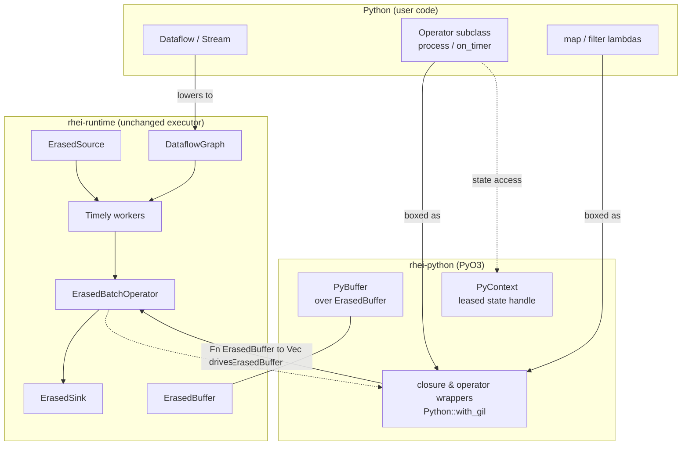
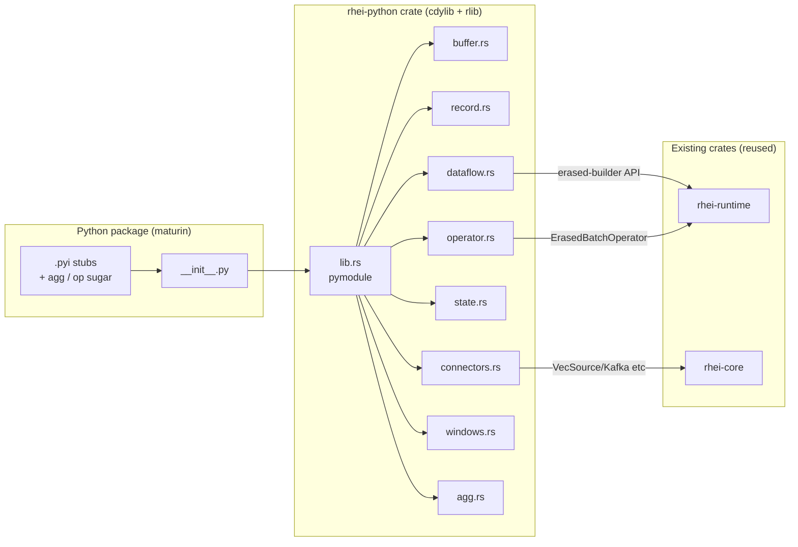

# ADR: Python Bindings

**Status:** Proposed
**Date:** 2026-06-03

## Context

Rhei pipelines are authored and run in Rust: a user defines record types with
`#[derive(RheiSchema)]`, builds a graph with the generic `Stream<T>` builder, and
runs it via `PipelineController`. This is a high barrier for the data engineers and
analysts who are the natural audience for a stream processor — they live in Python,
PyArrow, pandas/polars, and notebooks.

We want Python to be a **first-class surface for authoring *and* running complete
pipelines end-to-end**, with custom logic written in Python — not a config-only DSL
nor a UDF plug-in for Rust-authored graphs. The target experience is
`pip install rhei`, write a `.py` file, `python pipeline.py`.

This collides with three facts about rhei:

1. **Rhei is monomorphized over `T: RheiSchema`.** Every `Stream<T>`, operator,
   source, and sink is generic over a concrete Rust type known at compile time.
   Python record types are dynamic and known only at runtime. We cannot monomorphize
   over user-defined Python types.
2. **Execution is multi-threaded Timely on blocking worker threads**, but CPython has
   a Global Interpreter Lock. Python callbacks in the data path serialize on the GIL.
3. **`unsafe_code = "forbid"`** workspace-wide; clippy pedantic. PyO3 has never been
   used in the repo — this is greenfield.

The central question is therefore: *what type flows through a Python-authored graph,
and how do the generic Rust APIs bridge to a single dynamic Python-facing type?*

## Decision

Build a new `rhei-python` crate (PyO3 + maturin) that targets rhei's **existing
erased layer** directly, rather than wrapping the generic `Stream<T>` API.

### Key insight: the dynamic layer already exists

The codebase already contains a complete runtime-typed erasure layer, built for
Timely transport, that the generic API lowers to *before* execution:

- `ErasedBuffer` (`rhei-runtime/src/erased_buffer.rs`) — a `RecordBatch` + optional
  `BooleanArray` selection mask + a `schema_id` (seahash of the Arrow schema). Schema
  is **runtime data**. Already IPC-serializes for Timely Exchange.
- `ErasedSource` / `ErasedSink` / `ErasedBatchOperator`
  (`rhei-runtime/src/erased_batch.rs`) — object-safe `Box<dyn>` traits operating
  purely on `ErasedBuffer`.
- `Stream<T>::map/filter/flat_map` (`rhei-runtime/src/dataflow.rs`) erase immediately
  (e.g. `map` produces a boxed `Fn(ErasedBuffer) -> Vec<ErasedBuffer>` that
  `downcast::<T>()`s internally). The generic `T` is a **compile-time-only proof**
  that schemas line up; the executor never sees it.

**Consequence:** exactly one Rust type flows through a Python-authored graph —
`ErasedBuffer`. Python's `Buffer` is a thin handle around it. Every Python UDF is
boxed as the *same* closure / `ErasedBatchOperator` the Rust API already produces.
**No monomorphization over Python types is ever required.** The executor, exchange,
checkpointing, and state machinery are unchanged. The Python layer is a **peer** of
the typed `Stream<T>` facade — both lower to the same `DataflowGraph`.

### Data model: `Buffer` and `Record`

Mirror the Rust model Pythonically:

| Python | Rust analog | Role |
|--------|-------------|------|
| `Buffer` | `RheiBuffer<T>` / `ErasedBuffer` | An Arrow batch — the primitive that flows through the pipeline |
| `Record` | `View<'a>` | A zero-copy *view* over one row of a `Buffer` |

`Buffer.to_arrow()` / `Buffer.from_arrow()` are zero-copy via the Arrow C Data
Interface (PyCapsule protocol; arrow `54.3.1` provides FFI). The batch API never
round-trips through Python objects. `Record` holds `Arc<RecordBatch>` + a row index
and decodes columns to Python scalars lazily — genuinely "sugar over the batch path."

### Two transform APIs (both lower to the same node)

```python
# Row / Record API (ergonomic) — fn sees one Record view
stream.map(lambda t: {"usd": t["amount_cents"] / 100.0}, schema=DOLLARS)
stream.filter(lambda t: t["amount_cents"] > 0)

# Batch / Buffer API (vectorized, the fast path) — fn sees a whole Buffer
stream.map_batches(lambda b: Buffer.from_arrow(transform(b.to_arrow())), schema=DOLLARS)
stream.filter_batches(lambda b: pc.greater(b.to_arrow()["amount_cents"], 0))  # mask
```

`schema=` is required exactly where Rust requires `O: RheiSchema` (type-changing
transforms), not for `filter`/`inspect`/`key_by`. Schemas are declared as explicit
`pyarrow.schema([...])` in v1; a `@rhei.record` dataclass decorator is a later
additive sugar layer.

### Built-in stateful operators (declarative, no per-row GIL)

Built-in operators take Rust closures at construction; from Python they are exposed
as declarative configs so the hot loop stays in Rust:

```python
(stream.window(TumblingWindow(size=timedelta(minutes=1), time="event_time"))
       .key_by(key="account_id")
       .aggregate(total=agg.sum("amount_cents"), n=agg.count()))  # output schema derived
```

`agg.*` maps to existing `ReduceOp` / `RollingAggregateOp` + Arrow compute kernels.
`TemporalJoin`, `SequenceDetect`, and the window family are exposed the same way.

### Custom Python stateful operators

A Python `Operator` subclass is the projection of `StreamFunction`. It becomes a
`Box<dyn ErasedBatchOperator>` and slots into the executor with **zero executor
changes**:

```python
class VelocityGuard(rhei.Operator):
    input_schema, output_schema = TXN, ALERT
    def process(self, batch: Buffer, ctx: rhei.Context) -> rhei.Emit:
        total = ctx.value_state("total", default=0)
        for txn in batch:
            total.set(total.get() + txn["amount_cents"])
        return rhei.Emit.none()
    def on_timer(self, ts, key, ctx):
        return rhei.Emit.row({"account_id": key, "total_cents": ctx.value_state("total").get()})
```

`Emit` is the Pythonic `BufferOutput<T>`: `Emit.none()` (None),
`Emit.row(dict)` / `Emit.rows(iter)` / `Emit.buffer(b)` (Single),
`Emit.buffers([b])` (Multi). Lenient runtime: returning `None` / `dict` /
`list[dict]` from `process` is auto-wrapped.

### GIL strategy

Each Timely worker is single-threaded and calls `rt.block_on(op.process(...))` on
its own thread. Therefore:

- The GIL is held **only inside** `Python::with_gil` blocks — only while a Python UDF
  actually runs.
- All pure-Rust work (Arrow IPC ser/de in Exchange, `key_by` hashing, mask
  application, state backend I/O, Kafka I/O, Timely scheduling) runs **outside** the
  GIL.
- With `workers=N`, the N worker threads contend for the single GIL only when in a
  Python UDF. **Honest limitation:** Python UDF execution does not parallelize across
  workers under CPython's GIL. Everything else does — including the vectorized
  `agg`/`map_batches` path, where each batch is one GIL acquisition amortized over
  thousands of rows.
- **Free-threaded seam:** no global mutable Python state in closures; one Python
  operator *instance* per worker, constructed lazily on the worker thread (no
  cross-thread Python object sharing). On a Python 3.13t (`Py_GIL_DISABLED`) build the
  workers run Python in parallel with no API change. Nothing is gated on it now.

### The `&mut OperatorContext` lifetime problem

`StreamFunction::process` receives `ctx: &mut OperatorContext`, valid only for the
call; Python objects outlive Rust borrows. To stay `unsafe`-free, `OperatorContext`
is refactored so state is reachable via a cloneable handle (`Arc`-based) that
`PyContext` holds, rather than leaking a raw `&mut`. A `live` flag invalidates the
`PyContext` after `process` returns, so Python code that stashes the context and
touches it later gets a clean `RuntimeError`, not undefined behavior.

### Blocking `run()` owning tokio

`Dataflow.run(workers=4, checkpoint_dir="./ckpt")` lowers Python nodes to a
`DataflowGraph`, validates it, builds a `PipelineController`, then `py.allow_threads`
releases the GIL for the whole run while a multi-threaded tokio runtime drives the
pipeline. Ctrl-C is handled by a tokio task that periodically re-acquires the GIL to
call `py.check_signals()` and trips rhei's `ShutdownHandle` for a graceful,
checkpointed drain.

### Required Rust changes

1. Promote a small, documented `pub` erased-builder API on `DataflowGraph`
   (`add_erased_source`, `add_erased_transform`, `add_erased_operator`, `add_key_by`,
   `add_merge`, `add_erased_sink`). Today these are `pub(crate)`.
2. `erased_buffer.rs`: expose `pub fn schema_hash_of(&Schema) -> u64`; allow
   constructing an `ErasedBuffer` from an imported `RecordBatch` + explicit
   `schema_id`.
3. `OperatorContext` state-handle refactor (above), keeping `unsafe` forbidden.

## Diagram

### Where Python plugs into the existing erased layer



### Data path through one Python operator (per batch)

```mermaid
sequenceDiagram
    participant TW as Timely Worker (own thread)
    participant RT as tokio (block_on)
    participant W as PyErasedOperator
    participant PY as Python (GIL held)
    participant ST as State (L1/L2/L3, GIL released)

    TW->>RT: process(ErasedBuffer)
    RT->>W: ErasedBatchOperator::process
    W->>PY: with_gil { export RecordBatch (zero-copy FFI) }
    PY->>PY: op.process(Buffer, Context)
    PY->>ST: ctx.value_state("x").get()  (re-enter rt, GIL released)
    ST-->>PY: decoded value
    PY-->>W: Emit (None / row(s) / buffer(s))
    W->>W: import result zero-copy -> Vec<ErasedBuffer>
    W-->>RT: Ok(Vec<ErasedBuffer>)
    RT-->>TW: downstream
    Note over TW,ST: GIL held only inside with_gil; all transport/state/exchange runs GIL-free
```

### Crate / package layout



## Alternatives Considered

### 1. Wrap the generic `Stream<T>` API (monomorphize over Python types)

Rejected — impossible. `Stream<T>`, `StreamFunction<Input, Output>`, `Source`, and
`Sink` are generic over compile-time `T: RheiSchema`. Python record types exist only
at runtime, so no concrete `T` can be supplied. Targeting the erased layer
(`ErasedBuffer` + `Erased*` traits) sidesteps monomorphization entirely.

### 2. Row/dict-at-a-time UDF model (Bytewax-style)

Rejected as the *primary* model. A `def fn(row): ...` per record crosses the FFI
boundary and takes the GIL per row — orders of magnitude slower on hot paths and at
odds with rhei's columnar core. Instead the Arrow `Buffer` (batch) is the core
primitive and the `Record` row view is sugar implemented over it, so the ergonomic
path and the fast path share one lowering.

### 3. Subprocess / worker-pool execution (PySpark-style)

Rejected for v1. Running Python UDFs in a separate process pool with Arrow IPC would
give true UDF parallelism free of GIL contention, but adds substantial machinery
(IPC, serialization, process lifecycle) and per-batch latency. The in-process
embedded runtime is far simpler, and the GIL limitation is mitigated by the
vectorized `agg`/`map_batches` path plus a clean seam to Python 3.13 free-threading.

### 4. Carve an `unsafe` exception for a leased `&mut OperatorContext` pointer

Rejected. `unsafe_code = "forbid"` is a workspace invariant worth more than the minor
borrow gymnastics. A small `Arc`-based state-handle refactor of `OperatorContext`
keeps the crate fully safe while letting `PyContext` reach state.

### 5. dataclass/pydantic schema as the v1 base

Deferred (becomes additive sugar, layer L6). Building schema inference from type
hints first would couple the foundation to a decorator. An explicit
`pyarrow.schema([...])` primitive is the honest base; the decorator generates that
primitive later without changing the core.

### 6. Async `run()` (awaitable) as the primary entry point

Rejected for v1. `await graph.run(...)` would force every script into `asyncio.run`
boilerplate and complicate tokio-runtime ownership across the PyO3 boundary. A
blocking `run()` matches script/notebook usage; an async escape hatch can be added
later.

## Consequences

**Positive:**
- Python becomes a first-class authoring + execution surface with one
  `pip install`-and-run experience.
- The executor, exchange, checkpoint, DLQ, and state machinery are **reused unchanged**
  — the Python layer is a peer of the typed API, not a fork.
- Zero-copy Arrow boundary (`to_arrow()`/`from_arrow()`) drops the entire PyData
  ecosystem (pandas/polars/pyarrow.compute) into `map_batches` — a better batch story
  than row-at-a-time Python frameworks.
- The declarative `agg`/window path delivers Spark-like aggregation with Flink-like
  streaming semantics and **no Python in the hot loop**.
- The promoted erased-builder API is also the foundation for a future JSON-graph
  loader or dynamic SQL planner.
- Designed for Python 3.13 free-threading with no future API change.

**Negative:**
- **GIL:** `workers=N` does not give N× throughput for Python-heavy UDFs (documented
  loudly; mitigated by steering to `map_batches`/`agg` and the free-threaded seam).
- **`schema=` tax** on every type-changing transform — more ceremony than schema-free
  Python frameworks (mitigated by the L6 decorator and the schema-first rationale).
- **State `.get()` can block on NVMe/S3** despite a synchronous-looking API (mitigated
  by per-`process` read caching and "read once per batch" guidance).
- New build complexity: maturin, an `abi3` wheel matrix, and a PyO3 dependency in the
  workspace.
- Requires touching shared Rust (`DataflowGraph` visibility, `OperatorContext`) — a
  small, contained refactor but not zero.

## Phasing

Each layer is independently shippable and testable.

| Layer | Scope | Proves |
|---|---|---|
| L0 | Promote `pub` erased-builder API; `schema_hash_of`; `OperatorContext` refactor (Rust-only) | Erased-only graph runs — zero PyO3 risk |
| L1 | `PyBuffer` zero-copy FFI; `VecSource` → `map_batches` → `PrintSink`; `run(workers=1)` | Python↔Arrow↔Timely round-trips zero-copy |
| L2 | `Record` views; `map`/`filter`/`flat_map`/`inspect`/`filter_batches`/`key_by`/`merge`; multi-worker | Exchange routes correctly across workers |
| L3 | `window().aggregate(agg.*)`; `TemporalJoin`; `SequenceDetect` | Most real-world value, no per-row GIL |
| L4 | `Operator` protocol; `Context`/state/timers; `Emit`; `on_watermark`/`on_timer` | State survives checkpoint/restart |
| L5 | Kafka connectors; Python `Source`/`Sink`; DLQ + `on_error`; graceful Ctrl-C; metrics | Production hardening |
| L6 | `@rhei.record` dataclass/pydantic decorator (additive) | Schema ergonomics |

## Files Changed (anticipated)

| Area | Key Files | Change |
|------|-----------|--------|
| New crate | `rhei-python/Cargo.toml`, `pyproject.toml` | PyO3 + maturin; `cdylib`/`rlib`; deps on rhei-runtime/rhei-core |
| Module | `rhei-python/src/lib.rs` | `#[pymodule]` registering all pyclasses |
| Buffer | `rhei-python/src/buffer.rs` | `PyBuffer` + Arrow C Data Interface import/export |
| Record | `rhei-python/src/record.rs` | `PyRecord` lazy row view + iterator |
| Graph | `rhei-python/src/dataflow.rs` | `PyDataflow`/`PyStream`/`PyWindowedStream` + lowering |
| Operators | `rhei-python/src/operator.rs` | `PyErasedOperator`, `PyContext`, `PyEmit`, `PyTimers` |
| State | `rhei-python/src/state.rs` | `PyValueState`/`PyMapState`/`PyListState` |
| Connectors | `rhei-python/src/connectors.rs` | Configs constructing existing Rust connectors |
| Windows/agg | `rhei-python/src/windows.rs`, `agg.rs` | Specs → built-in operator construction |
| Python shim | `rhei-python/python/rhei/*` | `__init__.py`, `.pyi` stubs, `agg`/`op` sugar |
| Erased API | `rhei-runtime/src/dataflow.rs` | Promote `pub` erased-builder surface |
| Erased buffer | `rhei-runtime/src/erased_buffer.rs` | `pub schema_hash_of`; construct from `RecordBatch` + `schema_id` |
| Context | `rhei-core/src/arrow/context.rs` | State-handle refactor (cloneable, `unsafe`-free) |
| Workspace | `Cargo.toml` | Add `rhei-python` member |

## Related

- Design spec: `docs/superpowers/specs/2026-06-03-rhei-python-bindings-design.md`
- `ADR/arrow-columnar-execution.md` — the `ErasedBuffer` / erasure layer this builds on
- `ADR/dataflow-graph-api.md` — the `Stream<T>` builder the Python API mirrors
- `ADR/checkpoint-manifest.md` — checkpoint/restore that L4 state relies on
