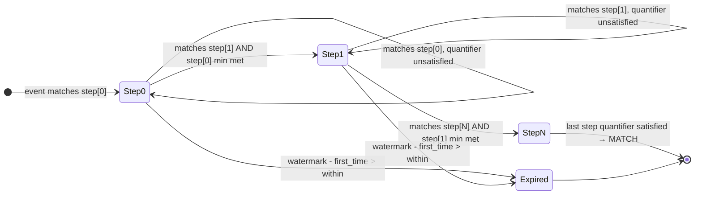
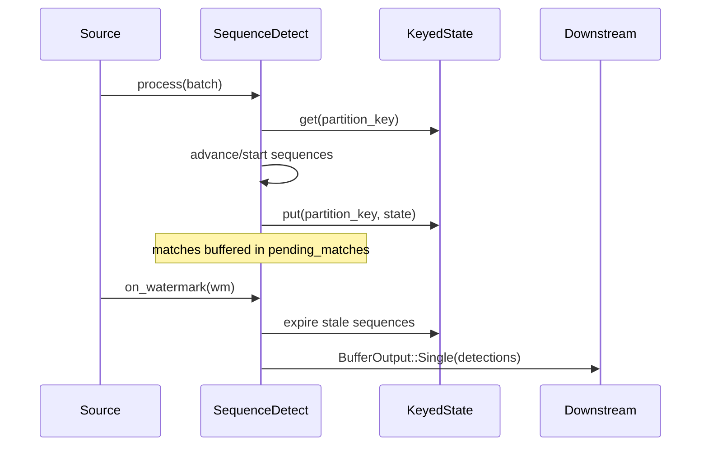

# ADR: Sequence Detect Operator

**Status:** Accepted
**Date:** 2026-05-22

## Context

Rhei's operator library covers windowed aggregation, joins, filtering, and stateful reduce — but has no mechanism for detecting ordered event sequences within a time window. This is required for UEBA (User Entity Behavior Analytics) detection patterns:

- **Ransomware:** read → write → rename within 30 minutes per entity+datastore
- **Brute force:** 5+ LoginFailed → LoginSuccess within 30 minutes per entity

These patterns correspond to Flink's `MATCH_RECOGNIZE` SQL clause. Rather than implementing SQL parsing, rhei needs an operator that provides equivalent semantics through its native closure-driven, Arrow columnar API.

## Decision

Introduce a `SequenceDetect` operator that matches ordered event sequences using a fluent builder pattern. The matching algorithm is NFA-inspired: per-partition state tracks multiple in-flight sequences, each progressing through named steps with quantifiers.

### API

```rust
let brute_force = SequenceDetect::builder()
    .key_fn(|v: LoginView<'_>| v.user_id.to_string())
    .time_fn(|v: LoginView<'_>| v.timestamp)
    .correlate_by(|v: LoginView<'_>| v.datastore_uid.to_string())
    .step("failed", |v: LoginView<'_>| v.action == "LoginFailed")
        .at_least(5)
    .step("success", |v: LoginView<'_>| v.action == "LoginSuccess")
    .within(Duration::from_mins(30))
    .after_match(AfterMatch::SkipPastMatch)
    .emit(|key: &str, ctx: &MatchCtx| Detection {
        entity: key.into(),
        failed_count: ctx.step_count("failed"),
        matched_at: ctx.last_time(),
    })
    .build();
```

### Key design choices

| Choice | Decision | Rationale |
|--------|----------|-----------|
| Step API | Fluent `.step()` chaining | Discoverable, consistent with builder pattern |
| Step predicates | `Box<dyn Fn(View) -> bool>` | Dynamic step count requires runtime dispatch |
| Correlation | Separate `.correlate_by()` | Partition = key+correlation; only key visible in emit |
| Match output | Lightweight default, opt-in `.retain_events()` | Performance first |
| After match | Configurable, default overlapping | Higher detection rate by default |
| Emit timing | Batch on watermark | Consistent with window operators |
| Quantifiers | Greedy | Matches Flink semantics; advances only when next step matches |

### Matching algorithm

The operator processes each event in timestamp order:

1. Load per-partition state from `KeyedState`
2. Expire sequences where `timestamp - first_event_time > within`
3. Advance existing in-flight sequences (check current step predicate)
4. Try to start new sequences (check step 0 predicate)
5. Persist updated state

Greedy quantifier semantics: a step with `at_least(N)` keeps consuming matching events until an event arrives that matches the *next* step AND the minimum is satisfied.

### State model

```
KeyedState<String, PartitionState>
  └── partition_key = "{key}\x1f{correlation}" or "{key}"
        └── sequences: Vec<InFlightSequence>
              ├── current_step: usize
              ├── current_step_count: usize
              ├── first_event_time / last_event_time: u64
              ├── step_counts: Vec<usize>
              └── step_times: Vec<(u64, u64)>
```

## Diagram





## Alternatives considered

1. **Full formal NFA with epsilon transitions and state splitting** — Overkill for sequential patterns without alternation. Adds complexity without benefit for the linear patterns UEBA requires.

2. **SQL compilation (like Flink)** — Doesn't fit rhei's API philosophy. Would require a SQL parser, planner, and runtime that duplicates existing Rust closures. Users lose type safety and IDE support.

3. **Abuse SessionWindow with custom accumulator** — Semantically incorrect. Sessions are gap-based; sequences are step-based with ordering constraints. Would result in fragile, hard-to-maintain code.

4. **Eager emit (on match)** — Considered for lower latency, but would be inconsistent with TumblingWindow/SessionWindow which emit on watermark. Consistency reduces user confusion.

## Consequences

**Positive:**
- All 5 UEBA patterns are now implementable in rhei (3 count-based + 2 sequence-based)
- API is consistent with existing operators (builder, `StreamFunction`, watermark emission)
- Bounded state via `max_in_flight` and WITHIN timeout
- Configurable overlap behavior supports both detection and deduplication use cases

**Negative:**
- State grows linearly with in-flight sequences per partition (mitigated by `max_in_flight` cap)
- `retain_events` mode stores empty placeholders (full event serialization deferred to future work requiring `I: Serialize`)
- Overlapping mode (default) can produce multiple matches per event sequence — users must understand this for correct downstream aggregation

## Files changed

| File | Change |
|------|--------|
| `rhei-core/src/operators/sequence_detect.rs` | New operator implementation |
| `rhei-core/src/operators/mod.rs` | Module declaration + re-export |
| `rhei/src/lib.rs` | Public API re-export |
