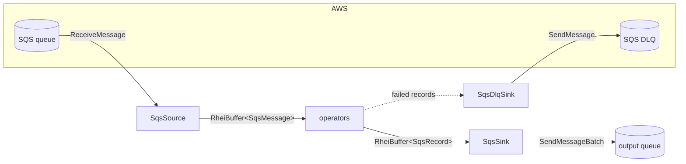

# ADR: Amazon SQS Source and Sink Connector

**Status:** Accepted
**Date:** 2026-06-16

## Context

Rhei shipped Kafka as its only production source/sink. Amazon SQS is a common
ingress/egress for AWS-native pipelines, particularly for decoupled
microservice workloads and as a buffer in front of stream processors. Unlike
Kafka, SQS has no partitions, no durable consumer offsets, and no replayable
log: consumption is destructive (a message is removed only when explicitly
deleted), and redelivery is governed by a per-message **visibility timeout**.

These differences mean SQS does not map onto the partition/offset machinery the
Kafka connector relies on (`partition_count`, `create_partition_source`,
`current_offsets`/`restore_offsets`). We need a connector whose
acknowledgement model fits rhei's checkpoint lifecycle while preserving the
same `Source`/`Sink`/`DlqSink` trait surface and Arrow columnar data path.

The roadmap calls for three capabilities: a long-polling source with
visibility-timeout management, a batched sink with message deduplication, and
dead-letter queue integration.

## Decision

Add an `sqs` cargo feature on `rhei-core` (mirroring `kafka`) that pulls in
`aws-sdk-sqs` + `aws-config` (rustls, matching the existing TLS stack) and
provides three components plus their Arrow schemas.

### Components

- **`SqsSource`** (`connectors/batch/sqs_source.rs`) — receives via long
  polling and produces `RheiBuffer<SqsMessage>`.
- **`SqsSink`** (`connectors/batch/sqs_sink.rs`) — sends `RheiBuffer<SqsRecord>`
  in `SendMessageBatch` calls.
- **`SqsDlqSink`** (`connectors/batch/sqs_dlq.rs`) — implements `DlqSink` by
  sending `DeadLetterRecord` JSON to a designated queue.
- **Shared types** (`connectors/sqs/types.rs`): `SqsMessage`, `SqsRecord`.
- **`SqsMessage` schema** lives in `sqs_schema.rs`; **`SqsRecord` schema** in
  `sqs_sink.rs` — the same split the Kafka connector uses.

### Acknowledgement = checkpoint-coordinated deletion (at-least-once)

SQS deletion is the analogue of a Kafka offset commit. `SqsSource` accumulates
the `receipt_handle` of every received message in `pending_handles` and deletes
them (via `DeleteMessageBatch`, ≤10 per call) only in
`on_checkpoint_complete()`. A message is therefore removed from the queue only
*after* the checkpoint that consumed it has durably committed. If the process
crashes before that, the messages reappear once their visibility timeout
elapses and are reprocessed — **at-least-once** delivery.

Because SQS has no durable, restorable cursor, `current_offsets` /
`restore_offsets` are intentionally left as the trait defaults (empty): there
is nothing meaningful to persist across restarts — the queue itself *is* the
durable state, and undeleted messages simply become visible again.

### Visibility-timeout management

`with_visibility_timeout` (default 30s) is applied on every receive. The
operative invariant is **visibility timeout > checkpoint interval**; otherwise
in-flight messages become visible mid-processing and are redelivered. This is
documented on the builder method rather than auto-tuned, because the safe value
depends on the pipeline's checkpoint interval, which the source does not own.

### Long-poll batching

The framework requests up to `batch_size` rows, but a single `ReceiveMessage`
returns at most 10. `poll_messages` issues the **first** call with the
configured long-poll wait (default 20s, the SQS max) and **subsequent** calls
with `wait_time_seconds = 0`, draining quickly until either `batch_size` is
reached or a call returns fewer messages than requested (queue drained). This
avoids paying a full long-poll window per sub-batch while still blocking for at
least one message when the queue is empty (SQS is an unbounded source, so
`next_batch` never returns `None`).

### Sink: batching, dedup, partial failures

`write_batch` regroups rows into owned `OutEntry` values and sends them in
batches of ≤10. For FIFO queues, per-record `group_id`/`dedup_id` map to
`MessageGroupId`/`MessageDeduplicationId`; `with_default_group_id` supplies a
group ID for records that omit one. `SendMessageBatch` can partially succeed,
so any non-empty `failed()` set is surfaced as an error (consistent with the
"propagate sink send errors" stability guarantee) rather than silently dropped.

### DLQ integration

Two independent layers: (1) **rhei-level** via `SqsDlqSink` for records that
fail *operator* processing (`ErrorPolicy::SendToDlq`); (2) **SQS-native**
redrive policy (`maxReceiveCount` → DLQ) for messages repeatedly received but
never deleted — handled server-side and surfaced through `receive_count` on
`SqsMessage` for observability.

## Diagram

### Data flow



### Acknowledgement lifecycle

```mermaid
sequenceDiagram
  participant Q as SQS queue
  participant S as SqsSource
  participant CP as Checkpoint
  S->>Q: ReceiveMessage (visibility_timeout=30s)
  Q-->>S: messages + receipt_handles
  Note over S: stash handles in pending_handles<br/>messages invisible for 30s
  S->>CP: emit batch downstream
  CP->>CP: frontier advances, state flushed
  CP-->>S: on_checkpoint_complete()
  S->>Q: DeleteMessageBatch(pending_handles)
  Note over S,Q: messages permanently removed only now;<br/>crash before this ⇒ redelivery after timeout
```

## Alternatives Considered

- **Auto-commit (delete on receive).** Simplest, but yields at-most-once: a
  crash between delete and checkpoint loses data. Rejected — rhei's checkpoint
  model exists precisely to avoid this.
- **Persisting receipt handles in the checkpoint manifest for cross-restart
  resume.** Receipt handles expire with the visibility timeout and are invalid
  after a restart, so persisting them is useless; the queue redelivers
  undeleted messages anyway. Rejected as dead weight.
- **Automatic visibility-timeout heartbeating** (`ChangeMessageVisibility` on a
  timer to extend in-flight messages). Real benefit for long checkpoints, but
  adds a background task and failure modes. Deferred — documented invariant
  (timeout > checkpoint interval) covers the common case; can layer on later.
- **Parallel per-worker consumption via `partition_count`.** SQS has no
  partitions; multiple consumers already share a queue natively. Modelling
  pseudo-partitions would complicate the source for no semantic gain. The
  source runs single-instance (`partition_count` ⇒ default `None`); horizontal
  scale is future work.
- **Binary bodies via base64.** SQS bodies are UTF-8 text; we keep `body:
  String` and leave any binary encoding to the application, matching SQS's own
  contract.

## Consequences

### Positive

- AWS-native pipelines get first-class SQS ingress/egress with the same
  ergonomics as Kafka and zero changes to the `Source`/`Sink`/`DlqSink` traits.
- At-least-once delivery integrated with existing checkpointing; no new
  coordination protocol.
- FIFO dedup, per-message delay, batched sends (10×), and partial-failure
  propagation are all supported.
- Fully feature-gated: default builds and non-AWS users pull no AWS SDK.

### Negative / limitations

- **At-least-once, not exactly-once.** Downstream must tolerate duplicates
  (idempotent sinks or dedup keys). Exactly-once would require 2PC, tracked
  separately on the roadmap.
- **Single-instance source.** No per-worker parallel consumption yet; throughput
  is bounded by one consumer's long-poll loop.
- **Operator-controlled invariant.** Correctness depends on visibility timeout
  exceeding the checkpoint interval; misconfiguration causes redelivery (safe,
  but wasteful).
- **Network-dependent tests.** Unit tests cover Arrow schema round-trips only;
  end-to-end coverage needs LocalStack/live SQS and is not wired into CI here.
