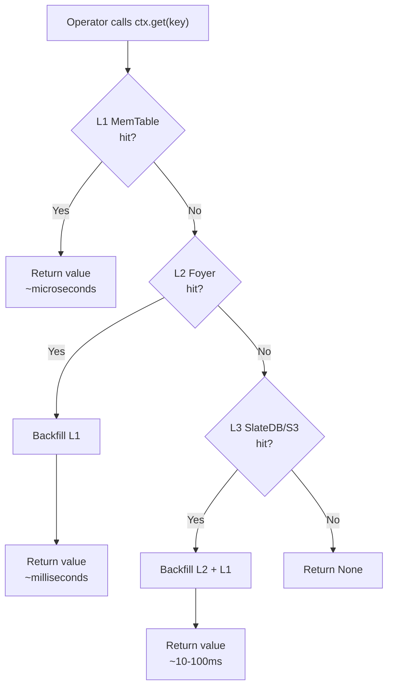
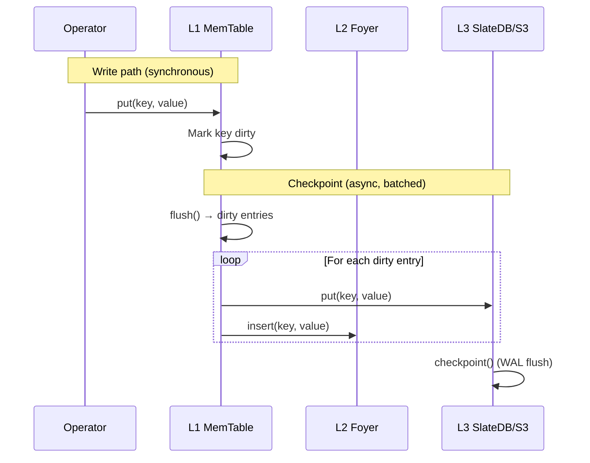
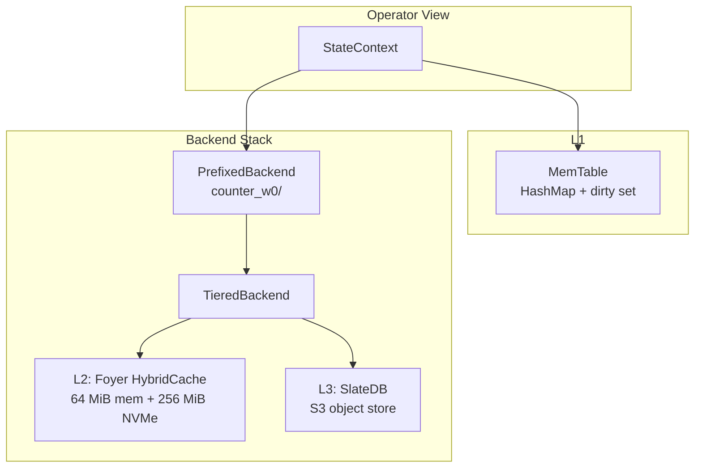
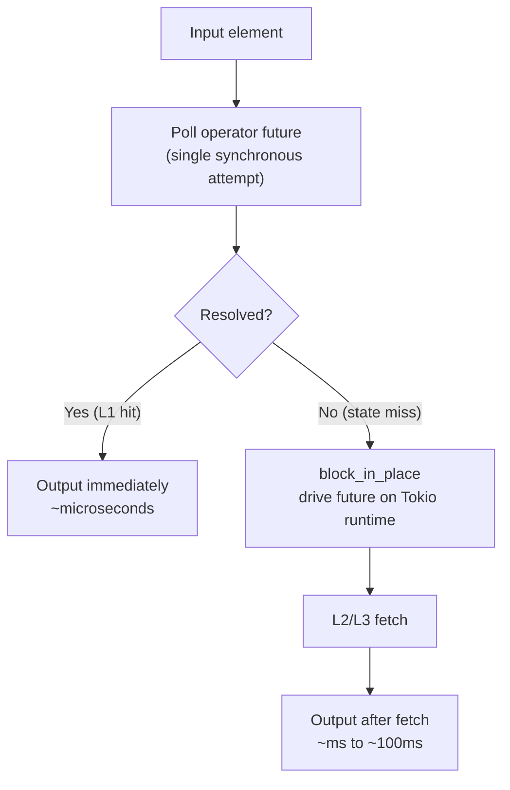

# ADR: Tiered State Backend

**Status:** Accepted
**Date:** 2026-02-21

## Context

Stateful stream processing operators need fast, durable key-value state. The access pattern is highly skewed: a small working set of keys is accessed frequently (hot path), while the full state may be orders of magnitude larger (cold path).

A single storage tier forces a trade-off: in-memory is fast but volatile and capacity-limited; object storage (S3) is durable and unbounded but has 10-100ms latency per access. The system needs a storage hierarchy that serves hot keys in microseconds while durably persisting the full state.

## Decision

Implement a **three-tier state hierarchy** with automatic promotion/demotion:

| Layer | Technology | Latency | Capacity | Durability |
|-------|-----------|---------|----------|------------|
| **L1** | `MemTable` (HashMap) | Microseconds | RAM-limited | Ephemeral |
| **L2** | Foyer `HybridCache` | Milliseconds | NVMe-backed | Local disk |
| **L3** | SlateDB on S3 | 10-100ms | Unbounded | Durable |

### StateBackend trait

```rust
#[async_trait]
pub trait StateBackend: Send + Sync {
    async fn get(&self, key: &[u8]) -> anyhow::Result<Option<Vec<u8>>>;
    async fn put(&self, key: &[u8], value: &[u8]) -> anyhow::Result<()>;
    async fn delete(&self, key: &[u8]) -> anyhow::Result<()>;
    async fn checkpoint(&self) -> anyhow::Result<()>;
}
```

All methods are async to support I/O-bound backends without blocking Timely worker threads.

### StateContext (operator-facing API)

Operators interact with state through `StateContext`, which encapsulates the L1 memtable and delegates to a backend (L2/L3) on cache miss:

- **Read path**: L1 memtable hit → return immediately. L1 miss → query backend → backfill L1 on hit.
- **Write path**: Synchronous write to L1 only. No backend I/O on write — writes are batched and flushed at checkpoint.
- **Delete path**: Record tombstone in L1. Backend delete deferred to checkpoint.

This makes the common case (read-your-own-writes, hot keys) synchronous and microsecond-fast.

### L1 MemTable

An in-memory `HashMap<Vec<u8>, Option<Vec<u8>>>` with dirty key tracking via `HashSet`. `None` values represent tombstones (deletes). The `flush()` method returns dirty entries and clears the dirty set — called by `StateContext::checkpoint()`.

### L2 Foyer HybridCache

Foyer provides a hybrid memory + NVMe disk cache. Configuration:

```rust
pub struct TieredBackendConfig {
    pub foyer_dir: PathBuf,
    pub foyer_memory_capacity: usize,   // default: 64 MiB
    pub foyer_disk_capacity: usize,     // default: 256 MiB
}
```

L2 sits between L1 and L3: on L1 miss, L2 is checked before falling through to L3. On L3 hit, the value is backfilled into L2. This reduces S3 round-trips for the working set that doesn't fit in L1.

### L3 SlateDB

SlateDB provides a Log-Structured Merge tree backed by an object store (S3, GCS, Azure Blob). Writes go to a local WAL first, then compact to S3 asynchronously. SlateDB is durable by default — `checkpoint()` is a no-op because writes are already committed to the WAL.

### TieredBackend

Composes L2 and L3 with **write-through** consistency:

- **Read**: L2 hit → return. L2 miss → L3 get → backfill L2 on hit.
- **Write**: L3 put first (durability), then L2 insert (cache).
- **Delete**: L3 delete + L2 remove.

### PrefixedBackend

Wraps any `StateBackend` and prepends `{operator_name}/` to every key. Multiple operators safely share a single backend instance without key collisions. In multi-worker mode, the prefix becomes `{operator_name}_w{worker_index}/`.

### Checkpointing

1. `StateContext::checkpoint()` calls `memtable.flush()` to get dirty entries.
2. Each dirty entry is applied to the backend (`put` or `delete`).
3. `backend.checkpoint()` is called for L3 durability.
4. In multi-worker mode, a barrier synchronizes all workers before source offsets are committed.

### Hot/cold path integration

`AsyncOperator` attempts a single synchronous poll of the operator future. If the future resolves immediately (L1 cache hit), output is returned with no context switch. If pending (state miss requiring L2/L3 I/O), `block_in_place` drives the future on the Tokio runtime. This keeps the hot path at microsecond latency while transparently handling cold-path fetches.

### Backend selection

The executor selects the backend based on configuration:

- **Without tiered storage**: `PrefixedBackend(LocalBackend)` — JSON file per operator. Suitable for development and testing.
- **With tiered storage**: `PrefixedBackend(TieredBackend(Foyer + SlateDB))` — full L2/L3 hierarchy. For production deployments.

```rust
// Development:
let executor = Executor::new(checkpoint_dir);

// Production:
let executor = Executor::new(checkpoint_dir)
    .with_tiered_storage(checkpoint_dir, l3_arc, foyer_config);
```

## Diagram

### Read path through tiers



### Write and checkpoint path



### Backend composition



### Hot/cold path split



## Alternatives considered

### 1. Single-tier in-memory state (HashMap only)

Rejected. In-memory state is fast but volatile — all state is lost on restart. It also limits state size to available RAM. The tiered approach keeps hot-path speed while adding durability and unbounded capacity.

### 2. RocksDB as L2/L3 instead of Foyer + SlateDB

Rejected. RocksDB is a local-only storage engine — it does not provide S3 durability. SlateDB's LSM tree on object storage gives the same sorted key access pattern while persisting to S3. Foyer is purpose-built as a caching layer (memory + NVMe) and integrates cleanly as L2.

### 3. Write-back caching (defer L3 writes)

Rejected for correctness. Write-back introduces a window where data exists only in L2 (local NVMe). A machine failure during this window loses uncommitted state. Write-through ensures every write reaches L3 (durable) before acknowledging. The checkpoint batching in L1 already amortizes write cost — individual operator puts are in-memory, and only dirty keys are flushed to L2/L3 at checkpoint boundaries.

### 4. Operator-managed state (no framework-provided StateContext)

Rejected. Requiring operators to manage their own storage backends would duplicate connection management, caching, checkpointing, and namespace isolation across every operator implementation. `StateContext` provides a consistent, tested interface that handles all of this transparently.

### 5. Synchronous-only state backend (no async trait)

Rejected. L3 access (S3) is inherently I/O-bound with 10-100ms latency. A synchronous backend would block the Timely worker thread on every L3 access, stalling the entire pipeline. The async trait + hot/cold path split allows L1 hits to be synchronous (no context switch) while L3 misses are handled asynchronously.

## Consequences

**Positive:**
- Microsecond read latency for hot keys (L1 cache hit) — no I/O, no async overhead.
- Unbounded state capacity — L3 on S3 is not constrained by local disk or RAM.
- Crash-safe durability — state survives process restarts via L3 persistence.
- Transparent to operators — `StateContext` hides the tiered complexity behind simple `get`/`put`/`delete`.
- Composable backends — `PrefixedBackend` wraps any `StateBackend`, enabling namespace isolation without backend-specific code.
- Comprehensive metrics — L1/L2/L3 hit rates, checkpoint durations, and dirty key counts are all observable.

**Negative:**
- Cold-start latency — first access to a key requires L3 fetch (10-100ms). Mitigated by L2 caching and the hot/cold path split.
- Write-through overhead — every checkpoint flushes dirty keys through to L3, even if they will be overwritten before the next checkpoint. Acceptable because checkpoints are infrequent relative to writes.
- Foyer dependency — adds NVMe disk management and a non-trivial cache eviction layer. Justified by the significant L3 latency reduction for working sets that exceed L1 capacity.
- Byte-oriented API — keys and values are `&[u8]` / `Vec<u8>`, requiring operators to handle serialization. A typed `KeyedState<K, V>` wrapper is planned but not yet implemented.

## Files

| File | Role |
|------|------|
| `rhei-core/src/state/backend.rs` | `StateBackend` trait definition |
| `rhei-core/src/state/context.rs` | `StateContext` — L1 memtable + backend integration |
| `rhei-core/src/state/memtable.rs` | `MemTable` — in-memory HashMap with dirty tracking |
| `rhei-core/src/state/local_backend.rs` | `LocalBackend` — JSON file backend for development |
| `rhei-core/src/state/prefixed_backend.rs` | `PrefixedBackend` — per-operator key namespacing |
| `rhei-core/src/state/tiered_backend.rs` | `TieredBackend` — L2 Foyer + L3 SlateDB composition |
| `rhei-core/src/state/slatedb_backend.rs` | `SlateDbBackend` — S3-backed LSM tree |
| `rhei-runtime/src/executor.rs` | `create_context`, `create_context_for_worker` — backend selection and wiring |
| `rhei-runtime/src/async_operator.rs` | Hot/cold path split — synchronous poll + async fallback |
