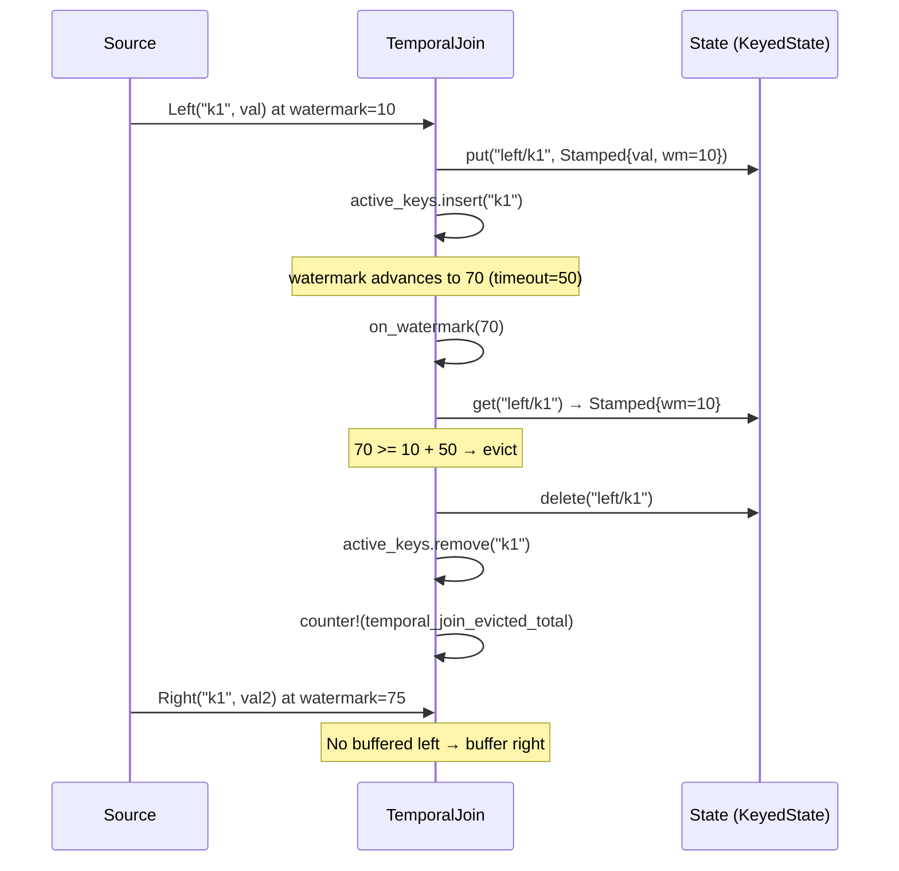
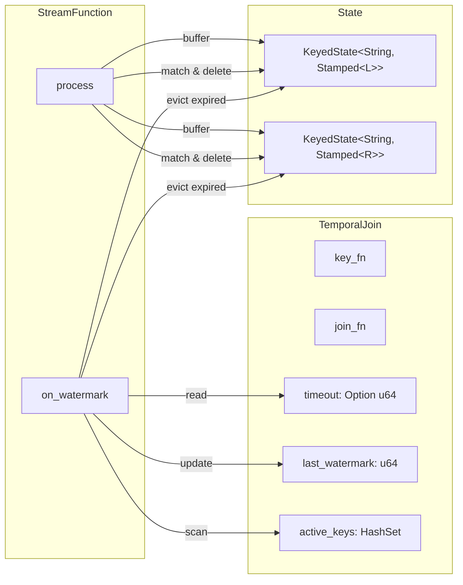

# ADR: Temporal Join Timeout and Eviction

**Status:** Accepted
**Date:** 2026-02-26

## Context

The temporal join operator (`rhei-core/src/operators/temporal_join.rs`) buffers unmatched events in operator state indefinitely. If one side of the join never produces a matching event for a given key, state grows without bound. In long-running pipelines with skewed join keys, this leads to OOM (tracked as KI-5).

Window operators already solve a similar problem via watermark-driven eviction in `on_watermark()`. The temporal join needs an analogous mechanism.

## Decision

Add an optional **timeout** (in watermark units) to `TemporalJoin`. When the watermark advances past `buffered_timestamp + timeout`, unmatched events are evicted from state.

### State format change

Buffered events are wrapped in a `Stamped<V>` struct that records the watermark at buffer time:

```rust
struct Stamped<V> {
    value: V,
    watermark_at_buffer: u64,
}
```

The `KeyedState` type changes from `KeyedState<String, L>` to `KeyedState<String, Stamped<L>>` (and similarly for `R`).

### New fields on `TemporalJoin`

```rust
timeout: Option<u64>,           // None = no eviction (backward compatible)
last_watermark: u64,            // current watermark for timestamping
active_keys: HashSet<String>,   // keys with buffered events (for scan)
```

### Eviction via `on_watermark()`

When the watermark advances and a timeout is configured, the operator iterates `active_keys` and checks both left and right state for each key. If `watermark >= stamped.watermark_at_buffer + timeout`, the entry is deleted and a `temporal_join_evicted_total` metric is incremented. Evicted events are silently dropped (no side-output yet).

### Builder API

`TemporalJoinBuilder::timeout(u64)` sets the timeout. Omitting it preserves backward-compatible unbounded buffering.

## Diagram

### Eviction flow



### Component relationships



## Alternatives considered

### 1. User-supplied `time_fn` for buffered event timestamps

Instead of using the watermark at buffer time, use a user-provided function to extract an event timestamp (like window operators do). Rejected because temporal joins don't require the user to provide a timestamp function in the general case — the watermark is a sufficient proxy for "when the event was buffered" and avoids adding a new type parameter.

### 2. LRU eviction by state size

Evict the oldest N entries when state exceeds a size limit. Rejected because size-based eviction is disconnected from time semantics — it could evict events that are still within a reasonable join window while keeping stale ones from high-frequency keys.

### 3. Side-output for evicted events

Route evicted events to a separate output stream instead of dropping them silently. Deferred — this requires changes to the `StreamFunction` trait to support multiple output types and is a broader design effort.

## Consequences

**Positive:**
- Temporal join state is now bounded when a timeout is configured, preventing OOM in long-running pipelines.
- Backward compatible — omitting `timeout` preserves the existing unbounded buffering behavior.
- Follows the same watermark-driven eviction pattern as window operators, maintaining consistency.
- `temporal_join_evicted_total` metric provides visibility into eviction frequency.

**Negative:**
- **State format breaking change:** Buffered events are now `Stamped<V>` instead of `V`. Old serialized state won't deserialize. Acceptable pre-1.0.
- Evicted events are silently dropped — no side-output mechanism yet.
- `active_keys` is an in-memory `HashSet` that is not persisted. On restart from checkpoint, keys with buffered state won't be tracked for eviction until they're accessed again. This is acceptable because checkpointing also resets the watermark, and the eviction scan only applies to keys seen since the last restart.

## Files changed

| File | Change |
|---|---|
| `rhei-core/src/operators/temporal_join.rs` | Add `timeout`, `last_watermark`, `active_keys` fields; `Stamped<V>` wrapper; `on_watermark()` eviction; builder `.timeout()` method; unit tests |
