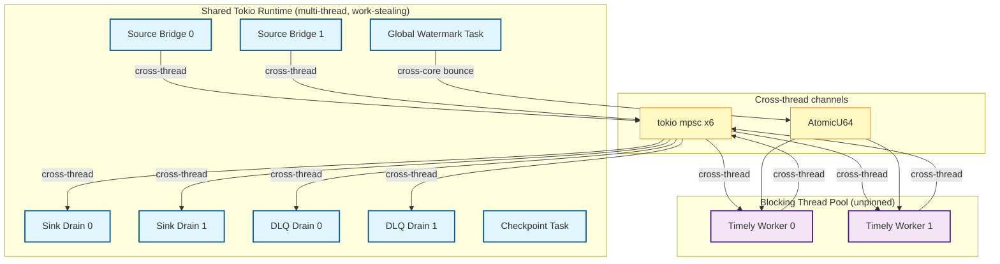
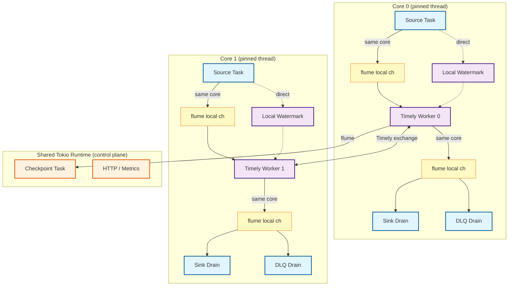
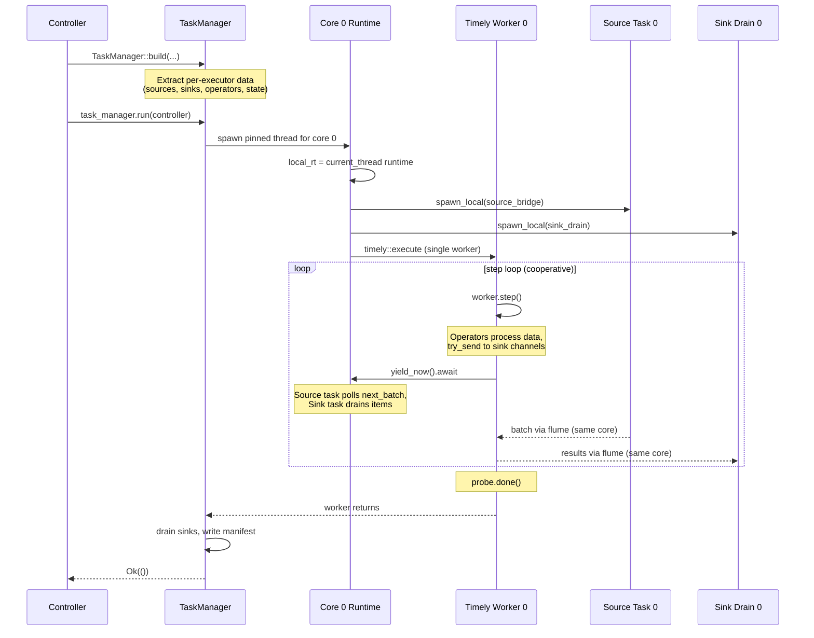

# ADR: Thread-Per-Core Execution Model

**Status:** Proposed
**Date:** 2026-03-01

## Context

The current execution model runs all async I/O (source reads, sink writes, DLQ drains, watermark computation) on a shared multi-threaded Tokio runtime, and all Timely workers on a separate blocking thread pool via `spawn_blocking`. These two worlds are connected by bounded `tokio::sync::mpsc` channels and shared atomics:

```
Tokio thread pool                           Timely blocking threads
┌─────────────────┐    mpsc(16)    ┌──────────────────────┐
│ Source Bridge 0  │──────────────→│ DataflowExecutor 0   │
│ Source Bridge 1  │──────────────→│ DataflowExecutor 1   │
│ ...              │               │ ...                   │
│                  │    mpsc(16)   │                       │
│ Sink Drain 0     │←─────────────│                       │
│ Sink Drain 1     │←─────────────│                       │
│ DLQ Drain 0/1    │←─────────────│                       │
│                  │               │                       │
│ Global Watermark │──AtomicU64──→│ (all operators read)  │
└─────────────────┘               └──────────────────────┘
```

This architecture has four performance costs:

1. **Cross-thread channel overhead.** Every batch crosses a thread boundary twice: source→worker (Tokio→Timely) and worker→sink (Timely→Tokio). Even with bounded channels, this means cache-line transfers between cores on every batch. The Timely side uses `blocking_send`/`try_recv`, paying for synchronization machinery designed for cross-thread use.

2. **Cache locality loss.** A batch read by source bridge task on core A is consumed by a Timely worker that may run on core B (unpinned). The data evicts from core A's L1/L2 and must be fetched into core B's cache. Same for sink output.

3. **Global watermark contention.** `global_watermark: Arc<AtomicU64>` is written by a centralized Tokio task every 100ms and read by every operator on every batch via `Ordering::Acquire`. Under load, this is a cross-core cache-line bounce on every operator invocation across all workers.

4. **Tokio work-stealing jitter.** Source bridge tasks and sink drain tasks run on Tokio's work-stealing scheduler. Under load, a source task may be stolen to a different core mid-batch, or delayed by unrelated work on the Tokio runtime. This adds unpredictable tail latency.

The bridge layer (`bridge.rs`) exists *solely* to connect async sources/sinks to sync Timely workers across threads. If both lived on the same core, the bridge could be simplified to core-local channels with no cross-thread synchronization.

## Decision

Adopt a **thread-per-core** execution model where each Timely worker is pinned to a dedicated core and co-located with its own source I/O, sink drains, and async runtime. The only cross-core communication is Timely's exchange channels (key-by), which are already designed for this.

### Per-core architecture

Each core runs a single pinned thread containing:

```
Core N
┌───────────────────────────────────────────┐
│  Per-worker tokio current_thread runtime  │
│  ┌─────────────┐    local     ┌─────────┐│
│  │ Source Task  │───channel───→│ Timely  ││
│  │ (spawn_local)│             │ Worker  ││
│  └─────────────┘             │ (pinned) ││
│  ┌─────────────┐    local    │         ││
│  │ Sink Drain  │←──channel───│         ││
│  │ (spawn_local)│             │         ││
│  └─────────────┘             │         ││
│  ┌─────────────┐    local    │         ││
│  │ DLQ Drain   │←──channel───│         ││
│  │ (spawn_local)│             │         ││
│  └─────────────┘             └─────────┘│
│                                          │
│  Per-worker watermark (local variable)   │
│  Per-worker state: L1 memtable (owned)   │
└───────────────────────────────────────────┘
         ↕ Timely exchange (cross-core)
```

### What changes

| Component | Before | After |
|-----------|--------|-------|
| **Timely workers** | Unpinned, on `spawn_blocking` pool | Pinned to dedicated cores via `core_affinity` |
| **Async runtime** | One shared multi-thread Tokio | Per-worker `current_thread` Tokio + shared runtime for control plane |
| **Source bridges** | Tokio task → `tokio::sync::mpsc(16)` → Timely `try_recv` | `spawn_local` task → `flume` channel → Timely `try_recv` (same core) |
| **Sink drains** | Timely `blocking_send` → `tokio::sync::mpsc(16)` → Tokio task | Timely `try_send` → `flume` channel → `spawn_local` task (same core) |
| **DLQ drains** | Timely `blocking_send` → `tokio::sync::mpsc(64)` → Tokio task | Timely `try_send` → `flume` channel → `spawn_local` task (same core) |
| **Watermark** | Centralized `Arc<AtomicU64>` written by Tokio task, read by all operators | Per-worker local variable updated directly by source operator from its co-located source task |
| **Cross-worker channels** | `tokio::sync::mpsc` | `flume` (works in both async and sync contexts) |
| **Control plane I/O** | Shared Tokio runtime | Shared Tokio runtime (unchanged) |
| **Checkpoint notify** | `tokio::sync::mpsc(64)` with `blocking_send` | `flume::bounded(64)` |
| **Exchanges (key-by)** | Timely in-memory channels (in-process) / TCP (cross-process) | Unchanged |

### What stays the same

| Component | Rationale |
|-----------|-----------|
| **State backends (L1/L2/L3)** | L1 memtable is already per-worker (no contention). L2 Foyer is designed for concurrent access and benefits from shared cache (higher hit rate with more keys). L3 SlateDB is remote I/O where shared connection pooling helps. The hot path (L1 hit → synchronous return) is already per-core after pinning. |
| **Hot/cold path split** | `AsyncOperator` polls once with `noop_waker` (L1 hit → microsecond return). Cold path uses `block_in_place` → `block_on` to drive L2/L3 fetch. With per-worker `current_thread` runtime, the cold path drives the future on the local runtime instead of the shared one. |
| **Timely exchange mechanism** | Exchanges are inherently cross-core — that's the whole point of key-based partitioning. Timely already handles this efficiently with its own channel abstraction. |
| **Checkpoint coordination protocol** | Cross-process coordination is TCP-based and low-frequency. No benefit from per-core localization. |
| **Public API** | `PipelineController`, `DataflowGraph`, builder pattern — all unchanged. |

### Step loop integration

The core design challenge is integrating Timely's synchronous `step()` loop with the per-worker async runtime. Since both run on the same thread, they must cooperate:

```rust
let local_rt = tokio::runtime::Builder::new_current_thread()
    .enable_all()
    .build()?;

let local_set = tokio::task::LocalSet::new();
local_rt.block_on(local_set.run_until(async {
    // Spawn source/sink/DLQ tasks on the local set
    tokio::task::spawn_local(source_bridge(source, source_tx));
    tokio::task::spawn_local(sink_drain(sink, sink_rx));

    // Timely step loop with cooperative yielding
    let probe = worker.dataflow(|scope| executor.compile(scope, &mut data));

    while !probe.done() {
        worker.step();
        // Yield to let local tasks (source reads, sink writes) make progress.
        tokio::task::yield_now().await;
    }
}));
```

Key constraint: Timely operators must not call `blocking_send` on tokio channels (this would deadlock the single-threaded runtime). All operator→sink and operator→DLQ sends use `try_send` with backpressure handling, or `flume` channels that work without an async runtime.

### Channel selection: flume

`flume` replaces `tokio::sync::mpsc` for data-path channels because:

- **Works in both sync and async contexts.** Timely operators call `try_send()` (sync), drain tasks call `recv_async().await` (async). No `blocking_send` needed.
- **No async runtime dependency.** `flume` channels don't require a Tokio runtime, eliminating the deadlock risk with `current_thread`.
- **Lower overhead for same-thread use.** When sender and receiver are on the same thread (post-migration), `flume`'s internal implementation avoids unnecessary atomic operations.
- **Drop-in API.** `flume::bounded(N)` is API-compatible with the current channel usage patterns.

`tokio::sync::mpsc` is retained for control plane channels (HTTP server, health checks) that remain on the shared Tokio runtime.

## Diagram

### Before: Shared Tokio runtime with cross-thread bridges



### After: Per-core co-located runtime



### Lifecycle sequence



## Implementation phases

### Phase 1: Core pinning + per-worker watermarks

Low risk, immediate cache locality benefit. No channel changes.

- Pin Timely workers to cores using `core_affinity` crate.
- Replace global `Arc<AtomicU64>` watermark with per-worker watermarks. Each source operator reads its co-located source bridge's watermark directly (already an `Arc<AtomicU64>` per source — just stop aggregating into a global one).
- Remove the centralized watermark computation task from TaskManager.

**Files:** `task_manager.rs` (remove global watermark task), `executor.rs` (per-worker watermark tracking in operators), `controller.rs` (core affinity setup).

### Phase 2: Per-worker async runtime + local I/O

Medium risk, eliminates cross-thread bridge overhead. Core structural change.

- Create a `current_thread` Tokio runtime per worker thread.
- Source bridge tasks become `spawn_local` on the worker's runtime.
- Sink and DLQ drain tasks become `spawn_local` on the worker's runtime.
- Integrate Timely step loop with cooperative yielding (`yield_now`).
- Keep shared Tokio runtime for control plane (HTTP server, metrics, checkpoint manifest writes, coordination).

**Files:** `task_manager.rs` (per-worker runtime setup, `spawn_local` for bridges), `executor.rs` (step loop with yield), `bridge.rs` (refactor for local spawning).

### Phase 3: Channel replacement (flume)

Low risk, incremental. Can be done independently of Phase 2.

- Replace `tokio::sync::mpsc` with `flume` for all data-path channels (source→worker, worker→sink, worker→DLQ, checkpoint notify).
- Replace `blocking_send` in Timely operators with `try_send` + backpressure handling.
- Keep `tokio::sync::mpsc` for control plane channels only.

**Files:** `bridge.rs`, `executor.rs` (send/recv call sites), `task_manager.rs` (channel creation), `Cargo.toml` (add `flume` dependency).

## Alternatives considered

### 1. Full glommio/compio replacement of Tokio

Replace Tokio entirely with a thread-per-core async runtime like glommio (io_uring-based) or compio.

Rejected because the ecosystem cost is prohibitive. `rdkafka`, `object_store` (SlateDB/S3), `hyper`, `tower`, `tonic` are all Tokio-native. Porting or shimming them would take months and create ongoing maintenance burden. Additionally, glommio is Linux-only (io_uring requires 5.8+), preventing macOS development. The I/O pattern (Kafka reads, occasional S3 writes) is not syscall-overhead-bound, so io_uring's batched submission provides minimal benefit over epoll.

### 2. Per-core L2 Foyer cache (fully share-nothing state)

Give each core its own Foyer `HybridCache` instance instead of sharing one.

Rejected because it trades cache hit rate for isolation. With N workers sharing a Foyer cache, the working set of hot keys is pooled — a key accessed by worker 0 benefits worker 1 if keys are exchanged. With per-core caches, each cache is 1/N the size with no cross-worker benefit. Foyer is already designed for concurrent access (lock-free reads), so contention is not a practical problem. L1 memtable is already per-worker, which handles the hot path.

### 3. Inline source polling (no channel at all)

Instead of a source task + channel, poll the source future directly inside the Timely source operator.

Rejected for this phase because it requires the source to be owned by the Timely operator, which conflicts with the current type-erased graph extraction model (sources are extracted during `TaskManager::build`, before the Timely closure runs). This could be explored in a future phase as an optimization on top of the per-core model, but the channel overhead is negligible when sender and receiver are on the same core.

### 4. Work-stealing with core affinity hints (soft pinning)

Use Tokio's runtime with affinity hints rather than hard pinning, allowing the scheduler to steal work under skew.

Rejected because it doesn't solve the core problem: source bridges and Timely workers would still run on different threads (even if preferentially on the same core), requiring cross-thread channels. Soft pinning reduces cache misses on average but doesn't eliminate the synchronization overhead. The exchange mechanism already handles key skew by redistributing data — work-stealing at the runtime level would interfere with this.

### 5. Crossbeam channels instead of flume

Use `crossbeam-channel` instead of `flume` for data-path channels.

Not rejected but deferred to benchmarking. Both are fast bounded MPSC channels. `flume` has native async support (`recv_async()`) which simplifies sink drain tasks. `crossbeam` is marginally faster for pure sync-to-sync but requires wrapping for async use. The choice should be based on benchmarks with the actual workload.

## Consequences

**Positive:**

- **Eliminated cross-core data transfers on the data path.** Source batches, sink output, and DLQ records stay on the same core's cache hierarchy. Only exchanges (key-by) cross cores, which is inherent to the computation.
- **No global watermark contention.** Per-worker watermarks are local variables with zero synchronization cost. Every operator reads its watermark without an atomic load.
- **Predictable tail latency.** No Tokio work-stealing jitter for data-path tasks. Each core's pipeline slice has deterministic scheduling.
- **Simpler bridge layer.** `bridge.rs` becomes a thin wrapper around `spawn_local` + `flume` channel, rather than a cross-thread synchronization layer.
- **Foundation for future optimizations.** Per-core runtime enables future work like inline source polling (no channel), per-core metrics aggregation, and NUMA-aware memory allocation.

**Negative:**

- **Key skew has no implicit load balancing.** If 80% of keys hash to core 2, that core saturates while others idle. The current model has the same problem at the Timely layer but Tokio's work-stealing helps for I/O tasks. Mitigation: sub-key splitting or adaptive repartitioning (future work).
- **Non-partitioned sources require special handling.** A `VecSource` or single-partition Kafka topic can only feed one core's source task. Other cores receive data only via exchange. This is the current behavior (worker 0 reads, exchanges distribute) but becomes more explicit.
- **Per-core memory overhead.** Each core gets its own sink buffer, DLQ buffer, and async runtime. With 16 cores this is ~16x the per-worker overhead for these structures (though the actual memory is small compared to L1/L2 state caches, which are already per-worker or shared).
- **`blocking_send` removal requires backpressure redesign.** Current sink operators use `blocking_send` which blocks the Timely thread when the sink channel is full. With a single-threaded runtime, this would deadlock. Switching to `try_send` requires handling the full-channel case (retry on next step, drop, or buffer). This is a correctness concern that must be addressed carefully in Phase 2.
- **Increased complexity in TaskManager.** TaskManager must manage per-worker runtimes, thread pinning, and cooperative scheduling in addition to its current responsibilities.

## Files changed

Phase 1 (core pinning + per-worker watermarks):

| File | Change |
|------|--------|
| `rhei-runtime/src/task_manager.rs` | Remove `spawn_global_watermark_task()`. Pass per-source watermarks directly to executors. |
| `rhei-runtime/src/executor.rs` | Per-worker watermark tracking in source and operator builders. Core pinning via `core_affinity`. |
| `rhei-runtime/src/controller.rs` | Configure core affinity mapping. |
| `rhei-runtime/Cargo.toml` | Add `core_affinity` dependency. |

Phase 2 (per-worker async runtime):

| File | Change |
|------|--------|
| `rhei-runtime/src/task_manager.rs` | Per-worker `current_thread` runtime. `spawn_local` for source/sink/DLQ tasks. |
| `rhei-runtime/src/executor.rs` | Step loop with `yield_now()` cooperative scheduling. Remove `spawn_blocking`. |
| `rhei-runtime/src/bridge.rs` | Refactor for local spawning (no cross-thread channels). |

Phase 3 (channel replacement):

| File | Change |
|------|--------|
| `rhei-runtime/src/bridge.rs` | `tokio::sync::mpsc` → `flume` for data-path channels. |
| `rhei-runtime/src/executor.rs` | `blocking_send` → `try_send` with backpressure. |
| `rhei-runtime/src/task_manager.rs` | `flume` channel creation. |
| `rhei-runtime/Cargo.toml` | Add `flume` dependency. |
