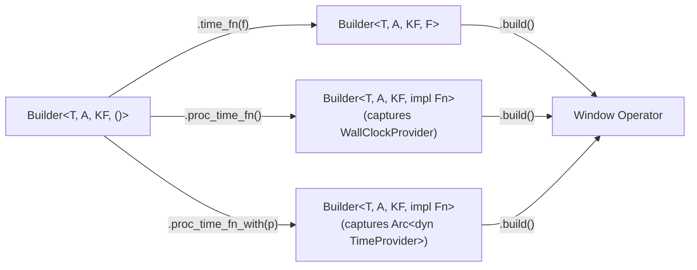
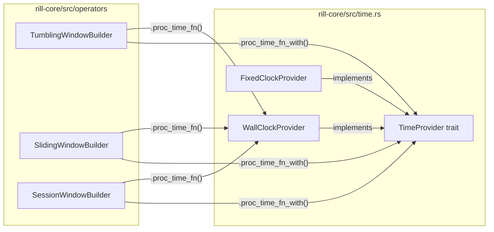
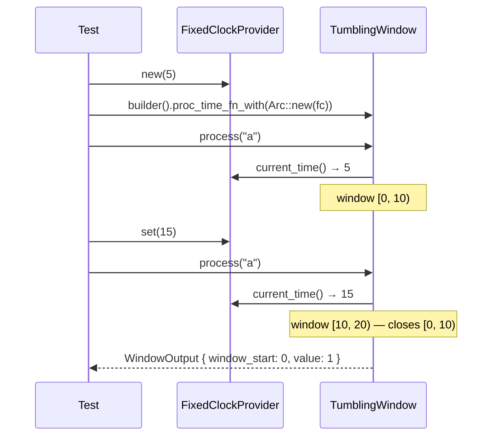

# ADR: TimeProvider Trait and Processing-Time Builder Sugar

**Status:** Accepted
**Date:** 2026-02-26

## Context

Window operators (`TumblingWindow`, `SlidingWindow`, `SessionWindow`) require a `time_fn: Fn(&T) -> u64` closure to extract timestamps from events. This works well for event-time windowing where timestamps are embedded in the data, but processing-time use cases require verbose, non-testable boilerplate:

```rust
.time_fn(|_| SystemTime::now().duration_since(UNIX_EPOCH).unwrap().as_millis() as u64)
```

This has two problems:

1. **Ergonomics** — the boilerplate is long and easy to get wrong.
2. **Testability** — there is no way to control the clock in tests, making deterministic verification of processing-time windows impossible.

## Decision

Introduce a `TimeProvider` trait and two builder convenience methods (`.proc_time_fn()` and `.proc_time_fn_with(provider)`) that delegate to the existing `.time_fn()`. No changes to operator structs, `StreamFunction` trait, or downstream code.

### `TimeProvider` trait (`rill-core/src/time.rs`)

```rust
pub trait TimeProvider: Send + Sync {
    fn current_time(&self) -> u64;
}
```

Two built-in implementations:

- **`WallClockProvider`** — zero-size, `Copy`. Returns `SystemTime::now()` as Unix millis.
- **`FixedClockProvider`** — wraps `Arc<AtomicU64>`. Provides `.set()` and `.advance()` for external clock control. `Clone` shares state via `Arc`.

### Builder methods

Each window builder gets an `impl` block constrained to `TF = ()` (only available when no time function has been set):

```rust
impl<T, A, KF> TumblingWindowBuilder<T, A, KF, ()> {
    pub fn proc_time_fn(self)
        -> TumblingWindowBuilder<T, A, KF, impl Fn(&T) -> u64 + Send + Sync + Clone>
    {
        let provider = WallClockProvider;
        self.time_fn(move |_: &T| provider.current_time())
    }

    pub fn proc_time_fn_with(self, provider: Arc<dyn TimeProvider>)
        -> TumblingWindowBuilder<T, A, KF, impl Fn(&T) -> u64 + Send + Sync + Clone>
    {
        self.time_fn(move |_: &T| provider.current_time())
    }
}
```

The same pattern applies to `SlidingWindowBuilder` and `SessionWindowBuilder`.

### Key design details

- **`TF = ()` constraint** prevents calling both `.time_fn()` and `.proc_time_fn()` — the type parameter changes from `()` to an opaque closure type after either call.
- **`+ Clone` in return type** is required because operator `Clone` impls require `TF: Clone`.
- **`WallClockProvider` is `Copy`** so the closure capturing it is auto-`Clone`. `Arc<dyn TimeProvider>` is `Clone` so that closure is too.
- **`proc_time_fn()` avoids `Arc` overhead** since `WallClockProvider` is zero-size and `Copy`.

## Diagram

### Builder flow



### Component ownership



### Testing sequence



## Alternatives considered

### 1. Generic `TP: TimeProvider` parameter on operator structs

Adding a type parameter to `TumblingWindow<T, A, KF, TF, TP>` would thread the provider through the struct. Rejected because it changes every operator signature, every `StreamFunction` impl, and every downstream generic bound — all for a feature that is pure builder sugar. The closure-capture approach achieves the same result with zero structural changes.

### 2. Global static clock (`static CLOCK: OnceLock<Box<dyn TimeProvider>>`)

A global clock avoids threading providers through builders but introduces hidden mutable state, makes parallel tests unsafe, and prevents per-operator clock control. Rejected.

### 3. Implement `Fn(&T) -> u64` directly on the trait

Making `TimeProvider` itself implement `Fn` would let users write `.time_fn(WallClockProvider)`. Rejected because `Fn` traits cannot be implemented on stable Rust, and the ergonomic gain over `.proc_time_fn()` is negligible.

### 4. Macro-based builder extension

A proc macro could generate the `proc_time_fn` methods for all builders. Rejected as over-engineering — three nearly identical `impl` blocks are simple and easy to maintain without macro indirection.

## Consequences

**Positive:**

- Processing-time windows are a one-liner: `.proc_time_fn()`.
- Tests can inject `FixedClockProvider` for fully deterministic window verification.
- Zero changes to operator structs, `StreamFunction`, or the runtime — purely additive.
- The `TF = ()` constraint makes it a compile error to set both `.time_fn()` and `.proc_time_fn()`.

**Negative:**

- Three near-identical `impl` blocks (one per window builder). Acceptable given the small size and the alternative (macros) being worse.
- `proc_time_fn_with` requires `Arc<dyn TimeProvider>` — one allocation. Negligible for a per-operator setup cost.

## Files changed

| File | Change |
|---|---|
| `rill-core/src/time.rs` | New — `TimeProvider` trait, `WallClockProvider`, `FixedClockProvider` |
| `rill-core/src/lib.rs` | Register `pub mod time` |
| `rill-core/src/operators/tumbling_window.rs` | Add `proc_time_fn()` / `proc_time_fn_with()` to builder, tests |
| `rill-core/src/operators/sliding_window.rs` | Add `proc_time_fn()` / `proc_time_fn_with()` to builder, tests |
| `rill-core/src/operators/session_window.rs` | Add `proc_time_fn()` / `proc_time_fn_with()` to builder, tests |
