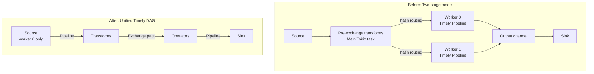
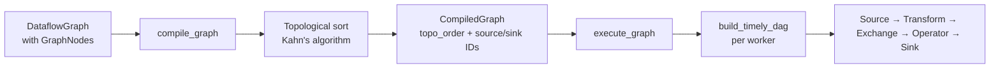
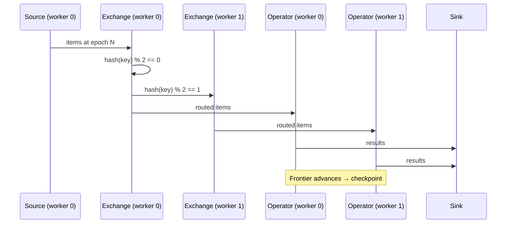

# ADR: Timely Exchange Pact DAG Execution

**Status:** Accepted
**Date:** 2026-02-21

## Context

The executor used a two-stage model: pre-exchange transforms ran on the main Tokio task with manual hash routing, and post-exchange segments ran inside Timely with Pipeline pact only. This architecture had several limitations:

- **Single key_by only (KI-4):** `split_at_first_exchange()` split the segment list at the first `Exchange` only. Subsequent `key_by()` calls were silently ignored, losing key affinity after the first repartition in multi-worker mode.
- **No merge/fan-in (KI-9):** `NodeKind::Merge` was modelled in the graph but explicitly rejected at compile time.
- **No fan-out (KI-17):** The compiler validated linear topology only. A single source feeding multiple sinks was rejected.
- **Two separate execution paths:** `execute_single_worker` and `execute_multi_worker` duplicated logic and had different behaviors (e.g., checkpoint coordination, source offset tracking).

Moving to a unified Timely DAG eliminates these restrictions and lays groundwork for multi-process clustering (Phase 2 of CLUSTERING.md), where Timely's Exchange pact handles inter-process communication natively.

## Decision

Replace the two-stage executor with a unified Timely dataflow that supports arbitrary DAG topologies.

### Serialization bounds

All pipeline element types gain `Serialize + DeserializeOwned` bounds (breaking change). This enables Timely's `Exchange` pact, which requires `ContainerBytes for Vec<T>` (auto-implemented when `T: Serialize + Deserialize`).

`AnyItem` (the type-erased wrapper for all values in the dataflow) implements `Serialize` and `Deserialize` via a global type registry. Each concrete type is tagged with `seahash(type_name::<T>())` during serialization, and the registry maps tags back to deserialization functions.

### DAG compiler

The new `compile_graph()` replaces the linear `compile()`:
- Uses Kahn's algorithm for topological sorting
- Validates: at least one source, at least one sink, no cycles
- Extracts sorted operator names for checkpoint manifest validation
- Supports arbitrary DAG topologies (fan-out, merge, multiple exchanges)

### Unified execution

A single `execute_graph()` function replaces both `execute_single_worker()` and `execute_multi_worker()`. All processing runs inside a single Timely dataflow per pipeline:

- **Source nodes:** Built with `OperatorBuilder`. Only worker 0 gets the real receiver; other workers' sources immediately close.
- **Transform nodes:** `unary` with `Pipeline` pact (no data movement between workers).
- **KeyBy nodes:** `unary` with `Exchange` pact. Timely handles worker routing via its internal channels.
- **Operator nodes:** `unary_frontier` with `Pipeline` pact. `TimelyErasedOperator` wraps the operator with frontier-based checkpointing.
- **Merge nodes:** `scope.concatenate()` combines multiple input streams.
- **Sink nodes:** `unary` with `Pipeline` pact, sending items via channel to async sink task.
- **Fan-out:** Implicit via Timely's internal Tee — the same stream can be connected to multiple downstream operators.

### Checkpoint coordination

Each `Operator` node independently checkpoints when its frontier advances. Only the last operator in topological order on worker 0 sends a checkpoint notification to the main task. Timely's frontier monotonicity ensures all upstream operators have already checkpointed.

The old `Barrier`-based coordination is removed — it could deadlock when Exchange communication depended on workers that were blocked at the barrier.

## Diagram

### Before vs After execution model

### DAG compilation flow

### Exchange pact data flow (multi-worker)

## Alternatives considered

### 1. Keep two-stage model, add manual multi-exchange routing

Rejected: Each additional `key_by()` would require another pre/post-exchange split, creating an increasingly complex execution graph. Manual hash routing reimplements Timely's built-in functionality and doesn't generalize to multi-process.

### 2. Use Pipeline pact everywhere, manual routing for all exchanges

Rejected: This would require custom inter-worker channels for every exchange point, losing Timely's progress tracking and frontier propagation. The Exchange pact already handles all of this correctly.

### 3. Use Abomonation instead of serde for Timely serialization

Considered but rejected. Abomonation is zero-copy but unsafe and requires fixed-size types. serde/bincode is safe, widely supported, and sufficient for current performance requirements. Can be revisited if profiling shows serialization as a bottleneck.

## Consequences

**Positive:**
- Arbitrary DAG topologies: multiple exchanges, merge/fan-in, fan-out all work correctly.
- Single execution path: eliminates code duplication between single-worker and multi-worker.
- Multi-process ready: the Exchange pact works identically with Timely's `ProcessAllocator` (threads) and future `TcpAllocator` (network).
- Simpler executor: ~400 fewer lines of code.
- Resolves KI-4, KI-9, KI-17.

**Negative:**
- Breaking change: all pipeline element types must now implement `Serialize + DeserializeOwned`. Standard types (`i32`, `String`, tuples) already do; custom types need `#[derive(Serialize, Deserialize)]`.
- Slight serialization overhead: with `Config::process(1)`, Exchange pact still serializes/deserializes even though data stays on one worker. Negligible for most workloads.
- `std::any::type_name` stability: the type registry uses `seahash(type_name::<T>())` as the key. This is safe for inter-worker communication within a single process but not across compiler versions.
- `on_checkpoint_complete()` not called on sources in the unified model — source offsets are saved via the shared bridge state instead.

## Files changed

| File | Change |
|---|---|
| `rhei-runtime/Cargo.toml` | Add `bincode` dependency |
| `rhei-runtime/src/dataflow.rs` | Extend `CloneAnySend` with serialization, add type registry, `Serialize`/`Deserialize` for `AnyItem`, serde bounds on all graph API types |
| `rhei-runtime/src/compiler.rs` | Replace linear `compile()` with DAG-aware `compile_graph()` using Kahn's algorithm |
| `rhei-runtime/src/executor.rs` | Replace two-stage executor with unified `execute_graph()` and `build_timely_dag()` |
| `ADR/timely-exchange-dag.md` | This ADR |
| `KNOWN-ISSUES.md` | Mark KI-4, KI-9, KI-17 as resolved |
| `ROADMAP.md` | Check off topology items |
