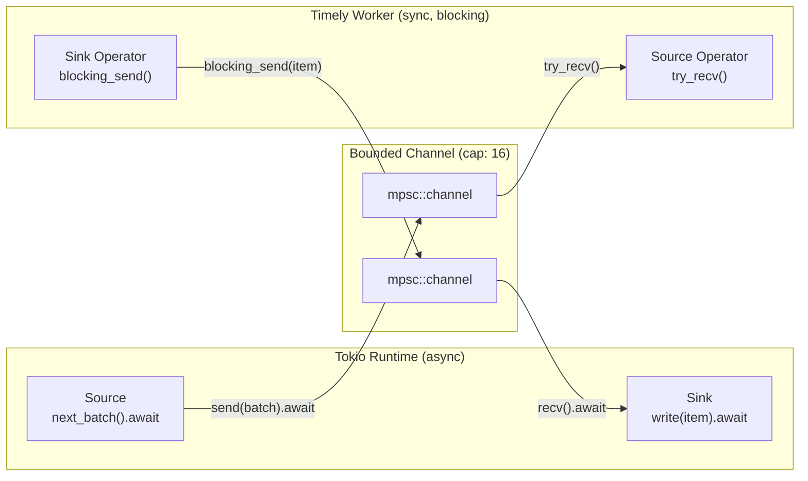
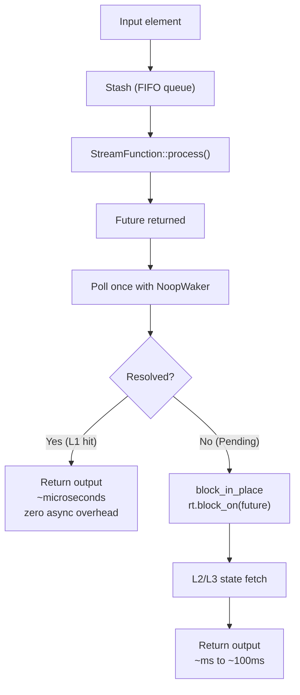
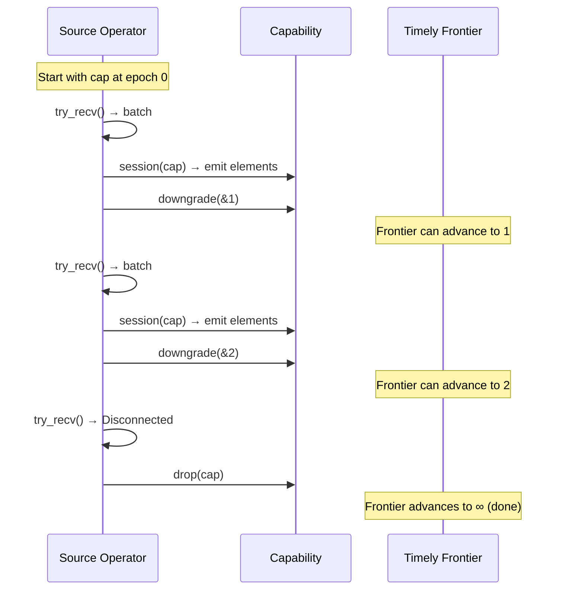
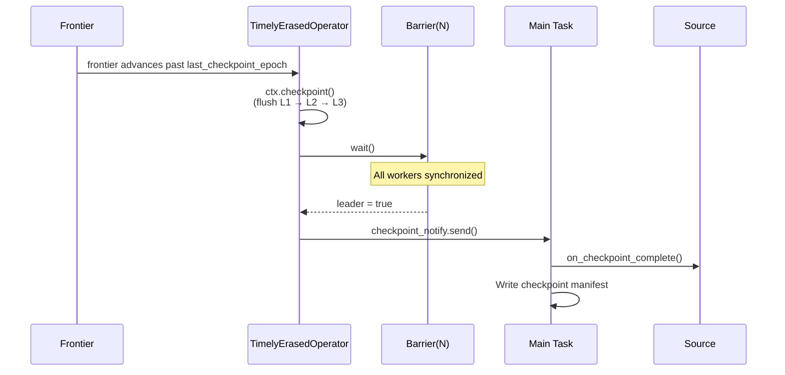
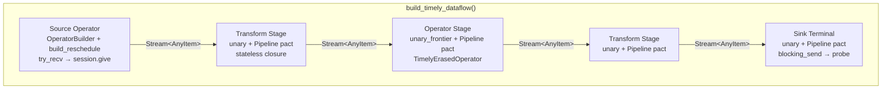

# ADR: Timely Dataflow Integration

**Status:** Accepted
**Date:** 2026-02-21

## Context

Rhei is an async-first Rust framework — sources, sinks, and operators are `async_trait` implementations running on Tokio. However, the execution engine needs frontier tracking (knowing when all data for an epoch has been processed), epoch-based checkpointing, and multi-worker coordination. These are exactly the problems Timely Dataflow solves.

The challenge is bridging two fundamentally different execution models:

- **Tokio**: cooperative async tasks, non-blocking I/O, `Send + Sync` futures.
- **Timely**: synchronous worker threads, capability-based progress tracking, `!Send` capabilities using `Rc`.

The integration must preserve Timely's correctness guarantees (frontiers, capabilities, progress protocol) while keeping the operator API async and supporting the tiered state backend's hot/cold access pattern (L1 cache hits should not pay async overhead).

## Decision

### Async-to-sync bridge pattern

Async `Source` and `Sink` implementations are bridged to Timely's synchronous world via bounded `tokio::sync::mpsc` channels (capacity 16):

- **Source bridge**: A Tokio task calls `source.next_batch().await` in a loop and sends batches through the channel. The Timely source operator reads with non-blocking `try_recv()`.
- **Sink bridge**: The Timely sink operator sends items via `blocking_send()`. A Tokio task receives and calls `sink.write(item).await`.

This decouples async I/O from the Timely scheduler — the Timely worker never blocks waiting for source data, and async sinks never stall the progress protocol.

### Timely source operator: reschedule pattern

The source is built with `OperatorBuilder::build_reschedule()`, which gives explicit control over capability lifecycle:

1. Start with one capability at epoch 0.
2. On each `try_recv()` of a batch: emit elements via a session on the current capability, then `downgrade(&next_epoch)` to advance.
3. On channel disconnect (source exhausted): drop the capability, signaling completion.
4. On empty channel: call `activator.activate()` to reschedule and return `true` (keep alive).

Each batch becomes one Timely epoch. Capability downgrades are monotonic — the frontier can only advance forward.

### Stateless transforms: `unary` with Pipeline pact

Transforms (map, filter, flat_map) are wired as Timely `unary` operators with the `Pipeline` pact. Pipeline means data stays on the current worker — no redistribution. The closure receives `(input, output)` handles, drains incoming data, applies the transform, and gives results to the output session.

### Stateful operators: `unary_frontier` with Pipeline pact

Stateful operators use `unary_frontier`, which additionally exposes the input frontier. The closure receives `((input, frontier), output)`. After processing each batch, the operator observes the frontier to decide whether to checkpoint. Pipeline pact is used here because key-based routing already happened before data enters the Timely dataflow (in the pre-exchange stage on the main task).

### Hot/cold path split (AsyncOperator)

`AsyncOperator` wraps a `StreamFunction` and optimizes for the common case where state access hits L1 (in-memory memtable):

- **Hot path**: Call `StreamFunction::process()`, which returns a future. Poll it once synchronously with a no-op waker. If it resolves immediately (L1 hit), return the result with zero async overhead — microsecond latency.
- **Cold path**: If the future is `Pending` (state miss requiring L2/L3 I/O), call `tokio::task::block_in_place(|| rt.block_on(fut))` to drive it on the Tokio runtime. This blocks the Timely worker thread but correctly handles the async I/O.

This split avoids the cost of async context switches for the majority of operations (L1 hits) while transparently handling cache misses.

### Stash for ordering guarantees

When a state miss causes a pending future, subsequent elements for the same key must not overtake it. The `Stash<T>` is a FIFO `VecDeque<(T, Option<u64>)>` that buffers elements with their epoch capability. Elements drain in arrival order, preserving per-key ordering even when state fetches complete out of order.

### Capability and frontier tracking

**Capabilities** are Timely's mechanism for declaring "I might still produce output at timestamp T." Holding a capability prevents the frontier from advancing past that timestamp. The system manages capabilities at two levels:

- **Source operator**: Holds one capability, downgrades after each batch, drops on source exhaustion.
- **TimelyAsyncOperator** (typed path): Retains `CapabilityToken`s in a `HashMap<u64, CapabilityToken>`. Tokens are released via `release_finished_epochs()` only when the frontier has passed that epoch AND no pending futures remain.

**Frontier** is the minimum timestamp at which any operator in the dataflow might still produce output. It advances monotonically. The executor observes the frontier in `unary_frontier` closures via `frontier.frontier().iter()`.

### Frontier-driven checkpointing

`TimelyErasedOperator::maybe_checkpoint()` triggers a checkpoint when:

1. The minimum frontier has advanced past `last_checkpoint_epoch`, AND
2. No pending futures remain (for `TimelyAsyncOperator`).

This ensures all data for the checkpointed epoch has been fully processed before state is flushed. In multi-worker mode, a `std::sync::Barrier(n_workers)` synchronizes all workers after checkpoint, and the barrier leader notifies the main task to commit source offsets.

### `!Send` constraint and the Mutex wrapping pattern

Timely's `Capability<T>` uses `Rc` internally, making any type that holds it `!Send`. `TimelyAsyncOperator` and `TimelyErasedOperator` must be constructed inside the Timely worker thread, not moved across threads.

The executor handles this by wrapping per-worker data (source channels, segments, state contexts) in `Mutex<Vec<Option<T>>>`. Each worker `.take()`s its data inside the Timely closure, then constructs the `!Send` operator locally. The Mutex is only held briefly during setup, not during processing.

### Two operator wrapper levels

| Wrapper | Used by | State access | Frontier | Capabilities |
|---------|---------|-------------|----------|-------------|
| `TimelyAsyncOperator<F>` | Pipeline builder API (typed) | Hot/cold split via `AsyncOperator` | Frontier-aware | Retains per-epoch `CapabilityToken`s |
| `TimelyErasedOperator` | Dataflow graph execution (type-erased) | `block_on` via Tokio runtime | Frontier-aware | Checkpoint only (no retained caps) |

`TimelyErasedOperator` is simpler because the type-erased path (`build_timely_dataflow`) does not need the stash or hot/cold optimization — it always blocks on the Tokio runtime. The frontier-based checkpoint logic is shared.

## Diagram

### Async-to-sync bridge

### Hot/cold path split

### Capability lifecycle in source operator

### Frontier-driven checkpoint coordination

### Timely dataflow construction

## Alternatives considered

### 1. Pure async execution without Timely

Rejected. Frontier tracking, epoch-based progress, and coordinated multi-worker checkpointing are fundamental requirements. Reimplementing them on top of Tokio tasks would duplicate Timely's core functionality without its battle-tested correctness guarantees. Timely's progress protocol is formally verified.

### 2. Run operators as async Tokio tasks, use Timely only for coordination

Rejected. This would require serializing elements between Tokio tasks and Timely workers, adding unnecessary overhead. The bridge pattern (async source/sink on Tokio, operators inside Timely) keeps the data path efficient — elements flow through Timely without crossing runtime boundaries during processing.

### 3. Always use `block_in_place` (no hot/cold split)

Rejected. `block_in_place` has non-trivial overhead (thread pool management). For L1 cache hits (the common case), a single synchronous `poll()` with a no-op waker is sufficient and avoids this cost entirely. Benchmarks showed the hot path is critical for throughput — most elements hit L1.

### 4. Spawn pending futures as separate Tokio tasks instead of `block_in_place`

Rejected. Spawning a task per pending element would lose ordering guarantees (tasks complete in arbitrary order). The stash-based approach preserves FIFO ordering per key. Additionally, spawning tasks adds allocation overhead per element that `block_in_place` avoids.

### 5. Use Timely's Exchange pact directly for key routing

Rejected for Phase 1. The pre-exchange routing on the main Tokio task integrates cleanly with the async source bridge — the source is polled on the main task, elements are transformed and hash-routed to per-worker channels. Using Timely's Exchange pact would require the source to run inside a Timely operator, complicating the async bridge. Timely-native Exchange is planned for Phase 2 (multi-process), where TCP transport makes it necessary.

### 6. Store capabilities directly in the operator (instead of CapabilityToken)

Rejected. Timely's `Capability<T>` uses `Rc`, making it `!Send`. Storing real capabilities would require the operator to be constructed with access to the Timely scope, complicating the separation between the typed pipeline API and the executor. `CapabilityToken` is a lightweight marker that tracks which epochs are retained without holding the actual Timely capability.

## Consequences

**Positive:**
- Operators remain pure async (`async_trait`) — no Timely-specific code in user-facing API.
- Hot path achieves microsecond latency for L1 cache hits with zero async overhead.
- Frontier-based checkpointing guarantees all data for an epoch is processed before state flush.
- Stash preserves per-key ordering even when state fetches are pending.
- Multi-worker checkpoint coordination reuses Timely's progress protocol with a simple barrier overlay.
- The bridge pattern cleanly separates async I/O (Tokio) from dataflow execution (Timely).

**Negative:**
- `block_in_place` on cold path blocks the Timely worker thread. During an L3 fetch (10-100ms), that worker processes no other elements. Acceptable because cold-path fetches are infrequent after cache warm-up.
- The `Mutex` wrapping pattern for `!Send` types adds boilerplate to worker setup. Well-contained in `executor.rs` and invisible to operators.
- Two wrapper levels (`TimelyAsyncOperator` for typed path, `TimelyErasedOperator` for graph path) create some code duplication. Justified by different optimization strategies (hot/cold split vs. simple block_on).
- Bounded channel (capacity 16) between source and Timely can cause backpressure if the source produces faster than operators consume. The capacity is a tunable trade-off between memory usage and throughput.

## Files

| File | Role |
|------|------|
| `rhei-runtime/src/async_operator.rs` | `AsyncOperator` — hot/cold path split, stash integration, pending futures management |
| `rhei-runtime/src/timely_operator.rs` | `TimelyAsyncOperator` — capability tracking, frontier-driven checkpointing; `TimelyErasedOperator` — type-erased equivalent |
| `rhei-runtime/src/bridge.rs` | `source_bridge`, `sink_bridge`, `erased_source_bridge` — async-to-sync channel bridges |
| `rhei-runtime/src/stash.rs` | `Stash<T>` — FIFO queue preserving element ordering across async state fetches |
| `rhei-runtime/src/executor.rs` | `build_timely_dataflow` — constructs source/transform/operator/sink as Timely stages; `execute_single_worker`, `execute_multi_worker` — spawn Timely with `Config::process(n)` |
