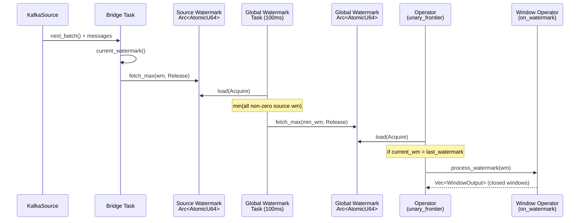
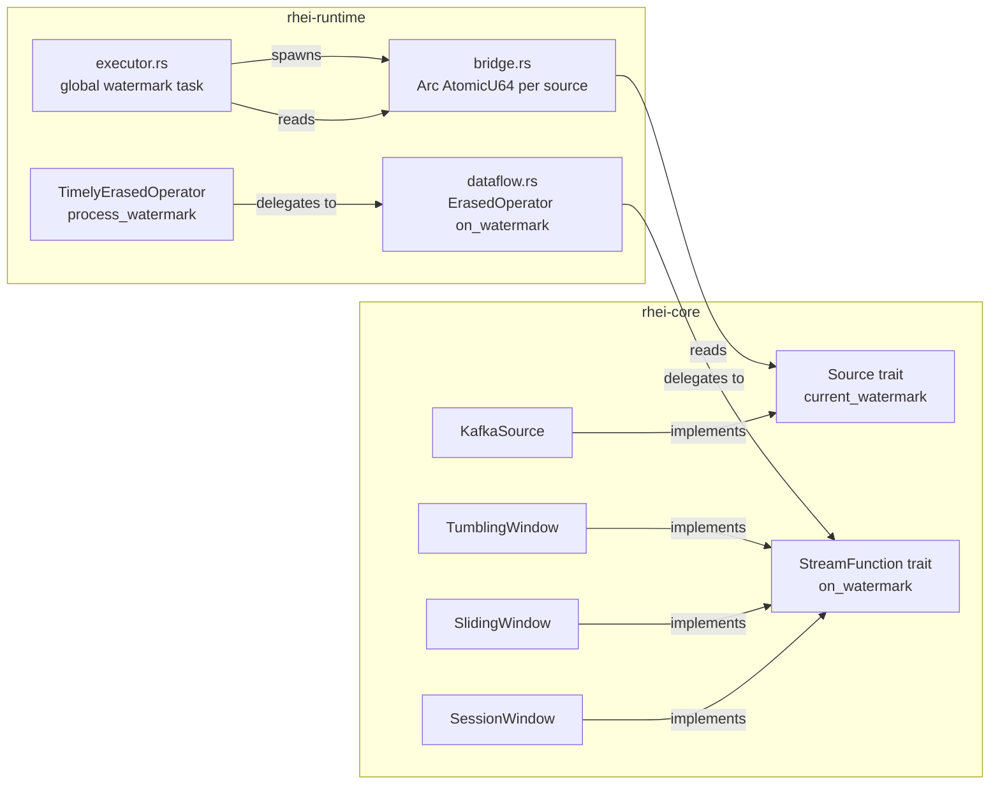

# ADR: Watermark Propagation

**Status:** Accepted
**Date:** 2026-02-22

## Context

Sources (`KafkaSource`) track `should_emit_watermark()` and `watermark_pending` state, but the bridge never reads these signals. Window operators (Tumbling, Sliding, Session) close windows only when new data arrives — if a source goes idle, open windows stay open indefinitely. Late events have no detection or policy. This addresses KI-13 and partially resolves KI-6.

## Decision

**Out-of-band watermark via shared `Arc<AtomicU64>`.** Watermarks flow outside the Timely dataflow as shared atomics (not as data items), avoiding the problem of routing watermark items through Exchange pacts (which route by key hash, not broadcast). Operators read the shared watermark in their `unary_frontier` callback and call `on_watermark()` on the wrapped `StreamFunction`.

### Source watermark tracking

- The `Source` trait gains a `current_watermark()` default method returning `Option<u64>`.
- `KafkaSource` tracks `max_timestamp` from consumed messages and returns `max_timestamp - allowed_lateness_ms` as the watermark.
- The bridge (`erased_source_bridge_with_offsets`) publishes each source's watermark into a per-source `Arc<AtomicU64>` after every batch.

### Global watermark computation

A Tokio task computes `global_watermark = min(all non-zero source watermarks)` every 100ms and stores the result in a shared `Arc<AtomicU64>`.

### Operator watermark consumption

In the operator closure within `build_timely_dag`, after processing input data:
1. Read `global_watermark.load(Ordering::Acquire)`
2. If the watermark has advanced past `last_watermark`, call `timely_op.process_watermark(current_wm, &rt)`
3. Emit any results (e.g. closed windows) using the retained capability from the most recent data batch

### StreamFunction trait extension

`StreamFunction` gains an `on_watermark(watermark, ctx)` default method (returns empty `Vec`). Window operators override this to close eligible windows.

### Late event detection

Each window operator checks incoming events against `last_watermark + allowed_lateness`. Events arriving after their window has been closed are dropped with a `late_events_dropped_total` metric increment.

## Diagram

### Watermark data flow

### Component ownership

## Alternatives considered

### 1. In-band watermark items through the dataflow

Inject watermark items (`AnyItem::Watermark(u64)`) into the Timely stream alongside data. Operators detect and forward them.

**Rejected** because Exchange pacts route by key hash, not broadcast. A watermark item would be routed to a single worker based on a synthetic key, requiring custom broadcast logic or a separate watermark-only stream. The shared atomic approach is simpler and avoids dataflow topology changes.

### 2. Use Timely epochs as event timestamps

Map event-time watermarks to Timely epoch boundaries. Advance the epoch only when the watermark advances.

**Rejected** as a major refactor. Timely epochs currently increment per batch for liveness and checkpointing. Coupling epochs to event-time would require rethinking checkpoint coordination, source pacing, and the entire epoch advancement strategy.

### 3. Per-operator watermark propagation (Flink-style)

Each operator maintains its own watermark and forwards it downstream. Watermarks are the minimum of all input watermarks.

**Rejected** as over-engineering for the current architecture. With the shared atomic approach, all operators see the same global watermark. Per-operator propagation would be needed for pipelines with multiple independent source branches at different speeds, which is not yet a requirement.

## Consequences

**Positive:**
- Window operators close windows on idle sources — no more indefinitely open windows.
- Late events are detected and dropped with metrics, giving operators visibility into out-of-order data.
- `allowed_lateness` is configurable per window operator, allowing users to trade latency for completeness.
- Default `on_watermark()` is a no-op, so all existing operators and pipelines work unchanged.
- Foundation for future side-output routing of late events.

**Negative:**
- After restart, `active_keys` is empty. Watermark-driven closure only works for keys seen since restart. Existing data-driven closure handles old keys when new data arrives.
- Global watermark is min of all sources — a single slow source holds back all operators. Per-branch watermarking would require additional complexity.
- 100ms polling interval adds up to 100ms latency to watermark propagation.

## Files changed

| File | Change |
|---|---|
| `rhei-core/src/traits.rs` | Add `current_watermark()` to `Source`, `on_watermark()` to `StreamFunction` |
| `rhei-core/src/connectors/kafka_source.rs` | Track `max_timestamp`, implement `current_watermark()`, add `with_allowed_lateness()` |
| `rhei-core/src/operators/tumbling_window.rs` | Add `active_keys`, `allowed_lateness`, `last_watermark`; implement `on_watermark()`; late event detection |
| `rhei-core/src/operators/sliding_window.rs` | Same pattern as tumbling |
| `rhei-core/src/operators/session_window.rs` | Same pattern adapted for session semantics |
| `rhei-runtime/src/dataflow.rs` | Add `current_watermark()` to `ErasedSource`, `on_watermark()` to `ErasedOperator` |
| `rhei-runtime/src/timely_operator.rs` | Add `process_watermark()` to `TimelyErasedOperator` |
| `rhei-runtime/src/bridge.rs` | Return `Arc<AtomicU64>` from bridge, publish watermark after each batch |
| `rhei-runtime/src/executor.rs` | Collect source watermarks, spawn global watermark task, pass to `build_timely_dag`, read in operator closure |
| `rhei-runtime/tests/watermark.rs` | Integration test with `WatermarkVecSource` |
