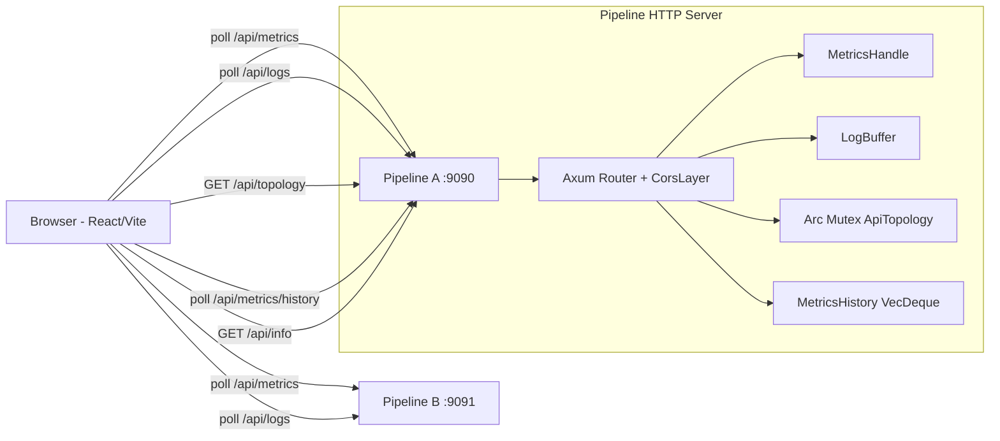

# ADR: Web Dashboard

## Context

Rhei has a TUI dashboard (`rhei run --tui`, `rhei attach`) for monitoring pipelines, but it is limited to a single terminal window with text-based rendering. Users need richer visualization (historical charts, interactive topology graphs) and multi-pipeline monitoring from a browser.

The existing HTTP server already provides JSON APIs for metrics, logs, and health. The web dashboard extends this foundation.

## Decision

Build a client-side React dashboard that connects directly to pipeline HTTP servers. No aggregation server is needed: the browser polls each pipeline independently.

### Backend Extensions

Add three new endpoints to the existing Axum HTTP server:

- `GET /api/topology` -- serializable pipeline DAG extracted from `CompiledGraph` during compilation
- `GET /api/metrics/history?since=<ms>` -- ring buffer of 720 timestamped `MetricsSnapshot` entries (6 min at 500ms)
- `GET /api/info` -- pipeline identity (name, version, workers, uptime)

Add `tower-http` with CORS support for cross-origin browser requests.

### Topology Extraction

`NodeKind` contains type-erased closures and cannot be serialized. Instead, `ApiTopology` / `ApiTopologyNode` structs are extracted during `compile_graph()` before nodes are consumed by execution. The topology is stored in an `Arc<Mutex<Option<ApiTopology>>>` on `PipelineController` and threaded through to `HttpServerConfig` / `AppState`.

### Frontend

Standalone Vite + React + TypeScript app in `rhei-dashboard/` (not a Rust crate, not in `Cargo.toml` workspace). Uses:

- **React Flow** for interactive DAG topology
- **Recharts** for time-series charts
- **TanStack Query** for polling with caching/deduplication
- **Zustand** for pipeline list persistence (localStorage)
- **Tailwind CSS** for styling

## Diagram

## Alternatives Considered

1. **Server-side aggregation proxy**: Would add operational complexity and a single point of failure. Client-side polling is simpler and each pipeline remains independently observable.

2. **Embed frontend in Rust binary (serve from HTTP server)**: More seamless deployment, but couples frontend build to Rust CI and increases binary size. Can be added later as an optional enhancement.

3. **WebSocket streaming**: Lower latency than polling, but adds complexity. The TUI already polls at similar intervals; polling is adequate for dashboard refresh rates.

## Consequences

### Positive

- Rich visualization with interactive topology and historical charts
- Multi-pipeline monitoring from a single browser tab
- No additional server infrastructure required
- Frontend can be developed and deployed independently of the Rust codebase
- CORS support enables any web-based tool to consume pipeline APIs

### Negative

- ~140 KB memory overhead per pipeline for the metrics history ring buffer
- CORS is permissive in development; should be tightened for production deployments
- Frontend is a separate build step (`npm run build`) not integrated into Cargo CI
- Browser-accumulated history (~30 min) is lost on page refresh
