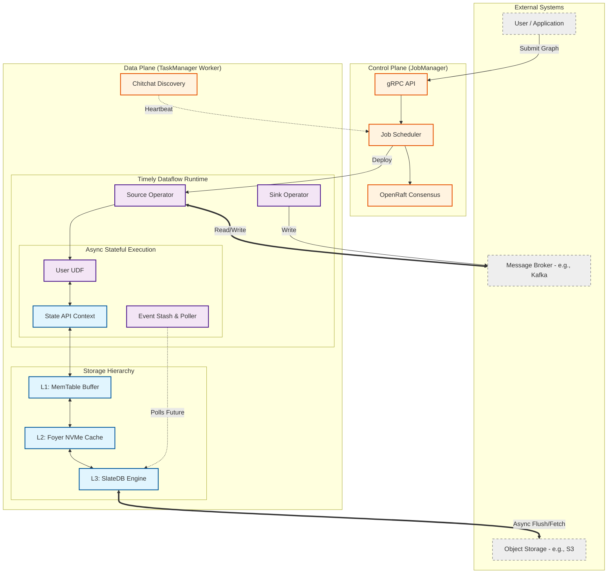

# Architecture Design: Rhei Overview
Overview Rhei is a distributed, stateful stream processing engine written in Rust. It utilizes a Shared-Nothing, Disaggregated State architecture, separating compute from durable storage to enable instant autoscaling and eliminate heavy local-disk state migrations.

## 1. System Topology

## 2. Component Breakdown
Control Plane (Coordination & Metadata)
The Control Plane is responsible for cluster consensus, job scheduling, and metadata management. It does not handle user data.

|Component|Technology|Responsibility|
|-|-|:-|
|Consensus|openraft|"Maintains the highly available, strongly consistent metadata state (e.g., active workers, latest checkpoint IDs, job graphs)."|
|Discovery|chitchat (Gossip)|"Provides fast, eventually consistent failure detection and worker node discovery without overloading the Raft leader."|
|API / RPC|tonic (gRPC)|"Handles external client submissions and internal Control-to-Data plane commands (e.g., trigger checkpoint)."|

### Data Plane (Execution Engine)
The Data Plane executes the physical DAG. It is designed around an async-bridging pattern to connect synchronous data movement with asynchronous storage.

|Component|Technology|Responsibility|
|-|-|-|
|Graph Runtime|timely|"Moves data between operators, handles cyclic execution, and tracks progress (watermarks/frontiers)."|
|Data Format|arrow-rs|"Provides zero-copy, columnar memory layout for standardizing row formats across the network and Python FFI."|
|Async Wrapper|Custom|"Intercepts elements requiring state. If state is unavailable (L1 miss), it stashes the element and yields to the Tokio runtime to fetch from S3, preventing worker thread blocking."|

### Storage Hierarchy (Disaggregated State)
State is tiered to mask the latency of object storage while maintaining cloud-native durability.

|Tier|Technology|Characteristic|Responsibility|
|-|-|:-|:-|
|L1 (RAM)|std::collections::HashMap|Microseconds.|Buffers immediate reads/writes for the current window. Flushed to L3 asynchronously on checkpoint barriers.|
|L2 (Disk)|foyer|Milliseconds.|Local NVMe cache. Handles L1 read misses to avoid network round-trips to S3 for frequently accessed historical state.|
|L3 (Cloud)|slatedb|10s - 100s of ms.|The ultimate source of truth. Writes SSTables directly to S3. Enables stateless worker autoscaling.|

# 3. Data Flow Paths
- **Hot Path (Zero I/O):** Event arrives -> Processed by Timely -> State read/written strictly to L1 MemTable -> Output emitted.
- **Cold Path (Async State Fetch):** Event arrives -> State not in L1 -> Event stashed -> Async read requested to Foyer/SlateDB -> Worker processes other keys -> State loaded to L1 -> Event un-stashed and processed.
- **Checkpoint Path (Consistency):** Barrier arrives -> L1 MemTable freezes -> Flushes dirty keys to SlateDB -> SlateDB uploads SSTables to S3 -> Raft commits checkpoint ID -> Next epoch begins.