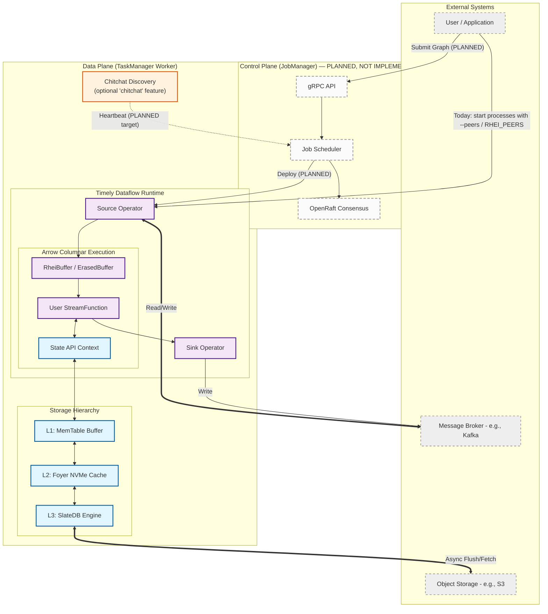

# Architecture Design: Rhei Overview

Rhei is a stateful stream processing engine written in Rust. It uses a Shared-Nothing, Disaggregated State architecture, separating compute from durable storage to reduce local-disk state migrations when the topology changes.

> **Scope of this document.** Everything below describes what is implemented on
> `main` unless a section is explicitly marked **PLANNED**. Planned components
> are drawn with dashed borders in the diagrams. For the phased plan see
> [CLUSTERING.md](CLUSTERING.md); for tracked gaps see
> [KNOWN-ISSUES.md](KNOWN-ISSUES.md).

## 1. System Topology


```mermaid
graph TD
    classDef storage fill:#e1f5fe,stroke:#01579b,stroke-width:2px;
    classDef compute fill:#f3e5f5,stroke:#4a148c,stroke-width:2px;
    classDef control fill:#fff3e0,stroke:#e65100,stroke-width:2px;
    classDef planned fill:#fafafa,stroke:#9e9e9e,stroke-width:2px,stroke-dasharray: 6 4;
    classDef ext fill:#eeeeee,stroke:#616161,stroke-width:1px,stroke-dasharray: 5 5;

    subgraph "External Systems"
        User[User / Application]:::ext
        Kafka[Message Broker - e.g., Kafka]:::ext
        S3[Object Storage - e.g., S3]:::ext
    end

    subgraph "Control Plane (JobManager) — PLANNED, NOT IMPLEMENTED"
        API[gRPC API]:::planned
        Sched[Job Scheduler]:::planned
        Raft[OpenRaft Consensus]:::planned

        API --> Sched
        Sched --> Raft
    end

    subgraph "Data Plane (TaskManager Worker)"
        Gossip["Chitchat Discovery<br/>(optional 'chitchat' feature)"]:::control

        subgraph "Timely Dataflow Runtime"
            Source[Source Operator]:::compute

            subgraph "Arrow Columnar Execution"
                OpLogic[User StreamFunction]:::compute
                ArrowBuf[RheiBuffer / ErasedBuffer]:::compute
                Context[State API Context]:::storage
            end

            Sink[Sink Operator]:::compute
        end

        subgraph "Storage Hierarchy"
            L1[L1: MemTable Buffer]:::storage
            L2[L2: Foyer NVMe Cache]:::storage
            L3[L3: SlateDB Engine]:::storage
        end

        Source --> ArrowBuf
        ArrowBuf --> OpLogic
        OpLogic <--> Context
        Context <--> L1
        L1 <--> L2
        L2 <--> L3
        OpLogic --> Sink
    end

    User -->|"Submit Graph (PLANNED)"| API
    Sched -->|"Deploy (PLANNED)"| Source
    User -->|"Today: start processes with --peers / RHEI_PEERS"| Source
    Source <==>|Read/Write| Kafka
    Sink -->|Write| Kafka
    L3 <==>|Async Flush/Fetch| S3
    Gossip -.->|"Heartbeat (PLANNED target)"| Sched
```

**What exists today:** the data plane only. Processes are launched externally
(by you, a shell script, or an orchestrator) and told about each other through
`--peers` / `--process-id` flags or the equivalent `RHEI_*` environment
variables. There is no job submission API, no scheduler, no leader election,
and no consensus store — `openraft` and `tonic` are not dependencies of any
crate in this workspace. Gossip-based membership via `chitchat` is implemented
but gated behind the optional `chitchat` feature on `rhei-runtime`, and it
reports membership to the running processes rather than to a job manager.

## 2. Execution Model: Arrow Columnar

Rhei processes data in Apache Arrow columnar batches. Data flows as `RecordBatch` buffers through the pipeline — there is no row-by-row execution path.

### Data Flow

```
Source → RheiBuffer<T> → ErasedBuffer → [Timely Exchange] → ErasedBuffer → RheiBuffer<T> → Operator → Sink
```

| Concept | Type | Description |
|---------|------|-------------|
| User schema | `RheiSchema` trait | Defines Arrow schema, builder, zero-copy view, and column accessors |
| Typed buffer | `RheiBuffer<T>` | `RecordBatch` + selection vector (boolean mask for zero-copy filtering) |
| Transport buffer | `ErasedBuffer` | Type-erased `RecordBatch + mask + schema_id` for Timely dataflow transport |
| Operator | `StreamFunction` | Async trait: `process(RheiBuffer<I>, ctx) → BufferOutput<O>` |
| Source | `Source` | Produces `RheiBuffer<T>` batches from external systems |
| Sink | `Sink` | Consumes `RheiBuffer<T>` batches to external systems |

### Processing Modes

Operators work at three granularities:

1. **Row-level (View)** — iterate `RheiBuffer<T>` via zero-copy `View<'a>` references. For custom stateful logic.
2. **Batch-level** — receive full `RheiBuffer<T>`. For windows, aggregations, batch transforms.
3. **Column-level (DataFusion)** — apply Arrow compute kernels on column arrays. For filter expressions (zero-copy selection vectors).

### Exchange (key_by)

Data redistribution across workers uses a two-stage Timely operator:

1. **Split (Pipeline pact):** Partition each buffer's rows by `seahash(key) % num_workers` into per-worker sub-buffers.
2. **Route (Exchange pact):** Send each sub-buffer to its target worker via Timely's built-in exchange.

Serialization uses Arrow IPC format — fast, self-describing, and columnar-friendly.

## 3. Component Breakdown

### Control Plane (Coordination & Metadata)

|Component|Technology|Responsibility|Status|
|-|-|-|-|
|Discovery|chitchat (Gossip)|Failure detection (phi-accrual) and worker discovery, driving debounced rescale|**Implemented**, behind the optional `chitchat` feature on `rhei-runtime`|
|Checkpoint coordination|Custom TCP protocol|Process 0 collects per-process readiness before committing a merged manifest|**Implemented**|
|Consensus|openraft|HA metadata state (active workers, checkpoint IDs, job graphs)|**Planned** — not a dependency of any crate|
|API / RPC|tonic (gRPC)|Client submissions and Control-to-Data plane commands|**Planned** — not a dependency of any crate|
|Leader election|—|Elect a coordinator rather than hardcoding process 0|**Planned**|

### Data Plane (Execution Engine)

|Component|Technology|Responsibility|
|-|-|-|
|Graph Runtime|timely|Moves data between operators, handles progress tracking (watermarks/frontiers)|
|Data Format|arrow-rs|Zero-copy columnar memory layout. `RheiBuffer<T>` with selection vectors for filtering|
|Type Erasure|ErasedBuffer|Schema-ID-tagged `RecordBatch` for Timely transport. Arrow IPC serialization|
|Async Bridge|Custom|Sources/sinks run as Tokio tasks, bridged to Timely via bounded channels|
|Operator Framework|StreamFunction|Async trait processing `RheiBuffer` batches with hot/cold state path|

### Storage Hierarchy (Disaggregated State)

|Tier|Technology|Latency|Responsibility|
|-|-|-|-|
|L1 (RAM)|`HashMap` for dirty entries + `moka` W-TinyLFU cache for clean entries|Sub-microsecond|Buffers immediate reads/writes. Dirty entries flush to L3 on checkpoint. Bounded by `MemTableConfig` (`max_entries`, optional `max_bytes`); note that **dirty entries are never evicted**, so L1 can still grow between checkpoints under high write cardinality|
|L2 (Disk)|foyer `HybridCache`|Sub-ms to ms|Local NVMe cache. Handles L1 read misses without network round-trips|
|L3 (Cloud)|slatedb|10s-100s ms|Source of truth on object storage. Enables stateless workers|

Latency columns are order-of-magnitude expectations for each backend, not measured
benchmark results. Run `just bench` for numbers from your own hardware.

State keys are namespaced by key group, not worker index:

```text
kg{key_group}/{operator_name}/{user_key}
```

Key groups decouple key ownership from worker count, so the worker count can
change between runs without rewriting state. The key group count is fixed by
`max_parallelism`; restoring a checkpoint taken with a different
`max_parallelism` is rejected.

## 4. Data Flow Paths

- **Hot Path (Zero I/O):** Batch arrives → operator processes via View iteration → state read/written to L1 MemTable → output buffer emitted.
- **Cold Path (Blocking State Fetch):** Operator reads state → L1 miss → the Timely worker thread calls `tokio::runtime::Handle::block_on` to drive the L2 Foyer / L3 SlateDB fetch (`rhei-runtime/src/timely_operator.rs`) → state loaded to L1 → processing continues. **This blocks that worker thread for the duration of the fetch**; other workers proceed independently. A non-blocking cold path needs an operator API redesign and is tracked as KI-11 in [KNOWN-ISSUES.md](KNOWN-ISSUES.md).
- **Checkpoint Path:** Frontier advances → L1 dirty keys flush to SlateDB → SlateDB uploads SSTables to S3 → checkpoint manifest written → source offsets committed → next epoch begins. Because offsets are committed after the checkpoint, delivery is **at-least-once**.

## 5. Pipeline API

```rust,ignore
// not-compiled: requires the `kafka` feature and librdkafka. For compiled
// examples see rhei/examples/ and API.md (whose snippets are doctests).
let graph = DataflowGraph::new();

let orders = graph.source(KafkaSource::new(broker, group, &["orders"])?);

orders
    .map(|msg| parse_order(msg))
    .filter_fn(|o| o.amount > 50.0)
    .key_by(|o| o.customer_id.to_string())
    .operator("aggregator", CustomerAggregator)
    .sink(KafkaSink::new(broker, "output")?);

let ctrl = PipelineController::builder()
    .checkpoint_dir("./checkpoints")
    .workers(4)
    .build()?;
ctrl.run(graph).await?;
```

Closures passed to `map`, `filter_fn`, and `key_by` receive a zero-copy row
**view** borrowed from the Arrow buffer, not an owned value — hence
`.to_string()` on the key. `PipelineController::new` takes a `PathBuf` and pairs
with `.with_workers(n)`; the builder above accepts `impl Into<PathBuf>` and
returns `anyhow::Result<PipelineController>`.

Key API types:
- `Stream<'a, T>` — `Copy` typed handle to a point in the dataflow. Supports `map`, `filter`, `filter_fn`, `flat_map`, `key_by`, `merge`, `inspect`, `limit`, `batch`, `distinct_by`, `name`, `operator`, `sink`. There is no separate `KeyedStream` type, so keying before a stateful operator is a convention the compiler does not enforce.
- `DataflowGraph` — container for the dataflow topology. Validated before execution.
- `PipelineController` — configures workers, checkpoint dir, DLQ sink, cluster settings. Compiles and runs the graph.

Full reference: [API.md](API.md).

## 6. Error Handling

| Mechanism | Description |
|-----------|-------------|
| `ErrorPolicy::Skip` | Log warning and drop the failed element (default) |
| `ErrorPolicy::SendToDlq` | Route failed elements to a `DlqSink` implementation |
| `DlqSink` trait | Async trait for dead-letter backends (`FileDlqSink`, `LogDlqSink`, `KafkaDlqSink` — the last behind the `kafka` feature) |
| `on_error()` hook | Per-operator error recovery callback on `StreamFunction`; defaults to propagating the error |

Error policy and DLQ sink are set on `PipelineController::builder()`
(`.error_policy(..)`, `.dlq_sink(..)`). There are no per-stream `.dlq()` or
`.with_dlq()` methods.

## 7. Clustering

| Mode | Config | What changes |
|------|--------|-------------|
| Single-thread | Default | One Timely worker, local state |
| Multi-thread | `.workers(4)` (or `.with_workers(4)` on `PipelineController::new`) | N worker threads, shared-nothing L1/L2 per worker |
| Multi-process | `.from_env()`, or `.process_id(..)` + `.peers(..)` | N processes over TCP, coordinated checkpoints via shared object storage |

In multi-process mode, each process independently opens SlateDB against the same bucket. Checkpoint coordination is out-of-band over TCP — process 0 collects readiness before committing a merged manifest. Sharing state across processes requires the `remote-state` feature on `rhei-runtime` plus a `RemoteStateConfig`.

Runtime rescaling is available via `PipelineController::run_dynamic()`, which checkpoints, rebuilds the `TaskManager` with a new topology generation, and restarts Timely. Key-group ownership moves; state bytes stay in shared L3 and fault in on first access after a rescale.
