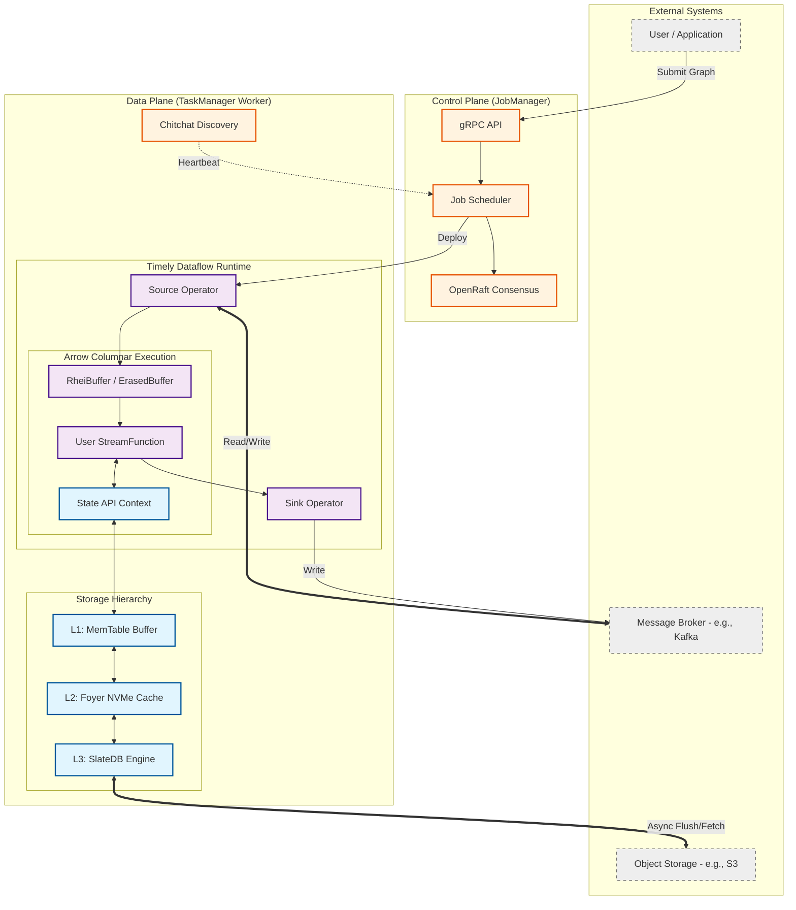

# Architecture Design: Rhei Overview

Rhei is a distributed, stateful stream processing engine written in Rust. It utilizes a Shared-Nothing, Disaggregated State architecture, separating compute from durable storage to enable instant autoscaling and eliminate heavy local-disk state migrations.

## 1. System Topology


```mermaid
graph TD
    classDef storage fill:#e1f5fe,stroke:#01579b,stroke-width:2px;
    classDef compute fill:#f3e5f5,stroke:#4a148c,stroke-width:2px;
    classDef control fill:#fff3e0,stroke:#e65100,stroke-width:2px;
    classDef ext fill:#eeeeee,stroke:#616161,stroke-width:1px,stroke-dasharray: 5 5;

    subgraph "External Systems"
        User[User / Application]:::ext
        Kafka[Message Broker - e.g., Kafka]:::ext
        S3[Object Storage - e.g., S3]:::ext
    end

    subgraph "Control Plane (JobManager)"
        API[gRPC API]:::control
        Sched[Job Scheduler]:::control
        Raft[OpenRaft Consensus]:::control

        API --> Sched
        Sched --> Raft
    end

    subgraph "Data Plane (TaskManager Worker)"
        Gossip[Chitchat Discovery]:::control

        subgraph "Timely Dataflow Runtime"
            Source[Source Operator]:::compute

            subgraph "Arrow Columnar Execution"
                OpLogic[User StreamFunction]:::compute
                ArrowBuf[RheiBuffer / ErasedBuffer]:::compute
                Context[State API Context]:::storage
            end

            Sink[Sink Operator]:::compute
        end

        subgraph "Storage Hierarchy"
            L1[L1: MemTable Buffer]:::storage
            L2[L2: Foyer NVMe Cache]:::storage
            L3[L3: SlateDB Engine]:::storage
        end

        Source --> ArrowBuf
        ArrowBuf --> OpLogic
        OpLogic <--> Context
        Context <--> L1
        L1 <--> L2
        L2 <--> L3
        OpLogic --> Sink
    end

    User -->|Submit Graph| API
    Sched -->|Deploy| Source
    Source <==>|Read/Write| Kafka
    Sink -->|Write| Kafka
    L3 <==>|Async Flush/Fetch| S3
    Gossip -.->|Heartbeat| Sched
```

## 2. Execution Model: Arrow Columnar

Rhei processes data in Apache Arrow columnar batches. Data flows as `RecordBatch` buffers through the pipeline — there is no row-by-row execution path.

### Data Flow

```
Source → RheiBuffer<T> → ErasedBuffer → [Timely Exchange] → ErasedBuffer → RheiBuffer<T> → Operator → Sink
```

| Concept | Type | Description |
|---------|------|-------------|
| User schema | `RheiSchema` trait | Defines Arrow schema, builder, zero-copy view, and column accessors |
| Typed buffer | `RheiBuffer<T>` | `RecordBatch` + selection vector (boolean mask for zero-copy filtering) |
| Transport buffer | `ErasedBuffer` | Type-erased `RecordBatch + mask + schema_id` for Timely dataflow transport |
| Operator | `StreamFunction` | Async trait: `process(RheiBuffer<I>, ctx) → BufferOutput<O>` |
| Source | `Source` | Produces `RheiBuffer<T>` batches from external systems |
| Sink | `Sink` | Consumes `RheiBuffer<T>` batches to external systems |

### Processing Modes

Operators work at three granularities:

1. **Row-level (View)** — iterate `RheiBuffer<T>` via zero-copy `View<'a>` references. For custom stateful logic.
2. **Batch-level** — receive full `RheiBuffer<T>`. For windows, aggregations, batch transforms.
3. **Column-level (DataFusion)** — apply Arrow compute kernels on column arrays. For filter expressions (zero-copy selection vectors).

### Exchange (key_by)

Data redistribution across workers uses a two-stage Timely operator:

1. **Split (Pipeline pact):** Partition each buffer's rows by `seahash(key) % num_workers` into per-worker sub-buffers.
2. **Route (Exchange pact):** Send each sub-buffer to its target worker via Timely's built-in exchange.

Serialization uses Arrow IPC format — fast, self-describing, and columnar-friendly.

## 3. Component Breakdown

### Control Plane (Coordination & Metadata)

|Component|Technology|Responsibility|
|-|-|-|
|Consensus|openraft|Maintains HA metadata state (active workers, checkpoint IDs, job graphs)|
|Discovery|chitchat (Gossip)|Fast failure detection and worker discovery|
|API / RPC|tonic (gRPC)|Client submissions and internal Control-to-Data plane commands|

### Data Plane (Execution Engine)

|Component|Technology|Responsibility|
|-|-|-|
|Graph Runtime|timely|Moves data between operators, handles progress tracking (watermarks/frontiers)|
|Data Format|arrow-rs|Zero-copy columnar memory layout. `RheiBuffer<T>` with selection vectors for filtering|
|Type Erasure|ErasedBuffer|Schema-ID-tagged `RecordBatch` for Timely transport. Arrow IPC serialization|
|Async Bridge|Custom|Sources/sinks run as Tokio tasks, bridged to Timely via bounded channels|
|Operator Framework|StreamFunction|Async trait processing `RheiBuffer` batches with hot/cold state path|

### Storage Hierarchy (Disaggregated State)

|Tier|Technology|Latency|Responsibility|
|-|-|-|-|
|L1 (RAM)|`HashMap` memtable|Microseconds|Buffers immediate reads/writes. Flushed to L3 on checkpoint|
|L2 (Disk)|foyer `HybridCache`|Milliseconds|Local NVMe cache. Handles L1 read misses without network round-trips|
|L3 (Cloud)|slatedb|10s-100s ms|Source of truth on S3. Enables stateless worker autoscaling|

## 4. Data Flow Paths

- **Hot Path (Zero I/O):** Batch arrives → operator processes via View iteration → state read/written to L1 MemTable → output buffer emitted.
- **Cold Path (Async State Fetch):** Operator reads state → L1 miss → `block_in_place` drives async fetch from L2 Foyer / L3 SlateDB → state loaded to L1 → processing continues.
- **Checkpoint Path:** Frontier advances → L1 dirty keys flush to SlateDB → SlateDB uploads SSTables to S3 → checkpoint manifest written → source offsets committed → next epoch begins.

## 5. Pipeline API

```rust
let graph = DataflowGraph::new();

let orders = graph.source(KafkaSource::new(broker, group, &["orders"])?);

orders
    .map(|msg| parse_order(msg))
    .filter_fn(|o| o.amount > 50.0)
    .key_by(|o| o.customer_id.clone())
    .operator("aggregator", CustomerAggregator)
    .sink(KafkaSink::new(broker, "output")?);

let ctrl = PipelineController::new("./checkpoints")
    .with_workers(4);
ctrl.run(graph).await?;
```

Key API types:
- `Stream<'a, T>` — typed handle to a point in the dataflow. Supports `map`, `filter_fn`, `flat_map`, `key_by`, `merge`, `inspect`, `limit`, `distinct_by`, `name`.
- `DataflowGraph` — container for the dataflow topology. Validated before execution.
- `PipelineController` — configures workers, checkpoint dir, DLQ sink, cluster settings. Compiles and runs the graph.

## 6. Error Handling

| Mechanism | Description |
|-----------|-------------|
| `ErrorPolicy::Skip` | Log warning and drop the failed element (default) |
| `ErrorPolicy::SendToDlq` | Route failed elements to a `DlqSink` implementation |
| `DlqSink` trait | Async trait for dead-letter backends (`FileDlqSink`, `LogDlqSink`, `KafkaDlqSink`) |
| `on_error()` hook | Per-operator error recovery callback on `StreamFunction` |

## 7. Clustering

| Mode | Config | What changes |
|------|--------|-------------|
| Single-thread | Default | One worker, local state |
| Multi-thread | `.with_workers(4)` | N worker threads, shared-nothing state per worker |
| Multi-process | `.from_env()` | N processes over TCP, coordinated checkpoints via S3 |

In multi-process mode, each process independently opens SlateDB against the same S3 bucket. Checkpoint coordination via out-of-band TCP — process 0 collects readiness before committing a merged manifest.
