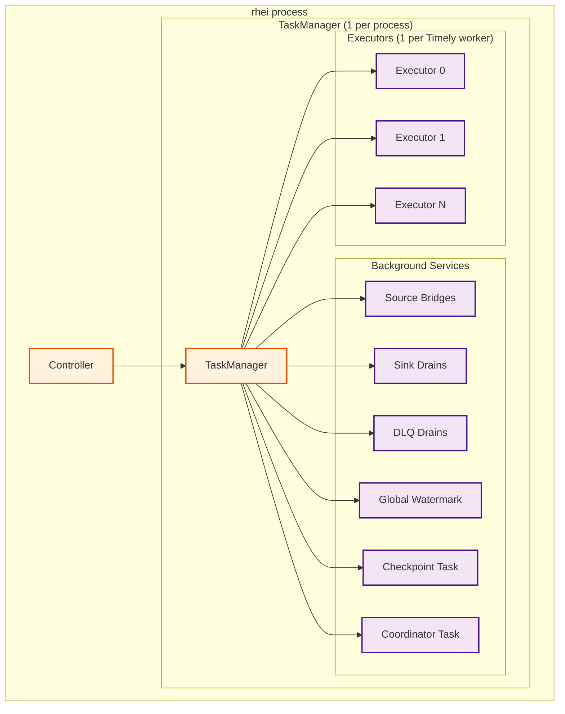
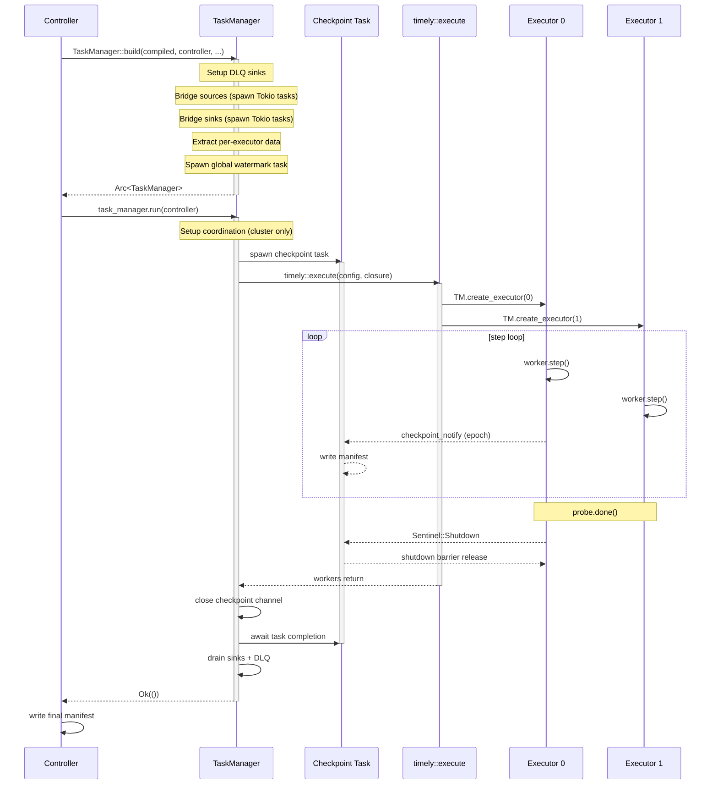
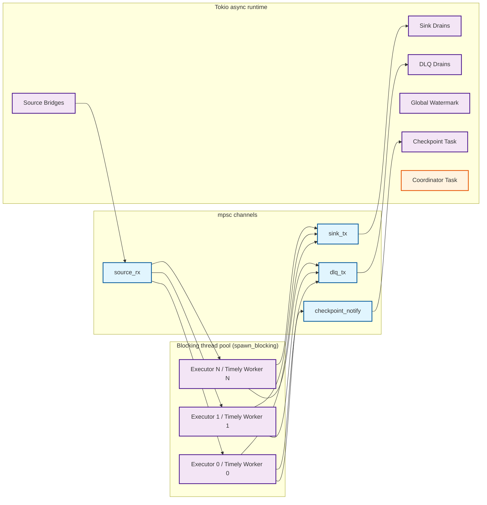

# Process Internal Architecture

Companion to [ARCHITECTURE.md](ARCHITECTURE.md) (system topology) and [CLUSTERING.md](CLUSTERING.md) (scaling phases). This document describes the internal layering within a single rhei process: how configuration, background services, and Timely worker threads are organized into three distinct responsibility layers.

## 1. Overview

A rhei process is structured as three layers: the **Controller** owns configuration and lifecycle, the **TaskManager** owns all shared infrastructure and background services, and one or more **Executors** (one per Timely worker thread) compile and run the dataflow.



---

## 2. Controller

The Controller is the public entry point (`PipelineController`). It owns all configuration and drives the top-level lifecycle. After the refactor, its internals become a simple linear sequence with no background task orchestration.

**Responsibilities:**
- Configuration ownership (checkpoint dir, tiered storage, workers, error policy, cluster settings)
- Health state management (Starting/Running/Stopped)
- Manifest load, validation, and final write
- State context factory (`create_context_for_worker`)

**Simplified `run_graph` pseudocode:**

```rust
async fn run_graph(graph, controller, shutdown) -> Result<()> {
    let compiled = compile_graph(graph)?;

    // Load + validate manifest
    let (checkpoint_id, restored_offsets) = load_manifest(&controller.checkpoint_dir);
    validate_operator_names(&manifest, &compiled.operator_names);

    controller.health.set_status(Running);

    // Delegate everything to TaskManager
    let task_manager = TaskManager::build(compiled, controller, shutdown, restored_offsets).await?;
    task_manager.run(controller).await?;

    // Write final manifest
    let manifest = build_final_manifest(task_manager.source_offsets(), ...);
    write_manifest(&manifest, &controller.checkpoint_dir)?;

    controller.health.set_status(Stopped);
    Ok(())
}
```

The Controller no longer spawns checkpoint tasks, sets up coordination, or manages shutdown barriers. All of that moves into TaskManager.

---

## 3. TaskManager

One TaskManager per process. Replaces the current `WorkerSet` struct and absorbs the checkpoint/coordination orchestration currently in `execute_compiled`. Owns all shared infrastructure and every background task.

**Naming rationale:** Follows Flink's convention (TaskManager = per-process manager) to avoid collision with Timely's `Worker` (per-thread).

**Struct sketch:**

```rust
pub(crate) struct TaskManager {
    // ── Shared infrastructure ──────────────────────────────
    sink_senders: Arc<HashMap<NodeId, mpsc::Sender<AnyItem>>>,
    global_watermark: Arc<AtomicU64>,

    // ── Graph metadata ─────────────────────────────────────
    topo_order: Arc<Vec<NodeId>>,
    node_inputs: Arc<HashMap<NodeId, Vec<NodeId>>>,
    node_kinds: Arc<HashMap<NodeId, NodeKindTag>>,
    last_operator_id: Option<NodeId>,
    all_operator_names: Vec<String>,

    // ── Per-executor data (one-time handoff) ───────────────
    per_executor: Mutex<Vec<Option<ExecutorData>>>,

    // ── Checkpoint infrastructure ──────────────────────────
    checkpoint_notify_tx: Mutex<Option<mpsc::Sender<u64>>>,
    checkpoint_notify_rx: tokio::sync::Mutex<mpsc::Receiver<u64>>,
    all_source_offsets: Vec<Arc<Mutex<HashMap<String, String>>>>,

    // ── Background task handles ────────────────────────────
    sink_handles: Vec<JoinHandle<Result<()>>>,
    dlq_handles: Vec<JoinHandle<Result<()>>>,
    // (watermark task is fire-and-forget)

    // ── Execution config ───────────────────────────────────
    initial_checkpoint_id: u64,
    checkpoint_dir: PathBuf,
    process_id: Option<usize>,
    n_processes: usize,
}
```

**Key methods:**

| Method | Purpose |
|--------|---------|
| `build(compiled, controller, shutdown, restored_offsets)` | Setup DLQ, bridge sources/sinks, extract per-executor data, spawn watermark task. Returns `Arc<TaskManager>`. |
| `create_executor(idx) -> Executor` | Construct an Executor for worker `idx`, taking its `ExecutorData` from the Mutex-Vec. Called inside the Timely closure. |
| `run(controller) -> Result<()>` | Setup coordination, spawn checkpoint task, launch `timely::execute`, step loop, coordinated shutdown, drain sinks/DLQ. |

The `build()` method performs the same work as the current `WorkerSet::build()`: DLQ setup, node classification, source bridging, sink bridging, per-worker data extraction, and global watermark task spawning. The difference is that `run()` also absorbs the orchestration currently split between `execute_compiled` and `execute_dag`.

---

## 4. Executor

One Executor per Timely worker thread. Replaces the current `TimelyCompiler`. Constructed by `TaskManager::create_executor(idx)` inside the Timely closure, so it is never moved across threads (satisfying `!Send` constraints from Timely capabilities).

**Struct sketch:**

```rust
pub(crate) struct Executor {
    // ── Per-worker data (owned, not shared) ────────────────
    data: ExecutorData,

    // ── Shared refs (cloned from TaskManager) ──────────────
    sink_senders: Arc<HashMap<NodeId, mpsc::Sender<AnyItem>>>,
    topo_order: Arc<Vec<NodeId>>,
    node_inputs: Arc<HashMap<NodeId, Vec<NodeId>>>,
    node_kinds: Arc<HashMap<NodeId, NodeKindTag>>,
    rt: tokio::runtime::Handle,

    // ── Per-worker config ──────────────────────────────────
    worker_index: usize,
    num_workers: usize,
    checkpoint_notify: Option<mpsc::Sender<u64>>,
    dlq_tx: Option<DlqSender>,
    last_operator_id: Option<NodeId>,
    global_watermark: Arc<AtomicU64>,
    local_first_worker: usize,
}
```

**Key method:**

```rust
impl Executor {
    fn run<A: Allocate>(self, worker: &mut Worker<A>) {
        let dataflow_index = worker.next_dataflow_index();
        let probe = worker.dataflow(|scope| self.compile(scope));
        while !probe.done() {
            worker.step();
        }
        // Coordinated shutdown (first local worker only)
        self.shutdown_barrier();
        worker.drop_dataflow(dataflow_index);
    }
}
```

The Executor receives everything it needs at construction time. No `Arc<Mutex<Vec<Option<...>>>>` handoff at runtime — `create_executor(idx)` takes the data from the Vec and passes it directly into the Executor constructor.

---

## 5. Lifecycle Sequence



---

## 6. Background Task Ownership

All background tasks are owned by the TaskManager. No background tasks are spawned by the Controller or Executor.

| Task | Owner | Spawned In | Lifetime |
|------|-------|-----------|----------|
| Source bridge (per source, per worker) | TaskManager | `build()` → `bridge_sources()` | Until source exhaustion or shutdown |
| Sink drain (per sink) | TaskManager | `build()` → `bridge_sinks()` | Until `drain()` drops senders |
| DLQ drain (per worker) | TaskManager | `build()` → `setup_dlq_sinks()` | Until `drain()` drops senders |
| Global watermark | TaskManager | `build()` → `spawn_global_watermark_task()` | Fire-and-forget (tokio task) |
| Checkpoint management | TaskManager | `run()` | Until checkpoint channel closes |
| Coordinator (process 0, cluster only) | TaskManager | `run()` → `setup_coordination()` | Until aborted after DAG completes |

---

## 7. Thread Model



**Async/sync boundary:** Tokio tasks handle all I/O (source reads, sink writes, DLQ writes, checkpoint manifest persistence, cross-process coordination). Timely worker threads are synchronous — they interact with the async world exclusively through bounded `tokio::sync::mpsc` channels and shared atomics.

**Cold path exception:** When an operator experiences an L1 cache miss, `block_in_place` on the Timely worker thread drives the future on the Tokio runtime to fetch from L2 Foyer or L3 SlateDB. This is the only point where a Timely thread blocks on async I/O.

---

## 8. Shared State Inventory

| State | Type | Written By | Read By | Purpose |
|-------|------|-----------|---------|---------|
| `global_watermark` | `Arc<AtomicU64>` | Watermark task | Executors (all operators) | Min of all source watermarks; triggers window closure |
| Per-source watermarks | `Arc<AtomicU64>` (per source per worker) | Source bridge tasks | Watermark task, source operator (exhaustion check) | Track per-source progress |
| `sink_senders` | `Arc<HashMap<NodeId, mpsc::Sender>>` | Executors (sink operators) | Sink drain tasks (recv side) | Bridge Timely → async sink writes |
| `checkpoint_notify` | `mpsc::Sender<u64>` | Executor 0 (last operator) | Checkpoint task | Signal epoch completion for manifest writes |
| `all_source_offsets` | `Vec<Arc<Mutex<HashMap>>>` | Source bridge tasks | Checkpoint task, Controller (final manifest) | Track Kafka offsets for checkpoint persistence |
| DLQ channels | `mpsc::Sender<DeadLetterRecord>` | Executors (operator error path) | DLQ drain tasks | Route operator errors to dead letter sinks |
| Shutdown barrier | `std::sync::mpsc::channel` | Checkpoint task (sender) | Executor 0 (receiver) | Coordinate cross-process Timely teardown (cluster mode) |
